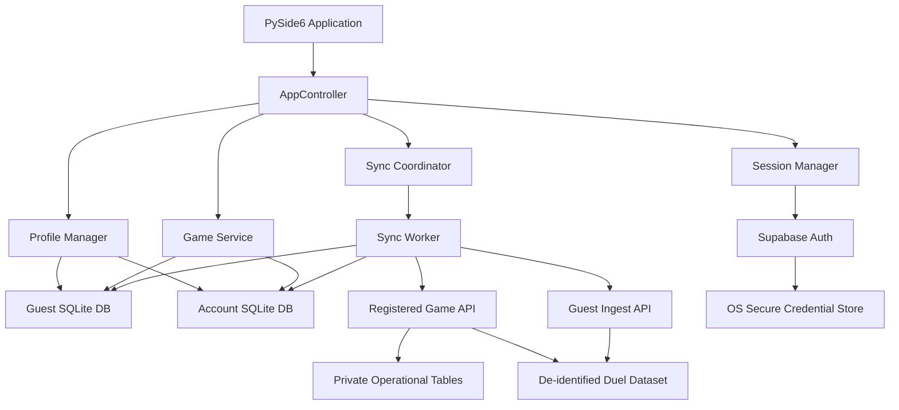
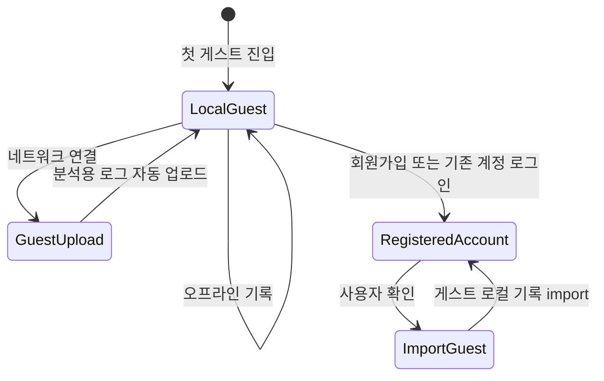
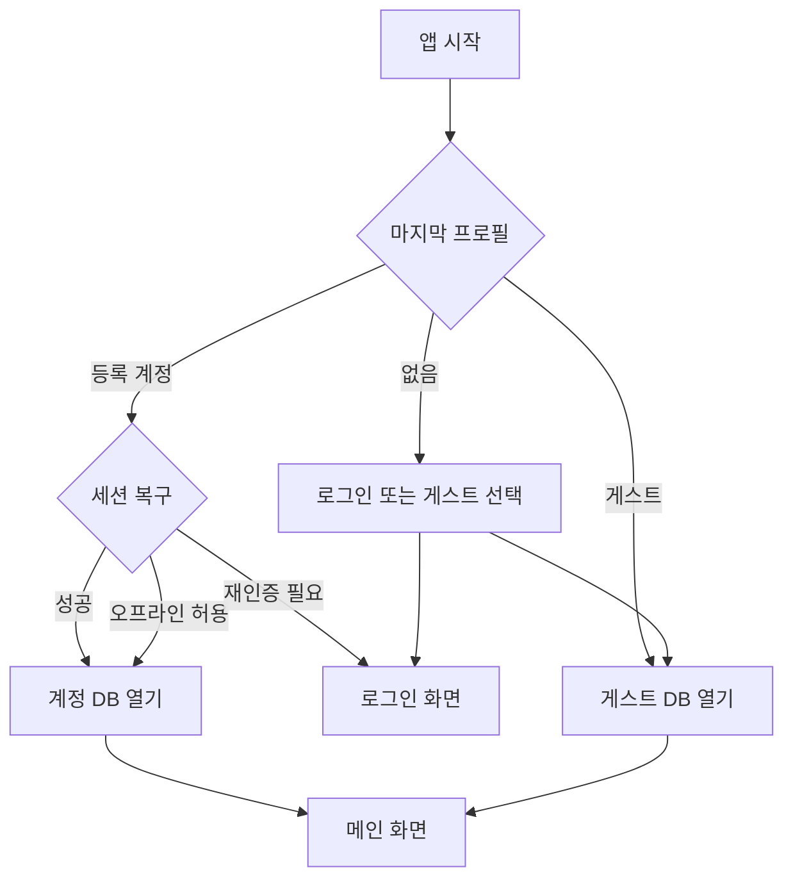

# MDLogger 온라인 계정·게스트·듀얼 데이터 로드맵

- 상태: 단계 0~~11 코어 구현 완료(단, 단계 10 휴대용 아카이브 **UI 배선은 미배선 → 미완료로 취급**, 하드닝 결정 H-3) + 하드닝 H1~~H6 구현 완료. 단계 12 미착수(진입 조건은 아래 §13 단계 12의 "단계 12 진입 조건"을 참조)
- 작성일: 2026-08-07
- 최근 개정: 2026-08-10 (단계 10 구현 기록 위치·상태 문구 정리, 버전 0.1.6 반영)
- 대상 프로젝트: MDLogger (`mdlogger`)
- 클라이언트: Python 3.13, PySide6, SQLite
- 기준 백엔드: Supabase Auth + PostgreSQL + Row Level Security
- 핵심 원칙: 로컬 우선, 계정별 DB 격리, 게스트 지속성, 비파괴 마이그레이션, 명시적 데이터 수집, 분석 가능한 정규 데이터

## 1. 문서 목적

이 문서는 MDLogger를 단일 로컬 SQLite 앱에서 다음 기능을 갖춘 온라인 계정 기반 앱으로 전환하기 위한 구현 기준과 단계별 로드맵을 정의한다.

- 이메일 기반 온라인 계정
- 로그인 없이 사용할 수 있는 지속형 게스트 계정
- 계정별 로컬 SQLite 캐시
- 네트워크 연결과 무관한 핵심 기록 입력
- 등록 계정과 게스트 계정의 백그라운드 업로드
- 여러 PC 사이의 양방향 동기화
- 기존 로컬 기록의 비파괴 마이그레이션
- 기기 간 이동을 위한 가져오기와 내보내기
- 향후 듀얼 환경 분석에 사용할 수 있는 명확하고 일관된 데이터 축적
- 계정 및 개인정보 보호를 위한 서버 측 권한 격리

이 문서는 구현 순서만 나열하지 않는다. 이후 구현자가 핵심 결정을 다시 추측하지 않도록 계정 수명 주기, 저장소 경계, 동기화 규칙, 분석 데이터 경계, 위험 검토 시점을 함께 정의한다.

### 1.1 AI 에이전트 실행 규칙

이 문서는 전체 기능을 한 번에 구현하라는 단일 작업 지시서가 아니다. AI 에이전트는 다음 규칙을 따라야 한다.

1. 현재 repository와 작업 트리를 먼저 조사하고 사용자 변경을 보존한다.
2. 한 번에 `단계 0`~`단계 12` 전체를 구현하지 않는다.
3. 사용자가 명시한 단계 또는 `## 18. 권장 작업 단위`의 한 작업 묶음만 수행한다.
4. 해당 단계의 작업, 검토 게이트, 완료 조건을 모두 작업 범위로 취급한다.
5. 구현 중 새로운 `결정 필요` 항목이 발견되면 임의 기본값으로 처리하지 않고 문서에 기록해 사용자에게 요청한다.
6. 외부 서비스 자격 증명, Supabase 프로젝트 정보 또는 제품 정책이 없으면 필요한 지점에서 중단하고 사용자에게 요청한다.
7. 스키마나 payload를 변경할 때 migration, rollback/forward-fix, 구버전 호환 테스트를 함께 작성한다.
8. Python 변경 후 `AGENTS.md`의 Ruff, format, ty, 관련 pytest 및 필요한 전체 pytest를 실제 실행한다.
9. 단계가 끝나면 이 문서에 구현 상태, 실제 파일, 검증 결과, 남은 위험을 갱신한다.
10. 다음 단계로 자동 진행하지 않고 사용자에게 검토 게이트 결과를 보고한다.

따라서 새 AI 세션에는 이 문서와 함께 예를 들어 `단계 1만 구현하고 R1 결과까지 보고하라`처럼 작업 범위를 지정해야 한다.

## 2. 확정된 제품 결정

### 2.1 온라인 계정

- 실제 온라인 계정을 제공한다.
- 첫 인증 방식은 이메일과 비밀번호를 기준으로 한다.
- 등록 계정은 여러 PC에서 로그인할 수 있다.
- 등록 계정의 게임 기록은 로컬에 먼저 저장하고 나중에 서버와 동기화한다.
- 서버 응답을 기다려야만 게임 기록을 저장할 수 있는 구조로 만들지 않는다.
- 장기적으로 소셜 로그인과 추가 온라인 기능을 도입할 수 있도록 인증 계층을 추상화한다.

### 2.2 게스트 계정

- 로그인하지 않아도 게스트로 앱을 사용할 수 있다.
- 게스트는 임시 메모리 세션이 아니라 지속되는 로컬 프로필이다.
- 게스트도 등록 계정과 동일하게 전용 SQLite DB를 가진다.
- 게스트 기록은 오프라인에서도 정상적으로 생성·편집·삭제·내보낼 수 있다.
- 네트워크에 연결되면 게스트는 auth 사용자 생성 없이 제한된 Guest Ingest API로 분석용 듀얼 로그를 자동 업로드한다.
- 앱을 재시작하거나 등록 계정에서 로그아웃해도 기존 게스트 프로필과 기록은 유지한다.
- 게스트가 회원가입하거나 기존 등록 계정으로 로그인하면 게스트 로컬 기록을 해당 계정으로 가져올지 사용자에게 확인한다.

### 2.3 자동 업로드와 고지

게스트 듀얼 로그 업로드는 제품 동작의 일부로 취급한다. 다만 숨겨진 수집으로 구현하지 않는다.

- 첫 게스트 진입 전에 어떤 데이터가 서버로 전송되는지 명확히 고지한다.
- 오프라인 첫 실행에서도 같은 고지를 로컬에서 표시하고 동의를 기록한다.
- 동의 후 오프라인에서 생성된 기록은 네트워크 연결 시 자동 업로드한다.
- 필수 데이터 업로드 고지에 동의하지 않으면 등록 계정과 게스트를 포함해 제품을 사용할 수 없다.
- 자유 입력 메모, 이메일, 표시 이름, 로컬 파일 경로, 장치 사용자명 등 분석에 불필요한 정보는 분석 데이터로 전송하지 않는다.
- 서버에 개인용 동기화 데이터가 필요한 경우에도 개인용 저장과 분석용 데이터셋의 목적과 접근 경계를 분리한다.
- 업로드 상태와 실패 여부는 계정/동기화 화면에서 확인할 수 있게 한다.
- 실제 배포 전 개인정보 처리방침, 보존 기간, 삭제 및 철회 정책을 확정한다.

자동 업로드 정책이 법적·스토어·배포 환경의 요구와 충돌할 경우 구현 완료 직전에 숨기거나 우회하지 않고 제품 정책을 다시 결정한다.

### 2.4 오프라인 동작

- 승패 선택, 상세 기록, 편집, 삭제, 통계, 내보내기는 네트워크 없이 동작한다.
- 로그인, 회원가입, 비밀번호 재설정, 새 장치의 최초 등록 계정 인증은 온라인에서만 가능하다.
- 한 번 정상 로그인한 등록 계정은 해당 장치에서 기간 제한 없이 오프라인 로컬 사용을 허용한다.
- 다시 온라인이 됐을 때 세션이 폐기됐으면 업로드와 pull만 멈추고 재로그인을 요구하며 로컬 기록은 보존한다.
- 네트워크 실패는 게임 저장 실패로 취급하지 않는다.
- 미전송 변경은 로컬 outbox에 남아 재접속 후 전송된다.

### 2.5 가져오기와 내보내기

- CSV/XLSX는 사람이 읽고 분석하는 내보내기 형식으로 유지한다.
- 완전한 왕복과 다른 PC 이동을 위해 별도의 MDLogger 휴대용 아카이브 형식을 추가한다.
- 오프라인 PC의 게스트 기록을 파일로 내보내 인터넷이 가능한 PC의 등록 계정 또는 게스트로 가져올 수 있다.
- 가져온 기록은 현재 대상 프로필의 로컬 DB에 먼저 저장되고 이후 일반 동기화 절차로 업로드된다.
- 휴대용 아카이브에는 개인 `note`를 포함한다.
- 내보내기 파일에는 인증 토큰, 비밀번호, Supabase 키 또는 OS 자격 증명을 포함하지 않는다.

### 2.6 게임 환경과 역사 데이터

- 마스터듀얼의 월별 환경을 서로 다른 불변 `environment_version`으로 관리한다.
- 예를 들어 2026년 8월 환경과 2026년 9월 환경의 기록은 집계에서 자동으로 섞이지 않아야 한다.
- 이전 환경 기록은 새 환경이 시작되어도 삭제하거나 현재 환경으로 다시 분류하지 않는다.
- 약 3개월 주기의 대회는 월별 게임 환경과 별도의 `event` 및 `event_stage` 차원으로 관리한다.
- 모든 듀얼 기록은 생성 당시의 `environment_version_id`를 영구적으로 보존한다.
- 사용자가 관리하는 deck catalog도 immutable version을 가지며 기록 당시의 `deck_catalog_version_id`를 보존한다.
- 기존 데이터에 확정할 수 없는 환경·이벤트 버전을 추측해서 채우지 않는다.
- 게스트와 등록 사용자의 기록은 동일한 분석 schema와 의미를 사용한다. 기여자 종류는 운영·품질 메타데이터로 기록하되 일반 환경 분석의 핵심 분류 기준으로 삼지 않는다.

### 2.7 클라이언트 지원 버전

- 일반 업데이트에서는 최신 버전과 바로 직전 버전을 지원한다.
- 큰 업데이트에서는 소유자가 최소 지원 버전을 최신 버전으로 올릴 수 있다.
- 최소 지원 버전은 코드에 고정하지 않고 서버 release policy에서 변경 가능하게 한다.
- 현재 버전이 최소 지원 버전보다 낮으면 강제 업데이트를 요구한다.
- 현재 버전이 최소 지원 이상이지만 최신보다 낮으면 업데이트를 공지만 하고 설치 여부는 사용자에게 맡긴다.
- release policy는 플랫폼별 `latest_version`, `minimum_supported_version`, `update_url`, `notice`, `effective_at`, 호환 payload/schema 범위를 제공한다.
- 월별 게임 환경 전환과 클라이언트 강제 업데이트는 별개 정책으로 유지하되, 새 환경 기록을 올바르게 생성할 수 없는 구버전은 최소 지원 버전 조정으로 차단할 수 있다.

## 3. 비목표와 초기 범위 제한

첫 온라인 계정 릴리스에서 다음은 구현하지 않는다.

- 앱 내부 듀얼 환경 분석 대시보드
- 공개 프로필과 사용자 검색
- 친구, 팔로우, 길드, 소셜 피드
- 게임 기록 공유 링크
- 실시간 공동 편집
- 앱 내부 WebView 기반 소셜 로그인
- 관리 기능을 데스크톱 클라이언트에 포함
- 클라이언트에 service-role 또는 관리자 자격 증명 포함
- 기존 `played_at` 로컬 naive ISO 형식 변경
- 서버 연결이 없을 때 핵심 기록 기능 차단

분석 데이터는 나중에 별도 도구나 데이터 파이프라인에서 사용한다. 클라이언트는 정확한 기록과 안전한 전달에만 책임을 둔다.

## 4. 핵심 아키텍처



### 4.1 로컬 우선

UI가 직접 원격 API를 호출하지 않는다. 게임 저장의 성공 조건은 로컬 SQLite 트랜잭션 성공이다.

```text
사용자 저장
  → 현재 프로필의 games 변경
  → 같은 트랜잭션에서 sync_outbox 추가
  → 로컬 commit
  → 즉시 결과 화면으로 복귀
  → 백그라운드 worker가 나중에 업로드
```

### 4.2 계정별 DB 격리

```text
DATA_DIR/
├── global/
│   ├── decks.json
│   └── decks_sync.json
├── guest/
│   └── games.db
└── accounts/
    ├── <opaque-account-key-a>/
    │   └── games.db
    └── <opaque-account-key-b>/
        └── games.db
```

- 이메일을 디렉터리 이름으로 사용하지 않는다.
- 등록 계정은 서버 사용자 UUID로부터 안전한 저장 키를 만든다.
- 게스트 DB는 한 OS 사용자 데이터 디렉터리당 기본 하나를 유지한다.
- 각 DB의 `database_metadata.owner_id`와 `profile_kind`를 검사해 다른 계정 DB를 잘못 여는 것을 차단한다.
- 전역 덱 후보와 덱 동기화 상태는 게임 기록 DB와 분리한다.
- `MDLOGGER_DATA_DIR` 지원과 기존 데이터의 비파괴 이전 동작을 유지한다.

### 4.3 계정 전환

현재 UI 창들은 SQLite 연결을 오래 보관하므로 계정 전환 시 연결만 교체하지 않는다.

1. 저장되지 않은 상세 입력이 있으면 사용자에게 확인한다.
2. 편집 다이얼로그와 통계 창을 닫는다.
3. 동기화 worker의 새 작업 수락을 중단한다.
4. 진행 중 요청을 제한 시간 안에서 종료하거나 안전하게 취소한다.
5. 기존 SQLite 연결을 닫는다.
6. 기존 `MainWindow`와 계정 범위 서비스를 폐기한다.
7. 새 프로필 DB의 소유권과 스키마를 검증한다.
8. 새 계정 범위 서비스를 구성한다.
9. 새 `MainWindow`를 생성한다.
10. 새 프로필의 동기화를 시작한다.

## 5. 프로필과 인증 모델

### 5.1 프로필 종류

```python
class ProfileKind(StrEnum):
    GUEST = "guest"
    REGISTERED = "registered"
```

로컬의 두 프로필 종류는 가능한 한 같은 인터페이스로 처리한다.

```text
ProfileContext
├── local_profile_id
├── kind
├── remote_user_id | None
├── installation_id
├── display_name
├── database_path
├── session_state
└── consent_version
```

- 등록 계정만 Supabase Auth의 `remote_user_id`를 가진다.
- 게스트는 로컬 `installation_id`와 안정된 게임 `sync_id`만 사용하며 `auth.users` 행을 만들지 않는다.
- `installation_id`는 서버의 사용자 계정이 아니며 남용 방지와 batch 진단에 필요한 제한된 pseudonym이다.

### 5.2 게스트 수명 주기



#### 로컬 게스트

- 첫 실행에서 로컬 guest UUID와 installation ID를 만든다.
- 네트워크가 없어도 DB를 만들고 기록할 수 있다.
- 자동 업로드 고지와 동의 버전을 로컬에 저장한다.
- 게스트의 개인 정보와 `note`는 로컬 DB에만 둔다.

#### 게스트 온라인 업로드

- 게스트마다 Supabase 익명 사용자를 만들지 않는다.
- 모든 게스트가 공유하는 로그인 자격 증명이나 공유 `auth.users` 행도 만들지 않는다.
- 공유 credential은 실행 파일에서 추출될 수 있고 모든 게스트가 같은 소유자로 보이므로 RLS 격리와 개별 남용 차단이 불가능하다.
- 게스트는 제한된 Guest Ingest API에 분석 허용 필드만 batch 업로드한다.
- Guest Ingest API는 private `games`를 만들지 않고 검증된 `analytics.duel_observations`만 idempotent하게 생성한다.
- API는 `sync_id`, batch ID, installation pseudonym, rate limit과 payload validation으로 중복과 남용을 제어한다.
- CAPTCHA/Turnstile은 기본 흐름이 아니라 의심스러운 최초 등록이나 남용 조건에서만 일회성 challenge로 사용한다.

#### 게스트에서 등록 계정으로 전환

- 신규 회원가입과 기존 계정 로그인 모두 같은 로컬 import 흐름을 사용한다.
- 사용자에게 게스트 기록을 등록 계정으로 가져올지 확인한다.
- 가져오면 현재 게스트 DB의 기록을 등록 계정 DB에 비파괴 import하고 private `games` 동기화 outbox에 등록한다.
- 분석 observation은 기존 `sync_id` 때문에 다시 생성되지 않는다.
- 원본 게스트 DB는 import와 서버 반영을 확인하기 전 삭제하지 않는다.
- 게스트는 원격 개인용 계정을 갖지 않으므로 서버 측 계정 소유권 병합 작업은 필요하지 않다.

### 5.3 등록 계정 세션

- access token은 메모리에 둔다.
- refresh token은 OS 보안 자격 증명 저장소에 둔다.
- 비밀번호를 저장하지 않는다.
- 로컬 설정에는 계정 ID, 표시 이름, 마지막 사용 시각 같은 비민감 정보만 저장한다.
- 로그아웃 시 해당 계정 refresh token을 제거한다.
- 로그아웃이 로컬 계정 DB 삭제를 의미하지는 않는다.
- 사용자는 나중에 같은 계정으로 로그인해 기존 로컬 캐시를 다시 사용할 수 있다.
- 모든 장치 로그아웃과 계정 삭제는 서버 측 토큰 폐기 절차를 사용한다.

## 6. 서버 데이터 경계

개인용 동기화 테이블과 분석용 듀얼 데이터셋을 같은 것으로 간주하지 않는다.

### 6.1 개인용 운영 데이터

등록 계정의 앱 상태 복원과 여러 PC 동기화를 위한 데이터다.

예상 테이블:

- `profiles`
- `games`
- `devices`
- `release_policies`
- 필요한 경우 `game_changes` 또는 서버 변경 버전 sequence

`games.note`처럼 사용자가 입력한 자유 텍스트는 개인용 기록에만 존재할 수 있다. 운영자 분석 데이터셋으로 자동 복제하지 않는다.

### 6.2 분석용 듀얼 데이터

향후 듀얼 환경 분석을 위한 최소·정규화된 이벤트다.

예상 테이블 또는 별도 스키마:

- `analytics.duel_observations`
- `analytics.ingestion_batches`
- `analytics.rejected_observations`

분석용 데이터에는 다음을 포함하지 않는다.

- 이메일
- 표시 이름
- 자유 입력 메모
- 인증 토큰
- 로컬 파일 경로
- OS 사용자명
- 원본 IP의 장기 저장값
- 분석에 필요하지 않은 장치 고유 정보

### 6.3 게스트 데이터와 등록 계정 데이터

등록 계정과 게스트 모두 동일한 의미와 schema의 듀얼 로그를 기여한다. 일반 환경 분석에서는 둘을 다른 종류의 기록으로 취급하지 않는다. 출처 종류는 남용 방어, import 추적, 품질 진단을 위한 메타데이터로만 유지한다. 분석 행에는 직접적인 auth user ID 대신 목적 제한된 기여자 pseudonym 또는 비식별 batch ID를 사용한다.

운영 데이터의 소유권 확인과 분석 데이터의 집계 목적을 분리한다.

```text
private games.user_id
    ≠ analytics.duel_observations.contributor_key
```

운영자나 분석 쿼리가 불필요하게 개인 계정과 분석 행을 다시 결합할 수 없도록 권한과 스키마를 분리한다.

### 6.4 분석 데이터 생성 시점

등록 계정과 게스트는 서로 다른 입력 경로를 사용하지만 같은 분석 schema로 수렴한다.

```text
등록 계정 games 업로드
  → JWT/RLS 소유권 검사
  → private games 반영
  → DB trigger가 허용된 필드만 분석 observation으로 projection

게스트 batch 업로드
  → Guest Ingest Edge Function
  → rate limit/CAPTCHA token/payload 검증
  → 허용된 필드만 분석 observation으로 insert
```

클라이언트가 분석 테이블에 직접 임의 INSERT하지 못하게 한다. 두 경로는 같은 `sync_id` 기반 observation key를 사용해 게스트 기록을 나중에 등록 계정으로 import해도 분석 행이 중복되지 않게 한다.

## 7. 데이터 모델

### 7.1 로컬 `games`

기존 필드를 유지하면서 동기화 메타데이터를 추가한다.

| 필드                         | 용도                                           |
| ---------------------------- | ---------------------------------------------- |
| `id`                         | 기존 로컬 정수 PK 및 UI 호환                   |
| `sync_id`                    | 장치 독립 UUID                                 |
| `played_at`                  | 기존 로컬 naive ISO 문자열 유지                |
| `result`                     | `win` / `lose`                                 |
| `turn_order`                 | `first` / `second`                             |
| `my_deck`                    | 사용자가 선택한 자신의 덱                      |
| `opp_deck`                   | 사용자가 관찰·선택한 상대 덱                   |
| `turns`                      | 소요 턴                                        |
| `end_reason`                 | 종료 방식                                      |
| `play_context_id`            | 월별 랭크·레이팅 또는 특정 대회 2라운드 식별자 |
| `standing_kind`              | `rank`, `rating`, `event_points`               |
| `rank_tier_before/after`     | 랭크 경기 전·후 티어                           |
| `rank_division_before/after` | 랭크 경기 전·후 5→1 단계                       |
| `rating_before/after`        | 레이팅 경기 전·후 점수                         |
| `event_points_before/after`  | DC컵/WCQ 2라운드 경기 전·후 점수               |
| `note`                       | 개인용 자유 메모. 분석 projection에서 제외     |
| `local_updated_at`           | 로컬 변경 시각                                 |
| `remote_version`             | 마지막 확인 서버 변경 버전                     |
| `sync_status`                | `pending`, `synced`, `conflict`, `failed`      |
| `deleted_at`                 | 동기화 가능한 소프트 삭제                      |
| `last_sync_error`            | 최근 실패 요약                                 |
| `import_batch_id`            | 파일 가져오기 추적                             |

### 7.2 로컬 메타데이터 테이블

#### `database_metadata`

- `schema_version`
- `owner_id`
- `profile_kind`
- `created_at`
- `last_opened_at`

#### `sync_state`

- `remote_user_id`
- `last_pulled_version`
- `last_successful_sync_at`
- `initial_sync_completed`
- `last_server_schema_version`

#### `sync_outbox`

- `id`
- `game_sync_id`
- `operation`
- `payload_version`
- `payload`
- `created_at`
- `attempt_count`
- `next_retry_at`
- `last_error_code`
- `last_error_detail`

#### `sync_conflicts`

- `id`
- `game_sync_id`
- `local_payload`
- `remote_payload`
- `base_remote_version`
- `detected_at`
- `resolution`
- `resolved_at`

#### `import_batches`

- `id`
- `archive_id`
- `archive_checksum`
- `source_profile_kind`
- `started_at`
- `completed_at`
- `imported_count`
- `skipped_count`
- `failed_count`

### 7.3 원격 `games`

| 필드              | 용도                                     |
| ----------------- | ---------------------------------------- |
| `id`              | 클라이언트가 생성한 UUID PK              |
| `user_id`         | `auth.users.id` 소유자                   |
| `played_at`       | 기존 형식을 보존한 로컬 naive ISO 문자열 |
| `play_context_id` | 랭크·레이팅·DC컵/WCQ 2라운드 문맥        |
| standing 필드     | context 종류에 맞는 경기 전·후 위치/점수 |
| 기존 게임 필드    | 현재 의미 유지                           |
| `note`            | 개인용 데이터. 분석 projection에서 제외  |
| `created_at`      | 서버 UTC 생성 시각                       |
| `updated_at`      | 서버 UTC 수정 시각                       |
| `deleted_at`      | 삭제 tombstone                           |
| `change_version`  | 서버가 부여하는 단조 증가 버전           |
| `payload_version` | 게임 payload 스키마 버전                 |
| `source_kind`     | `native`, `guest`, `import` 등           |

`user_id`, `created_at`, `updated_at`, `change_version`은 클라이언트가 임의 설정하거나 바꿀 수 없게 한다.

### 7.4 분석용 `duel_observations`

현재 입력만으로 확정 가능한 값과 시스템이 자동 파생한 값을 구분한다.

권장 필드:

| 필드                         | 설명                                               |
| ---------------------------- | -------------------------------------------------- |
| `observation_id`             | 분석 행 UUID                                       |
| `source_game_id`             | 중복 방지용 제한된 참조                            |
| `played_at_local`            | 원래 `played_at` 값                                |
| `timezone_offset_minutes`    | 기록 시점 장치 UTC offset. 신규 기록부터 자동 수집 |
| `server_received_at`         | 서버 수신 UTC 시각                                 |
| `result`                     | 승/패                                              |
| `turn_order`                 | 선공/후공                                          |
| `my_deck`                    | 정규 덱 식별자 또는 당시 표시값                    |
| `opp_deck`                   | 정규 덱 식별자 또는 당시 표시값                    |
| `turns`                      | 소요 턴                                            |
| `end_reason`                 | 종료 방식                                          |
| `play_context_id`            | 월별 랭크·레이팅 또는 대회 2라운드 식별자          |
| `standing_kind`              | `rank`, `rating`, `event_points`                   |
| `rank_tier_before/after`     | 랭크 경기 전·후 티어                               |
| `rank_division_before/after` | 랭크 경기 전·후 5→1 단계                           |
| `rating_before/after`        | 레이팅 경기 전·후 점수                             |
| `event_points_before/after`  | DC컵/WCQ 2라운드 경기 전·후 점수                   |
| `event_id`                   | DC컵 또는 WCQ 이벤트 식별자                        |
| `event_stage_id`             | 기록 대상인 `second_round` 식별자                  |
| `environment_version_id`     | 월별 게임/금제/카드풀 환경의 불변 식별자           |
| `deck_catalog_version_id`    | 기록 당시 덱 후보 카탈로그의 불변 식별자           |
| `client_version`             | 기록 앱 버전                                       |
| `payload_version`            | 전송 스키마 버전                                   |
| `source_kind`                | registered/guest/import                            |
| `quality_flags`              | import, unknown deck, old client 등 품질 표시      |
| `withdrawn_at`               | 사용자가 해당 듀얼 기록을 삭제해 분석 제외된 시각  |
| `withdrawal_source`          | registered/guest 등 철회 경로                      |

### 7.5 플레이 문맥과 점수 체계

월별 게임 환경과 실제 플레이 모드를 분리한다. 같은 2026년 9월 환경에서도 랭크, 레이팅, WCQ/DC컵은 서로 다른 `play_context`다.

#### 월별 랭크

- 매달 별도 context를 만든다. 예: `ranked-2026-08`.
- 티어 순서는 `rookie`, `bronze`, `silver`, `gold`, `platinum`, `diamond`, `master`다.
- 각 티어 안에서 5→4→3→2→1 순서로 상승한다.
- 분석에서 경기 당시 실력대를 구분할 수 있도록 가능하면 경기 전 standing과 경기 후 standing을 모두 저장한다.
- 티어와 division을 임의의 통합 점수로 변환하지 않고 각각 명시적으로 저장한다.

#### 월별 레이팅

- 매달 별도 context를 만든다. 예: `rating-2026-08`.
- 마스터 1 도달 후 참여 가능한 별도 시스템이라는 제품 의미를 기준정보에 기록한다.
- 레이팅에 처음 진입할 때의 시작 점수는 정확히 1500점이다.
- 최초 레이팅 context 상태를 만들 때 `rating_before` 기본값으로 1500을 사용할 수 있다.
- 이후에는 1,000 미만 또는 2,000 초과도 가능하므로 DB validation 상한·하한으로 금지하지 않는다.
- `rating_before`, `rating_after`를 저장하고 delta는 파생할 수 있게 한다.
- 랭크 티어와 레이팅 숫자를 같은 score 컬럼 의미로 섞지 않는다.

#### DC컵과 WCQ

- 3월, 9월, 12월의 대회는 `DC_CUP` event type으로 관리한다.
- 6월 대회는 중요도가 다른 `WCQ` event type과 표시 이름 `World Championship Qualifier`를 사용한다.
- 대회 날짜는 단순히 월 숫자로 영구 추론하지 않고 소유자가 event 기준정보로 등록한다.
- 클라이언트는 1라운드를 기록 대상으로 제공하지 않고 `second_round`만 제공한다.
- 2라운드 점수는 0에서 시작하지만 상한을 두지 않는다.
- 과거 최고 기록이나 일반적인 한 판 변동 폭을 validation 상한으로 사용하지 않는다.
- `event_points_before`, `event_points_after`를 저장하고 delta는 파생한다.
- 레이팅 점수와 대회 점수는 별도 필드와 `standing_kind`로 구분한다.

#### 기준정보 테이블

- `environment_versions`: 월별 카드풀·금제 환경
- `play_contexts`: 월별 랭크, 월별 레이팅, 특정 대회 2라운드
- `events`: DC컵과 WCQ의 실제 개최 단위
- `event_stages`: 기록 대상 `second_round`
- `rank_tiers`: 티어 순서와 표시 이름
- `deck_catalog_versions`: 당시 덱 분류 체계

각 게임은 하나의 `play_context_id`를 가지며 context가 `environment_version_id`와 선택적 event/stage를 참조한다. 이미 게임에서 사용된 context와 version의 의미는 나중에 수정하지 않고 새 version을 만든다.

기존 WCQ 전용 `score_after` 데이터는 migration 시 확정 가능한 WCQ context의 `event_points_after`로 옮기고, 경기 전 점수처럼 알 수 없는 값은 추측하지 않고 `NULL`로 둔다.

### 7.6 데이터 정확성 원칙

- 사용자 입력 사실과 시스템 파생값을 구분한다.
- `opp_deck`은 공식 게임 API가 아니라 사용자가 판별한 값임을 메타데이터에서 명시한다.
- 알 수 없는 값을 빈 문자열, `0`, 추측값으로 채우지 않고 nullable 또는 명시적 `unknown`으로 저장한다.
- 덱 이름 표시 문자열만 믿지 않고 장기적으로 안정된 deck identifier와 catalog version을 도입한다.
- 플레이 context, 이벤트, 스테이지, 금제/환경 버전은 분석 시 매우 중요하므로 payload 버전과 함께 명시한다.
- `environment_versions`, `play_contexts`, `events`, `event_stages`, `rank_tiers`, `deck_catalog_versions`는 별도 기준정보로 관리하고 이미 사용된 version의 의미를 나중에 덮어쓰지 않는다.
- 월별 환경은 `effective_from`과 `effective_to`를 갖지만 각 게임에는 계산 결과가 아닌 확정된 version ID를 저장한다.
- 이전 환경 데이터는 영구적인 역사 데이터로 유지하고 새 환경 집계와 기본적으로 분리한다.
- 기존 기록에 존재하지 않는 환경 정보를 마이그레이션 중 추측하지 않는다.
- 가져온 데이터는 `source_kind=import`와 품질 flag를 유지한다.
- 분석용 데이터에는 자유 텍스트 메모를 포함하지 않는다.
- 앱 버전과 payload 버전을 기록해 이후 의미 변경을 추적할 수 있게 한다.

## 8. 서버 권한과 RLS

### 8.1 기본 규칙

- 클라이언트의 필터는 보안 경계가 아니다.
- 서버가 모든 요청에서 JWT와 소유권을 확인한다.
- publishable/anon key는 앱에 포함할 수 있지만 secret/service-role key는 포함하지 않는다.
- RLS가 활성화되지 않은 공개 스키마 테이블을 클라이언트 데이터 경로로 사용하지 않는다.

### 8.2 등록 사용자

- 자신의 profile만 조회·수정한다.
- 자신의 games만 조회·삽입·수정한다.
- 다른 사용자의 game UUID를 알아도 접근할 수 없다.
- `user_id`를 다른 값으로 삽입하거나 변경할 수 없다.

### 8.3 게스트 ingest

게스트는 Supabase Auth 사용자나 private table 소유권을 갖지 않는다.

- 게스트 앱은 분석 테이블에 직접 쓰지 못한다.
- Guest Ingest Edge Function만 제한된 분석 payload를 받는다.
- `note`, 이메일, 표시 이름과 private profile 필드는 payload schema에서 거부한다.
- UUID와 batch ID로 idempotency를 보장한다.
- installation pseudonym, IP 단기 rate limit, batch 제한과 이상 탐지로 남용을 제어한다.
- 의심스러운 요청에만 일회성 CAPTCHA/Turnstile token을 요구한다.
- 공유 guest password, JWT 또는 service secret을 클라이언트에 포함하지 않는다.

### 8.4 관리자 작업

다음은 서버 함수에서만 수행한다.

- 계정 삭제
- 모든 세션 폐기
- 분석 projection 재처리
- 부정 데이터 격리
- 관리자 검토와 정리

## 9. 동기화 설계

### 9.1 push

1. 현재 프로필 DB의 전송 가능한 outbox를 조회한다.
2. 작은 배치로 서버에 전송한다.
3. 인증 만료면 세션을 한 번 갱신하고 재시도한다.
4. 서버 응답을 해당 로컬 게임과 outbox에 트랜잭션으로 반영한다.
5. 응답을 받기 전에 연결이 끊겨도 같은 요청을 안전하게 재전송한다.

### 9.2 pull

클라이언트 시각이 아니라 서버 `change_version` cursor를 사용한다.

```text
change_version > last_pulled_version
ORDER BY change_version ASC
LIMIT <batch-size>
```

- 배치 전체를 로컬에 성공적으로 반영한 뒤 cursor를 올린다.
- 중간 실패 시 cursor를 올리지 않는다.
- tombstone도 pull 대상에 포함한다.
- 첫 동기화는 별도 initial sync 상태로 추적한다.

### 9.3 개인 기록 삭제와 tombstone

여기서 삭제는 계정 삭제가 아니라 사용자가 현재 앱의 `마지막 기록 취소` 또는 기록 관리 화면의 삭제 기능으로 듀얼 한 건을 개인 기록에서 지우는 것을 의미한다.

- 등록 계정의 private game은 즉시 물리 삭제하지 않고 `deleted_at` tombstone을 다른 장치에 전파한다.
- PC A에서 지운 기록이 오프라인 PC B에서 다시 살아나거나 재업로드되지 않게 tombstone을 사용한다.
- 모든 관련 장치가 삭제 version을 확인할 때까지 private tombstone을 보존한다.
- 듀얼 기록 한 건 삭제는 잘못 입력한 관측을 철회하는 의미로 취급한다.
- 해당 분석 observation은 물리 삭제하지 않고 `withdrawn_at`을 기록해 기본 분석 dataset에서 제외한다.
- 게스트가 이미 업로드한 기록을 삭제하면 Guest Ingest API에 UUID 기반 withdraw operation을 전송한다.
- 아직 업로드되지 않은 게스트 기록을 로컬에서 삭제하면 create를 전송하지 않되 outbox 상태에 따라 create/withdraw 순서를 idempotent하게 처리한다.
- 계정 삭제는 듀얼 기록 철회와 다르다. 계정 삭제만으로 분석 observation을 `withdrawn` 처리하지 않는다.

### 9.4 충돌

낙관적 동시성을 사용한다.

- 클라이언트가 알고 있는 `remote_version`과 서버 버전이 같을 때만 일반 수정 성공
- 버전이 다르면 `sync_conflicts`에 양쪽 payload를 보존
- 원격 우선으로 조용히 로컬 데이터를 폐기하지 않음
- 초기 UI는 서버 버전 사용, 이 장치 버전 사용, 비교 후 편집을 제공
- 수정과 삭제가 충돌하면 자동 삭제하지 않고 사용자 확인 대상으로 둠

### 9.5 재시도

- timeout을 모든 네트워크 요청에 적용한다.
- 네트워크 오류는 지수 backoff와 jitter로 재시도한다.
- 인증 실패, RLS 거부, 스키마 불일치는 일반 네트워크 오류와 구분한다.
- 영구 실패를 무한 반복하지 않는다.
- 마지막 오류는 사용자가 이해할 수 있는 요약과 진단용 코드로 나눈다.

### 9.6 스레딩

- 게임 동기화 worker는 자신의 SQLite 연결을 만든다.
- 메인 UI의 `sqlite3.Connection`을 worker 스레드에 넘기지 않는다.
- Qt `QObject` + `QThread` 또는 동등하게 수명 주기가 명확한 방식을 사용한다.
- UI 갱신은 Qt signal로 메인 스레드에 전달한다.
- 앱 종료 시 새 작업을 차단하고 제한 시간 안에서 worker를 정리한다.
- SQLite WAL, `busy_timeout`, foreign keys와 짧은 트랜잭션을 검토한다.

## 10. 가져오기와 내보내기

### 10.1 형식 구분

#### CSV/XLSX

- 사람이 읽고 외부 도구에서 분석하는 형식
- 기존 기능 유지
- 완전한 round-trip 형식으로 간주하지 않음

#### MDLogger 휴대용 아카이브

권장 확장자 예: `.mdlogger-export`

내부 구조 예:

```text
manifest.json
records.ndjson
checksums.sha256
```

`manifest.json` 권장 필드:

- `format_version`
- `archive_id`
- `created_at`
- `source_app_version`
- `source_profile_kind`
- `record_count`
- `payload_version`
- `included_sections`

### 10.2 보안 규칙

- 개인 `note`를 포함하되 token, password, publishable key는 포함하지 않는다.
- 기본 archive가 평문이면 note가 파일을 가진 사람에게 노출될 수 있음을 내보내기 전에 알린다.
- 선택적 암호화 archive 도입 여부는 검증된 authenticated encryption 구현과 PyInstaller 호환성을 확인한 뒤 결정한다. 자체 암호 알고리즘을 만들지 않는다.
- 압축을 사용할 경우 path traversal을 차단한다.
- 파일 크기, 행 개수, 문자열 길이에 상한을 둔다.
- checksum을 검증한다.
- 알 수 없는 format version은 추측해서 가져오지 않는다.
- 전체 import를 SQLite 트랜잭션 또는 재개 가능한 batch로 처리한다.
- 손상된 행은 전체 파일을 조용히 실패시키지 않고 명확한 결과 보고서를 만든다.

### 10.3 중복 방지

- `archive_id`와 archive checksum을 `import_batches`에 기록한다.
- 동일 아카이브를 다시 가져오면 경고하고 기본적으로 중복 import하지 않는다.
- `sync_id`가 현재 프로필에 이미 있으면 payload를 비교한다.
- 다른 소유자에서 온 아카이브를 현재 계정으로 가져올 때 소유권을 신뢰하지 않는다.
- 서버 소유권은 항상 현재 인증 사용자로 설정한다.
- 원본 프로필과 대상 프로필이 다르면 provenance와 중복 방지 규칙을 적용한다.

### 10.4 오프라인 PC에서 온라인 PC로 이동

```text
오프라인 게스트 PC
  → 휴대용 아카이브 내보내기
  → 파일 이동
  → 온라인 PC에서 대상 계정 선택
  → 가져오기 검증
  → 대상 계정 로컬 DB 반영
  → outbox 등록
  → 일반 동기화로 서버 업로드
```

가져오기 UI는 업로드 자체를 직접 수행하지 않는다. 로컬 반영 후 기존 동기화 엔진을 재사용한다.

## 11. UI와 사용자 흐름

### 11.1 시작



### 11.2 게스트 첫 진입

- 게스트가 로컬에 지속되는 프로필임을 설명한다.
- 네트워크 연결 시 듀얼 로그가 자동 업로드된다는 사실을 설명한다.
- 분석 전송 필드와 제외 필드를 구분해 보여준다.
- 동의 버전을 로컬에 저장한다.
- 오프라인이면 guest ingest를 나중으로 미룬다.
- 온라인이 되어도 정상 상태에서는 별도 로그인이나 반복 CAPTCHA 없이 자동 업로드한다.
- 고지와 동의 화면 때문에 이후 빠른 기록 흐름이 반복해서 방해받지 않게 한다.

### 11.3 메인 화면

계정과 동기화 상태는 핵심 승/패 동작보다 낮은 시각적 우선순위를 가진다.

예:

```text
게스트 · 오프라인
12건 업로드 대기
```

```text
user@example.com · 동기화됨
```

- 색상만으로 상태를 전달하지 않는다.
- 동기화 실패를 매 기록마다 모달로 표시하지 않는다.
- 계정 메뉴에서 상세 상태, 지금 동기화, 내보내기, 가져오기를 제공한다.

### 11.4 로그인 폼

- 항상 보이는 이메일·비밀번호 라벨
- 비밀번호 표시/숨김
- Enter 제출
- 시각적 순서와 일치하는 Tab 순서
- 제출 중 중복 입력 방지
- 필드 근처의 오류 메시지
- 인증 실패와 네트워크 실패 구분
- 이메일 인증 재전송
- 비밀번호 재설정 진입
- 명확한 게스트 진입 동작

### 11.5 게스트에서 로그인

로그인 성공 직후 자동 병합하지 않는다.

```text
게스트 기록 126건이 있습니다.

[현재 계정으로 가져오기]
[게스트에 보관]
[나중에 결정]
```

원본 게스트 DB는 병합 검증과 서버 반영을 확인하기 전 삭제하지 않는다.

## 12. 개인정보·데이터 품질·남용 방어

### 12.1 최소 수집

- 분석 목적에 필요한 필드만 분석 projection에 포함한다.
- 자유 텍스트 메모는 제외한다.
- 계정 이메일과 분석 데이터 연결을 기본 분석 경로에서 제거한다.
- 장치 식별자는 동기화와 남용 방어에 필요한 범위로 제한한다.
- 로그와 오류 보고에 access/refresh token을 남기지 않는다.

### 12.2 데이터 신뢰 수준

클라이언트 입력은 공식 게임 서버 검증 데이터가 아니다.

- 사용자 신고/입력 기반 데이터임을 문서화한다.
- 비정상적으로 많은 업로드, 불가능한 값, 반복 payload를 탐지한다.
- 품질 flag를 두어 분석에서 제외하거나 가중치를 조정할 수 있게 한다.
- 원본을 조용히 고치지 말고 거부 또는 격리 이유를 기록한다.

### 12.3 게스트 남용

게스트 auth user를 만들지 않더라도 공개된 Guest Ingest API는 봇이 가짜 듀얼 로그를 대량 전송해 분석을 오염시키거나 비용을 발생시킬 수 있다.

방어 계층:

1. ingest endpoint의 IP·installation pseudonym 단위 rate limit
2. payload 크기와 batch 크기 제한
3. UUID/batch ID idempotency
4. 비정상 빈도와 불가능한 값 탐지
5. 분석 dataset 반영 전 validation/quarantine
6. 정상 사용에는 CAPTCHA를 요구하지 않음
7. 의심스러운 최초 등록 또는 남용 조건에서만 일회성 CAPTCHA/Turnstile challenge
8. abuse 데이터를 격리·삭제할 수 있는 관리자 절차

### 12.4 보존과 삭제

구현 전 확정할 정책:

- 등록 계정 탈퇴 시 개인용 games, note, 계정 연결정보의 삭제 절차
- guest ingest 진단 메타데이터의 보존 기간
- 분석용 비식별 데이터의 장기 보존 근거
- 사용자가 내보낼 수 있는 데이터 범위
- 계정 삭제가 이미 비식별화된 집계/분석 데이터에 미치는 영향
- 백업에서 최종 삭제되는 시점

## 13. 구현 로드맵

각 단계는 구현, 자동 검증, 위험 검토 게이트를 함께 완료해야 다음 단계로 넘어간다. 위험 검토를 마지막에만 수행하지 않는다. RLS, 계정별 경로, UUID, outbox, 마이그레이션 같은 기반 결정은 후반에 바꾸면 데이터 호환성과 사용자 데이터에 큰 위험을 만든다.

### 단계 0 — 요구사항·위협 모델·데이터 계약 확정

작업:

- 본 문서를 기준으로 미결 정책을 결정한다.
- Supabase를 기준 백엔드로 확정하거나 대안을 결정한다.
- 등록/게스트/오프라인 상태 머신을 확정한다.
- 개인용 데이터와 분석용 데이터의 필드 계약을 확정한다.
- 게스트 자동 업로드 고지와 동의 문구 초안을 만든다.
- 보존, 계정 삭제, guest ingest 데이터 정책을 확인한다.
- 위협 모델을 작성한다.

검토 게이트 R0:

- secret/service key가 클라이언트에 필요하지 않은가
- 게스트 자동 업로드가 사용자에게 명확한가
- 자유 텍스트와 직접 식별자가 분석 데이터에서 제외되는가
- 악성 클라이언트가 타 사용자 데이터를 읽거나 쓸 수 없는 설계인가
- 오프라인 상태가 데이터 손실을 만들지 않는가
- 기존 사용자 DB를 파괴하지 않는가

완료 조건:

- 서버 스키마, 로컬 스키마, payload version 1의 필드가 문서화됨
- 미결 정책에 담당 결정자가 지정됨
- 구현 전에 해결해야 할 보안 blocker가 없음

### 단계 1 — 현재 동작 기준선과 계층 분리

작업:

- 기존 DB와 UI 동작의 characterization test를 보강한다.
- UI의 직접 `db.*` 호출을 `GameService` 또는 repository 계층 뒤로 이동한다.
- `MainWindow`, `StatsWindow`, `EditDialog`, export 경로가 raw connection에 과도하게 의존하지 않게 한다.
- 현재 동작을 유지한 채 dependency injection 경계를 만든다.
- 기존 `sync.py`의 덱 동기화 책임과 향후 게임 동기화 책임을 구분한다.

검토 게이트 R1:

- 리팩터링이 게임 입력 속도나 기존 결과를 바꾸지 않는가
- 통계·편집·삭제·내보내기가 같은 현재 프로필 repository를 사용하는가
- 새 계정 범위 서비스를 생성·폐기할 명확한 소유자가 있는가

완료 조건:

- 기존 기능과 데이터 결과가 동일함
- UI 테스트 또는 service 단위 테스트로 계층 경계가 검증됨
- 전체 품질 검사와 테스트 통과

#### 단계 1 구현 기록 (2026-08-07)

상태: **구현 완료, R1 통과**

구현 내용:

- `GameRepository` 계약과 기존 `db.py`를 감싸는 `SqliteGameRepository`를 추가했다.
- UI가 공유하는 현재 프로필 범위 `GameService`를 추가하고 CRUD, 프리필, 통계, 조회, CSV/XLSX 내보내기를 이 경계로 모았다.
- `MainWindow`, `StatsWindow`, `EditDialog`에서 raw `sqlite3.Connection`과 직접 `db.*`/`export.*` 호출을 제거했다.
- `app.main()`이 `GameService`를 한 번 생성해 모든 창에 주입하고 `finally`에서 폐기하도록 했다.
- 기존 `sync.py`의 책임을 덱 카탈로그 동기화로 명시하고 앱 호출부에서도 `deck_sync`로 구분했다. 게임 동기화 worker는 추가하지 않았다.
- 기존 `db.py` 쿼리, DB 스키마, `played_at` 형식, 화면 흐름과 사용자 메시지는 변경하지 않았다.

실제 생성·변경 파일:

- 생성: `src/mdlogger/game_service.py`
- 생성: `tests/test_game_service.py`
- 변경: `src/mdlogger/app.py`
- 변경: `src/mdlogger/sync.py`
- 변경: `src/mdlogger/ui/main_window.py`
- 변경: `src/mdlogger/ui/stats_window.py`
- 변경: `src/mdlogger/ui/edit_dialog.py`
- 변경: `docs/online-account-and-duel-data-roadmap.md`

검증 결과:

- 변경 전 기준선: `uv run pytest tests/test_db.py tests/test_export.py` — 23 passed
- `uv run ruff check .` — 통과
- `uv run ruff format --check .` — 32 files already formatted
- `uv run ty check` — 통과
- 관련 테스트: `uv run pytest tests/test_game_service.py tests/test_db.py tests/test_export.py` — 26 passed
- 전체 테스트: `uv run pytest` — 55 passed
- `git diff --check` — 통과
- `GameService` 직접 import/인메모리 open/close 실행 — 통과
- UI 소스에서 `db.*`, raw `sqlite3.Connection`, 직접 DB/export import를 검색 — 잔존 참조 없음
- Zed 진단에서 새 `game_service.py` 오류는 재조회 후 해소됨. PySide6/pytest/openpyxl 외부 패키지 인덱싱 진단은 남지만 `uv run ty check`와 관련/전체 pytest는 통과

R1 검토 결과:

- **게임 입력 속도와 기존 결과 유지: 통과.** 원격 호출이나 추가 트랜잭션 없이 기존 동기식 로컬 DB 함수를 service가 그대로 위임한다. 결과 선택 → 상세 입력 → 저장 → 결과 화면 복귀 순서도 유지했다.
- **통계·편집·삭제·내보내기의 동일 현재 프로필 repository 사용: 통과.** `app.main()`이 만든 하나의 `GameService` 인스턴스를 `MainWindow`, `StatsWindow`, `EditDialog`가 공유하고, 내보내기도 해당 service의 repository 행을 사용한다.
- **계정 범위 서비스 생성·폐기 소유자 명확화: 통과.** 현재는 `app.main()`이 생성과 `finally` 폐기를 소유한다. 향후 계정 전환 시 이 수명 주기를 `AppController`로 이동할 수 있는 주입 경계가 생겼다.

남은 위험 및 단계 2 진입 전 주의점:

- service 단위 characterization test는 추가했지만 실제 Qt 클릭·다이얼로그를 구동하는 자동 UI 테스트는 아직 없다. 단계 2 전후로 핵심 저장/취소/편집 확인 흐름의 Qt 통합 테스트를 추가하면 회귀 탐지력이 더 높아진다.
- UI는 raw connection에서 분리됐지만 반환 행 타입은 아직 `sqlite3.Row`다. 온라인/다중 저장소 구현 전에 안정적인 도메인 DTO 도입 여부를 결정해야 한다.
- `app.main()`은 현재 단일 프로필 수명 주기만 소유한다. 계정 전환을 구현할 때 기존 창을 닫은 뒤 기존 service를 폐기하고 새 service를 생성해야 하며 SQLite 연결을 worker 스레드와 공유하면 안 된다.
- `sync.py` 파일명은 기존 호환을 위해 유지했지만 책임은 덱 카탈로그로 한정했다. 향후 게임 동기화 구성요소는 이 모듈에 섞지 말고 별도 이름과 수명 주기로 추가해야 한다.
- 단계 2의 schema migration, 계정별 DB, outbox 및 동기화 필드는 이번 단계에서 의도적으로 구현하지 않았다.

### 단계 2 — 정식 로컬 스키마 마이그레이션 시스템

작업:

- `PRAGMA user_version` 기반 순차 migration을 도입한다.
- migration 트랜잭션과 실패 복구 정책을 구현한다.
- DB 백업과 migration 전 검사를 추가한다.
- `database_metadata`, `sync_state`, `sync_outbox`, `sync_conflicts`, `import_batches`를 추가한다.
- 기존 games에 `sync_id`와 동기화 필드를 비파괴 추가한다.
- 기존 `played_at` 값을 그대로 유지한다.

검토 게이트 R2:

- 빈 DB, 현재 DB, `my_deck` 없는 구버전 DB에서 모두 migration 가능한가
- migration 실패 후 원본을 복구할 수 있는가
- UUID 재실행이 기존 행에 다른 값을 다시 부여하지 않는가
- outbox와 games 변경이 같은 트랜잭션인가

완료 조건:

- 모든 지원 구버전 fixture가 최신 스키마로 올라감
- migration 재실행이 idempotent함
- 백업과 실패 복구 테스트 통과

#### 단계 2 구현 기록 (2026-08-07)

상태: **구현 완료, R2 통과**

구현 내용:

- `PRAGMA user_version`을 기준으로 v1 baseline과 v2 동기화 준비 schema를 순서대로 적용하는 migration registry를 추가했다. 각 버전은 성공한 뒤에만 기록되며 최신 DB 재실행은 no-op이다.
- 빈 DB, 기존 `my_deck` 포함 DB, `my_deck` 없는 구버전 DB를 같은 migration 경로로 지원한다.
- `games`의 기존 컬럼과 행을 유지하면서 UUID `sync_id`, nullable play context/standing 필드, `local_updated_at`, `remote_version`, `sync_status`, `deleted_at`, `last_sync_error`, `import_batch_id`를 비파괴 추가했다.
- 기존 행의 `played_at`, `score_after`, 메모 및 기타 값을 변환하지 않았다. 알 수 없는 context와 standing 값은 추측하지 않고 `NULL`로 유지한다.
- `database_metadata`, `sync_state`, `sync_outbox`, `sync_conflicts`, `import_batches`를 추가했다. 단계 3 전이므로 기존 단일 DB의 `owner_id`와 `profile_kind`는 임의 지정하지 않고 `NULL`로 둔다.
- 기존 행의 `sync_id`는 비어 있을 때 한 번만 UUID로 채우고 unique index로 보호하며, 초기 `upsert` outbox를 같은 migration 트랜잭션에서 생성한다.
- 파일 DB migration 전 SQLite backup API로 `<db>.pre-migration-v<version>.bak` 백업을 생성하고 원본과 백업의 integrity, schema version, table 목록, games 행 수를 검증한다. POSIX 백업 권한은 `0600`으로 제한한다.
- migration 전체를 명시적 `BEGIN IMMEDIATE` 트랜잭션으로 감싸 실패 시 rollback하고 integrity를 재검사한다. 검증된 백업 경로를 `MigrationError`에 포함하며, 닫힌 DB를 검증 후 원자 교체하는 `restore_backup()`을 제공한다.
- game insert/update/delete와 `sync_outbox` enqueue를 각각 하나의 transaction으로 묶었다. 삭제는 동기화 가능한 soft delete로 전환했지만 기존 UI·통계·내보내기에서는 즉시 제외되어 기존 사용자 동작을 유지한다.
- `MDLOGGER_DATA_DIR`, OS 표준 데이터 경로, 기존 인접 파일을 덮어쓰지 않는 legacy migration 코드는 변경하지 않았다.
- 로그인 UI, Supabase, 원격 API/worker, 계정별 DB 및 `AppController`는 추가하지 않았다.

실제 생성·변경 파일:

- 생성: `src/mdlogger/migrations.py`
- 생성: `tests/test_migrations.py`
- 변경: `src/mdlogger/db.py`
- 변경: `tests/test_db.py`
- 변경: `docs/online-account-and-duel-data-roadmap.md`

검증 결과:

- 관련 테스트: `uv run pytest tests/test_migrations.py tests/test_db.py tests/test_paths.py` — 28 passed
- `uv run ruff check .` — 통과
- `uv run ruff format --check .` — 34 files already formatted
- `uv run ty check` — 통과
- 전체 테스트: `uv run pytest` — 65 passed
- `git diff --check` — 통과
- Zed diagnostics: `src/mdlogger/migrations.py`, `src/mdlogger/db.py`, `tests/test_migrations.py`, `tests/test_db.py` 오류·경고 없음
- Zed agent sandbox에서는 기본 uv cache가 읽기 전용이어서 같은 명령에 command-scoped `UV_CACHE_DIR=/tmp/...`만 적용했다. 이는 프로젝트 또는 사용자 실행 명령 변경이 아니다.

R2 검토 결과:

- **빈 DB, 현재 DB, `my_deck` 없는 구버전 DB migration: 통과.** file/`:memory:` 빈 DB와 두 구버전 fixture가 모두 schema version 2 및 전체 최신 table/column 집합으로 올라가며 기존 값이 보존된다.
- **migration 실패 후 원본 복구: 통과.** DDL과 데이터 변경 뒤 강제 실패를 주입해 schema version, column, `played_at`이 rollback되는 것을 확인했고, 이후 손상시킨 대상 파일을 검증된 백업으로 복원했다. 손상 백업은 원본을 교체하기 전에 거부된다.
- **UUID 재실행 안정성: 통과.** migration 재실행 후 기존 `sync_id`, `played_at`, `local_updated_at`, metadata, outbox 수가 바뀌지 않는다.
- **outbox와 games 변경의 동일 transaction: 통과.** insert/update/delete별 outbox 생성과 soft delete를 검증했으며, outbox trigger 강제 실패 시 각 game 변경도 함께 rollback된다.

완료 조건 결과:

- **모든 지원 구버전 fixture 최신화: 충족.** 빈 DB, 현재 DB, `my_deck` 없는 DB를 포함한다.
- **migration 재실행 idempotency: 충족.** 최신 버전은 no-op이고 기존 UUID/outbox를 재생성하지 않는다.
- **백업과 실패 복구 테스트: 충족.** 백업 검증, rollback, 명시적 restore, 손상 백업 거부를 자동 테스트한다.

남은 위험 및 단계 3 이후 주의점:

- 현재 `database_metadata.owner_id`와 `profile_kind`는 의도적으로 비어 있다. 단계 3에서 프로필 경로와 소유권 정책이 확정될 때 검증·설정해야 하며 이번 단계에서는 계정별 DB로 이동하지 않았다.
- outbox에는 payload version 1 JSON과 `upsert`/`delete` operation만 기록한다. 전송, retry, compaction, acknowledgement 및 원격 version 처리는 단계 7 범위이며 아직 실행되지 않는다.
- migration 백업은 source schema version별 고정 이름으로 보존된다. 제품의 백업 보존 개수와 사용자 노출/정리 정책은 배포 정책과 함께 후속 결정이 필요하다.
- 기존 `score_after`는 정확한 context가 없으므로 `event_points_after`로 복사하지 않았다. 후속 context migration에서도 확정 근거 없이 과거 값을 재분류하지 않아야 한다.
- 단계 3 이후는 **미착수**이며 이 구현에서 자동 진행하지 않았다.

### 단계 3 — 계정별 로컬 프로필과 `AppController`

작업:

- `ProfileKind`, `ProfileContext`, `ProfileManager`를 구현한다.
- 게스트와 등록 계정별 경로를 구현한다.
- 기존 `games.db`를 비파괴 guest DB로 인식하거나 복사한다.
- DB 소유권 검사를 구현한다.
- `AppController`가 계정 범위 서비스와 창의 수명 주기를 관리하게 한다.
- 가짜 등록 계정으로 로그인/로그아웃/전환을 검증한다.

검토 게이트 R3:

- 계정 A에서 계정 B의 DB가 열리지 않는가
- 통계 창을 연 상태의 계정 전환이 이전 connection을 남기지 않는가
- 로그아웃이 로컬 DB를 삭제하지 않는가
- 게스트 복귀 시 이전 기록이 유지되는가
- `MDLOGGER_DATA_DIR`와 legacy migration이 유지되는가

완료 조건:

- 게스트와 두 등록 테스트 프로필이 완전히 격리됨
- 반복 로그인/로그아웃에서 handle과 worker가 누수되지 않음
- 기존 로컬 사용 흐름 유지

#### 단계 3 구현 기록 (2026-08-07)

상태: **구현 완료, R3 통과**

구현 내용:

- `ProfileKind`, 불변 `ProfileContext`, `ProfileManager`를 추가했다. 설치 ID와 게스트 profile ID는 `global/profiles.json`에 원자적으로 저장되며 재실행해도 유지된다.
- 게스트 DB는 `guest/games.db`, 등록 계정 DB는 이메일이나 표시 이름을 포함하지 않는 remote user UUID 기반 SHA-256 저장 키 아래 `accounts/<opaque-key>/games.db`를 사용한다.
- 기존 `DATA_DIR/games.db`가 있고 guest DB가 없으면 임시 파일을 거쳐 guest DB로 원자 복사한다. 원본은 삭제·변경하지 않으며 이후 기존 schema migration을 복사본에 적용한다.
- DB를 처음 열 때 `database_metadata.owner_id`와 `profile_kind`를 함께 설정하고, 이후 요청 profile과 하나라도 다르면 열기를 거부한다. 등록 계정의 `sync_state.remote_user_id`도 같은 계정인지 검증한다.
- `AppController`가 현재 profile의 `GameService`와 `MainWindow` 생성·폐기를 소유한다. 전환 시 통계 창을 포함한 기존 profile 창을 먼저 닫고 SQLite connection을 닫은 뒤 새 범위를 구성한다.
- 현재 앱 시작은 지속형 guest profile을 사용한다. 테스트용 직접 API로 가짜 등록 계정 로그인, 로그아웃, A/B 전환을 검증했으며 실제 인증·로그인 UI는 추가하지 않았다.
- 기존 `MDLOGGER_DATA_DIR`, OS 표준 데이터 경로, 덱 동기화, 빠른 결과 선택 → 상세 입력 → 저장 흐름은 유지했다.
- Supabase schema/RLS, 인증, 원격 API, game sync worker 및 로그인 UI는 단계 4 이후 범위로 남겼다.

실제 생성·변경 파일:

- 생성: `src/mdlogger/profiles.py`
- 생성: `src/mdlogger/app_controller.py`
- 생성: `tests/test_profiles.py`
- 생성: `tests/test_app_controller.py`
- 변경: `src/mdlogger/app.py`
- 변경: `src/mdlogger/ui/main_window.py`
- 변경: `tests/test_paths.py`
- 변경: `docs/online-account-and-duel-data-roadmap.md`

검증 결과:

- `uv run ruff check .` — 통과
- `uv run ruff format --check .` — 38 files already formatted
- `uv run ty check` — 통과
- 관련 테스트: `uv run pytest tests/test_profiles.py tests/test_app_controller.py tests/test_paths.py tests/test_game_service.py tests/test_migrations.py tests/test_db.py` — 37 passed
- 전체 테스트: `uv run pytest` — 71 passed
- `git diff --check` — 통과
- Zed diagnostics: 단계 3 신규/변경 파일은 오류·경고 없음. `src/mdlogger/app.py`의 기존 미커밋 신규 모듈 `.ui.theme` import만 editor가 계속 미해결로 표시하지만 `uv run ty check`, 전체 pytest 및 직접 import는 통과한다.
- Zed agent sandbox에서는 기본 uv cache가 읽기 전용일 수 있어 명령별 `UV_CACHE_DIR=/tmp/...`만 사용했다. 이는 프로젝트 실행 요구사항 변경이 아니다.

R3 검토 결과:

- **계정 A에서 계정 B DB 열기 차단: 통과.** A 소유 DB를 B의 예상 경로에 강제로 복사해도 metadata mismatch로 거부되고 기존 metadata는 변경되지 않는다.
- **통계 창이 열린 계정 전환 정리: 통과.** offscreen Qt 테스트에서 통계 창과 이전 메인 창이 닫힌 뒤 이전 `GameService` connection이 닫혀 재사용할 수 없음을 확인했다.
- **로그아웃 시 로컬 DB 보존: 통과.** 등록 계정에서 guest로 돌아가도 양쪽 DB 파일이 유지되며 같은 계정 재로그인 시 같은 경로를 사용한다.
- **게스트 복귀 시 이전 기록 유지: 통과.** 지속형 guest ID와 guest DB를 재사용하며 등록 계정 A/B 데이터와 완전히 격리된다.
- **`MDLOGGER_DATA_DIR`와 legacy migration 유지: 통과.** override 경로 해석 테스트가 통과하고 기존 root DB는 비파괴 복사 후에도 남는다.

완료 조건 결과:

- **게스트와 두 등록 프로필 격리: 충족.** 세 DB에 서로 다른 기록을 저장하고 각 profile에서 자기 기록만 조회됨을 검증했다.
- **반복 전환의 handle/worker 누수 방지: 충족.** 반복 guest/A/B/logout 후 생성된 모든 창과 SQLite service가 닫힌다. 단계 3에는 game sync worker가 아직 없어 추가 worker handle은 생성하지 않는다.
- **기존 로컬 사용 흐름 유지: 충족.** 앱은 자동으로 지속형 guest DB를 열며 기존 `MainWindow`의 기록 입력·통계 동작을 그대로 사용한다.

남은 위험 및 단계 4 이후 주의점:

- 실제 계정 인증과 로그인/프로필 선택 UI는 단계 5~6 범위다. 현재 등록 profile 전환 API는 UUID를 받는 로컬 테스트 경계이며 사용자에게 노출되지 않는다.
- 계정 전환 중 새 profile DB 검증이 실패하면 안전을 위해 이전 scope를 이미 닫은 상태로 오류를 전파한다. 단계 6 UI에서 복구 안내와 재선택 흐름을 제공해야 한다.
- 등록 계정 DB 경로는 remote UUID의 SHA-256 저장 키를 사용하지만 DB metadata에는 소유권 검증을 위해 remote UUID가 저장된다. 이메일·표시 이름은 경로와 DB metadata에 저장하지 않는다.
- 단계 3에는 동기화 worker가 없다. 단계 7에서 worker를 추가할 때 `AppController` 종료 순서에 새 작업 차단·스레드 종료를 SQLite service 폐기보다 앞에 연결해야 한다.
- 단계 4 이후는 **미착수**이며 이 구현에서 자동 진행하지 않았다.

### 단계 4 — Supabase 스키마·RLS·서버 함수 기반

작업:

- staging Supabase 프로젝트를 구성한다.
- repository에 SQL migration을 추가한다.
- `profiles`, `games`, `devices`와 서버 변경 version을 구현한다.
- 등록 사용자의 RLS를 구현한다.
- 등록 계정용 분석 projection과 게스트용 제한된 ingest 경계를 구현한다.
- 계정 삭제용 서버 함수의 인터페이스를 정의한다.
- 개발은 local Supabase에서 검증하고 hosted production 적용 경계를 분리한다.

예상 경로:

```text
supabase/
└── migrations/
    ├── 0001_profiles.sql
    ├── 0002_games.sql
    ├── 0003_rls.sql
    ├── 0004_change_version.sql
    ├── 0005_analytics_projection.sql
    └── 0006_account_operations.sql
```

검토 게이트 R4:

- 사용자 A 토큰으로 사용자 B의 모든 CRUD가 실패하는가
- 비인증 게스트가 private 등록 사용자 테이블에 접근하지 못하는가
- Guest Ingest API가 허용된 분석 필드 외 payload를 거부하는가
- `user_id`, `change_version`을 클라이언트가 위조하지 못하는가
- 분석 테이블에 직접 식별자와 note가 들어가지 않는가
- service secret이 서버 환경 밖으로 나오지 않는가

완료 조건:

- RLS 공격 테스트 자동화
- local/staging에서 등록 계정 격리와 guest ingest 경계 검증
- schema rollback 또는 forward-fix 절차 문서화

#### 단계 4 구현 기록 (2026-08-07)

상태: **구현 완료, local Supabase R4 통과**

구현 내용:

- `supabase/migrations/0001~0006`을 추가했다. `profiles`, `games`(기존 naive ISO `played_at` 보존, 플레이 문맥·standing 필드 포함), `devices`, 서버 부여 `change_version` sequence/trigger, 소유자 전용 RLS, `analytics` 스키마와 projection trigger, 계정 삭제 서버 함수 인터페이스(`public.delete_account_data`)를 구현했다.
- 모든 테이블은 생성 즉시 RLS를 활성화하고, 클라이언트 물리 DELETE 권한을 부여하지 않으며(개인 기록 삭제는 `deleted_at` tombstone UPDATE), `user_id`/`created_at`/`updated_at`/`change_version`과 새 tombstone 시각은 BEFORE trigger가 서버 값으로 강제한다.
- `analytics` 스키마는 anon/authenticated 접근이 없고 분석 행에는 note·이메일·표시 이름·직접 auth user ID 컴럼이 존재하지 않는다. 기여자/설치 pseudonym은 서버 전용 salt의 SHA-256으로 파생해 운영 계정과 분석 행의 재결합을 막는다.
- 등록 계정 projection은 DB trigger, 게스트는 service_role 전용 `public.ingest_guest_batch` wrapper(허용 필드 allowlist, batch/observation idempotency, withdraw op, 거부 이유 기록)로 같은 `sync_id` 기반 observation key에 수렴한다(결정 13).
- `supabase/functions/guest-ingest/index.ts` Edge Function을 추가했다. payload/batch 크기 제한과 형식 검증을 수행하고, rate limit·이상 탐지·Turnstile을 나중에 넣을 `checkAbuseGuards` 확장 경계와 428 `challenge_required`/429 `rate_limited` 응답 계약을 확정했다. service-role key는 서버 환경 변수로만 주입된다.
- `supabase/tests/database/01~04`에 pgTAP 공격 테스트를 자동화했다: A 토큰으로 B CRUD 전부 차단, anon 차단, `user_id`/`change_version`/`created_at`/tombstone 시각 위조 무력화, 분석 스키마 직접 접근 차단, ingest allowlist 거부(note 포함 payload 거부), batch/observation idempotency, 계정 삭제 시 분석 행 보존.
- `supabase/README.md`에 local 검증 절차(`supabase start`/`db reset`/`test db`), hosted production 적용 경계(소유자 장비 전용 `db push`), rollback/forward-fix 절차를 문서화했다.

실제 생성 파일:

- `supabase/config.toml`, `supabase/README.md`
- `supabase/migrations/0001_profiles.sql` 단계 `0006_account_operations.sql`
- `supabase/functions/guest-ingest/index.ts`, `supabase/functions/deno.json`
- `supabase/tests/database/01_registered_isolation.test.sql` 단계 `04_guest_ingest.test.sql`

검증 결과:

- `supabase db reset` — migration `0001`~`0006` 적용 성공
- `supabase test db` — 4 files, 45 tests, 모두 통과

R4 검토 결과:

- **사용자 A 토큰의 B CRUD 차단 / 비인증 게스트의 private 테이블 접근 차단 / `user_id`·`change_version` 위조 차단 / 분석 테이블의 직접 식별자·note 배제 / ingest allowlist 거부: 통과.** local Supabase에서 `supabase db reset`으로 migration `0001`~`0006` 적용에 성공했고 `supabase test db`의 pgTAP 4파일, 45 assertions가 모두 통과했다.
- **service secret 비포함**: repository와 클라이언트 코드에는 publishable(anon) key 경계만 존재하고 service-role key는 Edge Function 환경 변수 참조만 있다.
- **staging 구성**: 결정 11에 따라 local Supabase 검증 + hosted production 1개 구성을 문서화했다. hosted 프로젝트 생성·지역 선택은 소유자 운영 작업이다.

### 단계 5 — 등록 계정 인증·보안 자격 증명·게스트 ingest 접근

작업:

- `AccountService` 인터페이스와 Supabase adapter를 구현한다.
- 이메일 회원가입, 로그인, 이메일 인증, token refresh, 로그아웃을 구현한다.
- OS 보안 자격 증명 저장소 adapter를 구현한다.
- 오프라인 시작과 세션 복구 상태 머신을 구현한다.
- 인증 오류를 네트워크, 자격 증명, 이메일 미인증, token 만료, 서버 거부로 분류한다.
- 게스트 installation pseudonym과 제한된 ingest 요청 흐름을 구현한다.
- 정상 게스트 업로드는 로그인이나 CAPTCHA 없이 동작하게 한다.
- rate limit, batch validation, 이상 탐지와 나중 Turnstile을 추가할 수 있는 확장 경계를 구현한다.

검토 게이트 R5:

- 비밀번호와 token이 파일, SQLite, 로그에 평문으로 남지 않는가
- 로그아웃 후 refresh token이 제거되는가
- 앱에 service-role/secret key가 포함되지 않는가
- 게스트가 공유 password/JWT 또는 Supabase auth user를 사용하지 않는가
- 게스트 ingest token이 private account API 접근 권한을 갖지 않는가
- 만료·폐기된 등록 계정 token과 오프라인을 구분하는가

완료 조건:

- 앱 재실행 후 등록 계정 세션 복구
- 오프라인 게스트 기록 정상 동작
- 네트워크 복구 후 guest batch ingest
- mock과 local/staging 인증·ingest 테스트 통과

#### 단계 5 구현 기록 (2026-08-07)

상태: **구현 완료, local Supabase 및 실제 OS keyring R5 통과**

구현 내용:

- `remote` 패키지: 로드맵 16장에 따라 새 HTTP 의존성 없이 표준 라이브러리 `urllib` 기반 `JsonHttpClient`를 구현했다. 모든 요청에 timeout을 적용하고 TLS 검증 기본값을 유지하며, transport 주입으로 테스트 대체가 가능하다. 설정은 `RemoteConfig`(publishable key만)와 `MDLOGGER_SUPABASE_URL`/`MDLOGGER_SUPABASE_ANON_KEY` 환경 변수로 읽는다.
- `AccountService` 추상 인터페이스와 Supabase GoTrue REST adapter(`SupabaseAccountService`)를 구현했다: 이메일 회원가입(즉시 세션/이메일 인증 대기 모두 처리), 로그인, 인증 메일 재전송, token refresh, 로그아웃. 오류는 서버 `error_code` 기준으로 네트워크/자격 증명/이메일 미인증/token 만료/서버 거부 5가지로 분류한다.
- OS 보안 자격 증명 저장소: `keyring` 의존성을 추가하고(로드맵 16장 권장) `KeyringCredentialStore`를 구현했다. refresh token만 계정별로 저장하고 비밀번호·access token은 저장하지 않으며, backend 장애 시 평문 파일로 대체하지 않고 `CredentialStoreError`를 전파한다. 토큰 필드는 `repr`에서 제외된다.
- `SessionManager` 상태 머신: 저장된 token 없음→`SIGNED_OUT`, refresh 성공→회전된 token 재저장 후 `AUTHENTICATED`, 네트워크/서버 일시 오류→token 보존한채 `OFFLINE`(기간 제한 없는 로컬 사용, 결정 A), 폐기·만료 확인→token 제거 후 `REAUTH_REQUIRED`(로컬 DB 보존). 로그아웃은 서버 폐기 실패와 무관하게 로컬 refresh token을 제거한다.
- `GuestIngestClient`: 게스트는 로그인·CAPTCHA 없이 installation pseudonym과 anon key로만 batch 업로드한다. `build_observation`은 명시적 allowlist로만 payload를 구성해 `note`/`id`/레거시 `score_after` 등이 전송될 수 없고, 알 수 없는 값은 추측 없이 생략한다. batch ID 재사용으로 응답 유실 후 재전송이 idempotent하며, withdraw op, 429 rate limit 분류, 428 challenge 분류와 선택적 `challenge_token` 전달(향후 Turnstile 확장 경계)을 지원한다. 신규 기록용 `timezone_offset_minutes` 자동 수집 helper도 제공한다.
- 앱 시작 흐름·UI·`AppController` 연결은 단계 6, outbox 기반 sync worker는 단계 7 범위로 남겨 기존 동작을 변경하지 않았다.

실제 생성·변경 파일:

- 생성: `src/mdlogger/remote/__init__.py`, `errors.py`, `client.py`, `config.py`, `guest_ingest.py`
- 생성: `src/mdlogger/auth/__init__.py`, `models.py`, `service.py`, `supabase_auth.py`, `credential_store.py`, `session_manager.py`
- 생성: `tests/test_account_service.py`, `tests/test_credential_store.py`, `tests/test_session_manager.py`, `tests/test_guest_ingest.py`, `tests/integration/test_supabase_auth.py`
- 변경: `pyproject.toml`, `uv.lock`(`keyring>=25.0` 추가), `docs/online-account-and-duel-data-roadmap.md`

검증 결과:

- `uv run ruff check .` — 통과
- `uv run ruff format --check .` — 55 files already formatted
- `uv run ty check` — 통과
- 관련 테스트: `uv run pytest tests/test_account_service.py tests/test_credential_store.py tests/test_session_manager.py tests/test_guest_ingest.py tests/integration` — 42 passed, 3 skipped
- 전체 테스트: `uv run pytest` — 113 passed, 3 skipped(환경 변수 없음 시 skip되는 통합 테스트)
- local Supabase 통합 테스트: `tests/integration/test_supabase_auth.py` — 3 passed. 이메일/비밀번호 로그인 → refresh token 회전 → 로그아웃 후 token 폐기 분류, 잘못된 자격 증명 분류, guest batch ingest와 같은 batch 재전송 idempotency를 모두 통과
- 실제 OS keyring: `keyring.backends.SecretService.Keyring (priority: 5)`에서 임시 refresh token 저장 → 조회 → 삭제 → 삭제 확인 smoke test 통과
- Fedora rootless Podman + CLI 2.109.1에서는 CLI 임시 bootstrap과 `supabase/functions` bind의 SELinux label을 제한적으로 `container_file_t`로 설정해 Edge Runtime을 검증했다. 상세 절차는 `supabase/README.md`에 기록했다.
- Zed diagnostics: `keyring` import에 대한 unresolved-import 표시는 문서화된 stale 편집기 인덱싱 동작이다. `uv run ty check`, 직접 import, pytest 모두 통과한다. `supabase/functions`의 TS 진단은 Deno 런타임 전역을 모르는 일반 TS 서버의 한계로 `supabase/functions/deno.json`에 명시했다.

R5 검토 결과:

- **비밀번호·token 평문 미저장: 통과.** 비밀번호는 어디에도 저장하지 않고, access token은 메모리에만, refresh token은 OS 저장소에만 둔다. 토큰 필드는 repr 제외되며 테스트로 검증했다. 오류 메시지에 토큰을 포함하지 않는다.
- **로그아웃 후 refresh token 제거: 통과.** 서버 호출 성공/실패 모두 로컬 token을 제거하며 테스트로 검증했다.
- **service-role/secret key 미포함: 통과.** 클라이언트 코드는 publishable(anon) key만 다룬다.
- **게스트의 공유 password/JWT/auth user 미사용: 통과.** 게스트 요청은 anon key와 installation pseudonym만 사용하며 공유 비밀이 없다.
- **게스트 ingest의 private API 미접근: 통과.** 게스트 경로는 Edge Function 하나뿐이고, 서버 측은 단계 4 pgTAP 테스트로 anon의 private 테이블 접근이 차단됨을 검증한다.
- **만료·폐기 token과 오프라인 구분: 통과.** 네트워크 오류는 `OFFLINE`(token 보존), 서버가 확인한 폐기·만료는 `REAUTH_REQUIRED`(token 제거)로 분리하며 테스트로 검증했다.

완료 조건 결과와 남은 위험:

- 세션 복구·오프라인 동작·guest batch ingest·오류 분류는 mock 기반 42개 테스트로 검증했다. `tests/integration/test_supabase_auth.py`의 실제 local Supabase 인증·ingest 3개 테스트와 Secret Service keyring 저장·조회·삭제 smoke test도 모두 통과했다.
- 앱은 아직 이 계층을 사용하지 않는다. 단계 6에서 profile router·로그인 UI가 `SessionManager`/`ProfileManager`를 연결하고, 단계 7에서 outbox 소비자가 `GuestIngestClient`와 등록 계정 push를 연결해야 한다.
- Linux keyring backend(Secret Service)는 headless 환경에서 없을 수 있다. 이 경우 `CredentialStoreError`가 전파되는데, 단계 6 UI에서 사용자 안내로 변환해야 한다.
- 단계 6 이후는 **미착수**이며 이 구현에서 자동 진행하지 않았다.

### 단계 6 — 로그인·게스트·계정 UI

작업:

- 시작 profile router를 구현한다.
- 로그인, 회원가입, 이메일 인증 안내, 비밀번호 재설정 진입 UI를 구현한다.
- 게스트 첫 진입 고지와 동의 UI를 구현한다.
- 메인 화면의 계정/동기화 상태 표시를 구현한다.
- 계정 메뉴와 로그아웃/전환 흐름을 구현한다.
- 게스트에서 로그인할 때 기록 처리 선택 UI를 구현한다.
- 현재 `theme.py`의 semantic token과 Quiet Utility 방향을 유지한다.

검토 게이트 R6:

- 로그인 UI가 결과 선택 → 상세 입력 → 저장 흐름을 방해하지 않는가
- 저장된 세션이면 불필요한 로그인 화면 없이 진입하는가
- 게스트 업로드 고지가 명확하고 반복적으로 방해하지 않는가
- 오류가 입력란 근처에 표시되고 복구 방법을 제공하는가
- 키보드, 포커스, 라이트/다크, DPI와 긴 한국어 텍스트를 검증했는가

완료 조건:

- 등록 계정과 게스트의 전체 UI 여정이 staging 또는 mock에서 동작
- 로그인 실패와 네트워크 실패가 명확히 구분됨
- 핵심 기록 입력 성능과 클릭 수가 악화되지 않음

#### 단계 6 구현 기록 (2026-08-07)

상태: **구현 완료, R6 통과**

구현 내용:

- `ProfileRouter`를 추가해 첫 실행, 마지막 게스트, 저장된 등록 계정 세션, 오프라인, token 폐기·재인증 필요, OS 자격 증명 저장소 장애를 구분한다. 정상 저장 세션과 오프라인 등록 계정은 불필요한 로그인 화면 없이 현재 계정 DB로 진입하며, 재인증 필요 상태는 로컬 DB를 유지한 채 로그인 창을 함께 표시한다.
- `profiles.json`에는 현재 동의 버전, 마지막 프로필 종류, 등록 계정 UUID와 표시용 이메일만 원자적으로 저장한다. password/access token/refresh token은 저장하지 않는다. 쓰기 실패 시 메모리 상태도 성공으로 바뀌지 않는다.
- 로그인·회원가입·비밀번호 표시/숨김·Enter 제출·이메일 인증 안내/재전송·비밀번호 재설정 요청을 한 개의 간단한 Qt Widgets 계정 창으로 구현했다. 오류는 이메일/비밀번호/폼 수준에 맞게 배치하고 네트워크, 자격 증명, 이메일 미인증, 서버 거부의 복구 안내를 구분한다.
- 실제 UI signal에서 발생한 인증 네트워크 요청은 daemon 작업 스레드에서 수행하고 Qt timer로 메인 스레드에 결과를 전달한다. 제출 중 중복 입력을 막고, 인증 창을 닫으면 세대 token으로 늦게 도착한 응답을 폐기해 취소한 계정 전환이 나중에 실행되지 않는다.
- 인증 세션은 데이터 동의와 게스트 기록 처리 선택, 대상 프로필 DB 열기가 모두 성공한 뒤에만 OS credential store와 `SessionManager`에 확정한다. 취소 또는 profile open 실패 시 이전 profile을 복구하고 새 refresh token을 남기지 않는다. 세션 복구 응답의 user ID도 token 회전 저장 전에 예상 계정과 비교한다.
- 필수 듀얼 데이터 사용 고지는 첫 프로필 진입 전에 한 번 표시하며 전송 필드와 제외 필드(note, 이메일, 표시 이름, token, 로컬 경로, OS 사용자명)를 구분한다. 동의 버전은 로컬에 저장되어 반복해서 빠른 기록 흐름을 막지 않는다.
- 메인 결과 화면 상단에 낮은 우선순위의 `프로필 · 인증/오프라인 상태 · 로컬 저장` 텍스트와 계정 진입 버튼을 추가했다. 계정 대화상자는 로그인/다른 계정 전환, 로그아웃 후 게스트 복귀와 현재 로컬 저장 상태를 제공한다.
- 게스트에서 등록 계정으로 로그인할 때 원본 기록 수와 처리 선택 UI를 표시한다. 단계 9 전이므로 실제 import는 수행하지 않고 가져오기 버튼을 명시적으로 준비 중 상태로 두며, 게스트 DB와 기록을 그대로 보존한다.
- 비밀번호 재설정 진입을 위해 `AccountService.request_password_reset()`과 Supabase GoTrue `POST /recover` adapter를 추가했다. 이는 인증 UI 지원 범위이며 game sync API나 worker를 추가하지 않는다.
- 기존 결과 선택 → 상세 입력 → 저장 흐름과 클릭 수는 변경하지 않았고, 단계 7의 outbox 소비·등록 push·guest ingest 실행은 연결하지 않았다.

실제 생성·변경 파일:

- 생성: `src/mdlogger/profile_router.py`
- 생성: `src/mdlogger/ui/account_views.py`
- 생성: `tests/test_profile_router.py`
- 생성: `tests/test_account_views.py`
- 변경: `src/mdlogger/app.py`, `src/mdlogger/app_controller.py`, `src/mdlogger/profiles.py`
- 변경: `src/mdlogger/auth/service.py`, `src/mdlogger/auth/session_manager.py`, `src/mdlogger/auth/supabase_auth.py`
- 변경: `src/mdlogger/ui/main_window.py`, `src/mdlogger/ui/result_view.py`
- 변경: `tests/test_account_service.py`, `tests/test_session_manager.py`, `tests/test_profiles.py`, `tests/test_app_controller.py`
- 변경: `docs/online-account-and-duel-data-roadmap.md`

검증 결과:

- `uv run ruff check .` — 통과
- `uv run ruff format --check .` — 59 files already formatted
- `uv run ty check` — 통과
- 관련 테스트: `uv run pytest tests/test_account_service.py tests/test_session_manager.py tests/test_profiles.py tests/test_app_controller.py tests/test_account_views.py tests/test_profile_router.py tests/test_theme.py` — 59 passed
- 전체 테스트: `uv run pytest` — 134 passed, 3 skipped(환경 변수 없음 시 skip되는 기존 local Supabase 통합 테스트)
- `git diff --check` — 통과
- Qt offscreen `QT_SCALE_FACTOR=1.25`, `1.5` smoke test — 인증 창/긴 한국어 고지 최소 크기와 34px 이상 입력, 44px 이상 주요 버튼 확인
- 라이트/다크 semantic palette 대비 테스트와 다크 모드 결과 헤더 palette 회귀 테스트 — 통과
- Zed diagnostics는 새 `account_views.py` 및 importer를 일시적으로 unresolved module로 표시하지만 `uv run ty check`, 직접 Qt import/scale smoke와 전체 pytest는 모두 통과해 알려진 신규 모듈 인덱싱 지연으로 판단한다.

R6 검토 결과:

- **빠른 기록 흐름 비간섭: 통과.** 계정 상태는 결과 화면의 보조 한 줄과 계정 버튼으로만 추가했고 승/패 선택, 상세 입력, 저장 동작 및 클릭 수를 변경하지 않았다. 인증 HTTP는 UI 스레드 밖에서 실행한다.
- **저장 세션의 직접 진입: 통과.** 정상 refresh와 네트워크 실패(오프라인 로컬 사용)는 로그인 화면 없이 등록 계정 DB를 열며 mock 테스트로 검증했다. token 폐기 시에는 로컬 계정 DB를 유지하면서 로그인 화면을 제공한다.
- **고지 명확성·비반복성: 통과.** 전송/제외 필드, 오프라인 동작, 필수 동의를 긴 한국어 줄바꿈 UI로 표시하고 동의 버전 재실행 시 dialog가 다시 열리지 않음을 검증했다.
- **오류 위치와 복구 방법: 통과.** 잘못된 자격 증명, 중복/허용되지 않은 이메일, 약한 비밀번호, 이메일 미인증, 네트워크 및 서버 실패를 필드 또는 폼 수준 메시지와 로그인/재설정/게스트/재시도 경로로 구분했다.
- **키보드·포커스·테마·DPI·긴 텍스트: 통과.** visible label/buddy, Enter 제출, password toggle, Tab focus, semantic focus/error QSS, 라이트/다크 대비, 125%/150% offscreen scaling 및 한국어 고지 문자열을 자동 검증했다. 실제 Windows 화면의 최종 시각적 polish는 사용자가 예고한 전체 UI 최종 점검에서 다시 확인한다.

완료 조건 결과와 남은 위험:

- mock에서 첫 실행 → 동의 → 게스트, 로그인, 회원가입 → 이메일 인증 안내/재전송, 비밀번호 재설정, 저장 세션 자동 복구, 오프라인 등록 계정, 재인증, 로그아웃/전환, 취소와 profile open 실패 복구 여정을 검증했다.
- 게스트 기록 import는 단계 9 범위이므로 UI에서 준비 중으로 명시하고 원본을 보존한다. 단계 6에서는 어떠한 record 이동도 수행하지 않는다.
- 메인 화면의 동기화 표시는 의도적으로 `로컬 저장`과 향후 자동 업로드 안내만 제공한다. 실제 pending/failed/synced 계산, 지금 동기화, outbox 소비와 guest/registered 업로드는 단계 7 범위다.
- 실제 Windows Credential Manager와 hosted Supabase를 포함한 패키징/배포 시각 검증은 후속 통합 단계에서 다시 수행해야 한다. 이번 단계는 mock UI 여정과 기존 단계 5 adapter 테스트를 사용했다.
- 단계 7 이후는 **미착수**이며 이 구현에서 자동 진행하지 않았다.

### 단계 7 — outbox 기반 push 동기화

작업:

- 게임 생성·수정·삭제와 outbox 기록을 원자적으로 처리한다.
- sync worker 전용 SQLite 연결을 구현한다.
- 등록 계정의 private games batch upsert와 soft delete를 구현한다.
- 게스트의 분석 전용 batch ingest를 구현한다.
- UUID 기반 idempotency를 구현한다.
- timeout, retry, backoff와 등록 계정 인증 갱신을 구현한다.
- 하나의 sync coordinator가 profile 종류에 따라 registered sync와 guest ingest를 명시적으로 다른 경로로 보낸다.
- 두 경로의 분석 observation 결과가 같은 schema와 의미를 갖는지 검증한다.

검토 게이트 R7:

- 로컬 commit 성공 후 앱이 종료되어도 변경이 outbox에 남는가
- 서버 응답 유실 뒤 재시도해도 중복이 생기지 않는가
- worker가 UI SQLite connection을 공유하지 않는가
- `note`가 분석 dataset에 들어가지 않는가
- 게스트 업로드 실패가 로컬 기록 실패로 보이지 않는가

완료 조건:

- 온라인 등록/게스트 기록 자동 업로드
- 오프라인 생성 후 재접속 업로드
- 강제 종료와 응답 유실 fault injection 테스트 통과
- pending/failed/synced 상태가 UI에 반영됨

#### 단계 7 구현 기록 (2026-08-07)

상태: **구현 완료, local Supabase R7 통과**

구현 내용:

- `game_sync` 패키지를 추가했다. `SyncRepository`는 worker가 생성한 전용 SQLite 연결만 사용하고, 게임별 최신 outbox 변경을 제한된 batch로 읽어 acknowledgement·실패·재시도 상태를 트랜잭션으로 반영한다. 같은 게임의 이전 변경은 최신 항목으로 압축하되 요청 중 새로 생긴 변경은 지우지 않는다.
- SQLite 연결에 WAL, `busy_timeout=5000`, foreign keys를 적용했다. 프로필별 `SyncCoordinator`는 background thread에서 즉시/주기 push를 수행하고, 전환·종료 시 새 작업을 차단한 뒤 UI `GameService` 연결보다 먼저 정리된다. 종료 요청 뒤 늦은 worker signal은 폐기한다.
- 등록 계정은 `RegisteredGamesClient`가 PostgREST `games?on_conflict=id` UUID batch upsert를 JWT+RLS로 수행한다. private `note`는 등록 계정 games에만 전송하고 로컬 metadata는 제외한다. HTTP 401은 `SessionManager`의 OS 저장 refresh token으로 세션을 한 번 갱신한 뒤 같은 UUID batch를 재시도한다.
- 게스트는 기존 `GuestIngestClient` allowlist 경계로만 전송한다. outbox 항목 집합에서 결정적으로 만든 batch UUID를 재사용해 응답 유실에도 batch idempotency를 유지하고, `note`와 private/local 필드는 payload에 포함하지 않는다. create/update는 `upsert`, 삭제는 `withdraw`로 명시적으로 분리한다.
- local schema v3에 신규 기록의 `timezone_offset_minutes`를 추가했다. 기존 기록은 추측하지 않고 `NULL`로 둔다. Supabase `0007`은 등록 private game과 분석 projection에 같은 offset을 보존하고, `0008`은 동일 `sync_id` 게스트 observation 수정 upsert를 추가하되 등록 observation UUID와 충돌하면 수정하지 않는다.
- 네트워크/서버 오류는 지수 backoff+jitter로 재시도하고, rate limit의 `retry_after`를 존중한다. 인증/RLS/payload 거부 같은 영구 오류는 무한 재시도하지 않고 사용자가 `지금 동기화`로 명시적으로 재시도할 수 있다.
- 결과 화면의 낮은 우선순위 계정 한 줄과 계정 대화상자에 `동기화 중`, pending 건수, 실패 건수, 오프라인, 재로그인 필요, 동기화 완료를 색상에 의존하지 않는 텍스트로 반영했다. 게임 저장 성공 조건과 빠른 입력 흐름은 계속 로컬 transaction 성공뿐이다.
- pull cursor, 원격 변경 반영, 다중 장치 reconciliation, 충돌 저장/해결은 단계 8 범위이므로 추가하지 않았다.

실제 생성·변경 파일:

- 생성: `src/mdlogger/game_sync/__init__.py`, `models.py`, `repository.py`, `engine.py`, `coordinator.py`
- 생성: `src/mdlogger/remote/games.py`
- 생성: `supabase/migrations/0007_push_timezone_projection.sql`, `0008_guest_upsert.sql`
- 생성: `tests/test_registered_games.py`, `tests/test_sync_engine.py`, `tests/test_sync_coordinator.py`
- 변경: `src/mdlogger/app.py`, `app_controller.py`, `db.py`, `migrations.py`, `profile_router.py`
- 변경: `src/mdlogger/auth/session_manager.py`, `src/mdlogger/remote/client.py`, `config.py`
- 변경: `src/mdlogger/ui/main_window.py`, `account_views.py`
- 변경: `tests/test_app_controller.py`, `test_account_views.py`, `tests/integration/test_supabase_auth.py`
- 변경: `supabase/tests/database/03_analytics_boundary.test.sql`, `04_guest_ingest.test.sql`
- 변경: `docs/online-account-and-duel-data-roadmap.md`

검증 결과:

- `uv run ruff check .` — 통과
- `uv run ruff format --check .` — 68 files already formatted
- `uv run ty check` — 통과
- 단계 7 관련 Python 테스트 — 등록/게스트 adapter, outbox, fault injection, worker 수명 주기, migration/DB/UI 회귀 모두 통과
- 전체 `uv run pytest` — 149 passed, 4 skipped(환경 변수 없는 Supabase 통합 테스트)
- local Supabase 실제 HTTP 통합 테스트 — 3 passed, 1 skipped(사전 생성 테스트 계정이 필요한 기존 세션 회전 테스트만 skip)
- `supabase db reset` — migration `0001`~`0008` 적용 성공
- `supabase test db` — 4 files, 47 tests, 모두 통과
- `git diff --check` — 통과
- Qt offscreen `QT_SCALE_FACTOR=1.5` 동기화 실패/긴 계정 상태 smoke 및 단계 7 모듈 직접 import — 통과
- Zed diagnostics: 단계 7 변경 파일은 오류·경고 없음. 단, 새 `remote/games.py`와 importer는 editor가 상대 import를 일시적으로 unresolved로 표시하지만 `uv run ty check`, 직접 import·통합 테스트 및 전체 pytest가 모두 통과해 알려진 신규 모듈 인덱싱 지연으로 판단한다.

R7 검토 결과:

- **로컬 commit 후 종료에도 outbox 보존: 통과.** 게임과 outbox가 기존 동일 transaction으로 commit되고 즉시 service를 닫아 다시 열어도 둘 다 복구됨을 테스트했다.
- **응답 유실 재시도 idempotency: 통과.** 등록 계정은 같은 game UUID, 게스트는 같은 game UUID와 결정적 batch UUID를 재사용하며 서버 반영 후 응답 유실 fault injection에서 원격 중복이 하나도 생기지 않았다.
- **worker의 UI SQLite connection 비공유: 통과.** background coordinator가 worker thread 안에서 별도 connection을 생성·폐기하는 동안 메인 thread의 `GameService`를 계속 사용할 수 있음을 검증했다. 프로필 전환 시 worker stop이 창과 UI connection 폐기보다 먼저 실행된다.
- **분석 dataset의 note 제외: 통과.** 게스트 payload allowlist, 등록 DB trigger projection, pgTAP schema/권한 테스트에서 note가 분석 경로에 들어가지 않는다. 등록 계정 private games에는 개인 복원을 위해 note를 유지한다.
- **게스트 업로드 실패와 로컬 저장 분리: 통과.** 원격 설정 없음, 네트워크 실패, 응답 유실 모두 로컬 게임과 outbox를 유지하며 게임 입력은 성공한다. 실패는 비모달 상태 텍스트와 계정 대화상자에서만 표시한다.

완료 조건 결과와 단계 8 진입 전 주의점:

- 온라인 등록/게스트 자동 push, 오프라인 pending 보존 후 재접속, 강제 종료/응답 유실, pending/failed/synced UI 반영을 mock·실제 local Supabase·pgTAP으로 검증했다.
- 단계 7 push는 현재 서버 값을 pull하거나 비교하지 않는다. 같은 게임을 여러 PC에서 수정할 때의 `remote_version` optimistic concurrency, `change_version` cursor pull, tombstone pull과 충돌 보존은 단계 8에서 구현해야 한다.
- worker 종료 대기 제한을 넘긴 in-flight HTTP 요청은 UI connection과 분리된 worker connection으로만 완료되며 종료 후 UI signal을 보내지 않는다. Python `urllib`은 진행 중 요청 강제 취소 API가 없으므로 모든 요청 timeout을 계속 유지해야 한다.
- 실제 hosted production 적용과 Windows 패키징 worker 종료 검증은 후속 통합 단계에 남아 있다.
- 단계 8 이후는 **미착수**이며 이 구현에서 자동 진행하지 않았다.

### 단계 8 — pull·다중 장치·충돌

작업:

- `change_version` cursor 기반 pull을 구현한다.
- initial sync와 증분 sync를 구분한다.
- 서버 변경을 로컬 트랜잭션으로 반영한다.
- tombstone pull을 구현한다.
- 낙관적 동시성과 conflict 저장을 구현한다.
- 충돌 해결 UI를 구현한다.
- 장치 등록과 last seen/version을 구현한다.

검토 게이트 R8:

- 같은 timestamp의 변경도 누락되지 않는가
- pull batch 실패 시 cursor가 잘못 전진하지 않는가
- 다른 장치의 삭제가 복구되거나 무시되지 않는가
- 충돌에서 어느 쪽 데이터도 조용히 유실되지 않는가
- 오래된 클라이언트가 새 스키마를 잘못 쓰지 못하는가

완료 조건:

- 두 PC 시뮬레이션에서 생성·수정·삭제가 양방향 반영됨
- 동시 수정과 수정/삭제 충돌이 재현되고 해결 가능함
- 대량 initial sync와 중단 후 재개 테스트 통과

#### 단계 8 구현 기록 (2026-08-08)

상태: **구현 완료, local Supabase R8 통과**

구현 내용:

- 등록 계정 worker가 `change_version > last_pulled_version` 및 오름차순 제한 batch로 private games를 pull한다. 서버 행 반영, tombstone, 충돌 저장과 cursor 갱신은 하나의 SQLite transaction이며 batch 실패 시 모두 rollback된다. 빈/마지막 batch에서만 initial sync 완료를 기록한다.
- local schema v4에 `games.base_remote_payload`를 추가했다. 기존 기록에는 알 수 없는 기준 payload를 추측하지 않고 `NULL`로 두며, 서버와 동기화된 뒤부터 마지막 remote payload를 보존해 3-way merge 기준으로 사용한다.
- 서로 다른 필드의 로컬·원격 변경은 자동 병합하고 최신 remote version 위에 outbox를 다시 만든다. 같은 필드 변경과 수정/삭제 충돌은 로컬/원격 payload를 `sync_conflicts`에 모두 보존하며 conflict 상태에서는 자동 push하지 않는다.
- 계정 대화상자에서 보존된 충돌 수와 해결 진입점을 제공한다. 충돌 화면은 양쪽 값을 필드별로 비교하고 서버 버전, 이 장치 버전, 필드별 선택 내용을 적용할 수 있다. 창이 열린 동안 remote version이 다시 바뀌면 오래된 선택을 적용하지 않고 최신 내용을 다시 확인하게 한다.
- `RegisteredGamesClient`를 단계 8 RPC 계약으로 전환했다. create/update/delete/restore는 `expected_change_version` CAS를 사용하고, pull·장치 등록/heartbeat·마지막 확인 version을 같은 JWT 경계로 수행한다. HTTP 401은 기존 session refresh 후 한 번 재시도한다.
- Supabase `0009_stage8_sync.sql`은 사용자별 transactional change-version clock, 동일 UUID advisory lock, versioned game mutation RPC, 장치 register/touch/monotonic ack RPC를 추가했다. 등록 클라이언트의 direct games/devices 쓰기를 회수하고 sync schema/payload v1만 허용한다.
- 기존 sequence 발급 순서와 commit 순서 역전으로 cursor가 변경을 놓칠 수 있던 위험을 사용자별 clock 행 lock으로 제거했다. 중복 create 재전송은 실제 변경 없이 cursor를 증가시키지 않는다.
- 게스트 ingest, 분석 projection, 로컬 빠른 기록 저장 조건과 `played_at` 형식은 변경하지 않았다. 단계 9의 legacy/guest import와 단계 10 이후 기능은 추가하지 않았다.

실제 생성·변경 파일:

- 생성: `supabase/migrations/0009_stage8_sync.sql`
- 생성: `supabase/tests/database/05_cursor_and_cas.test.sql`, `06_devices.test.sql`
- 생성: `tests/test_conflicts.py`
- 변경: `src/mdlogger/game_sync/models.py`, `repository.py`, `engine.py`, `coordinator.py`
- 변경: `src/mdlogger/remote/games.py`, `src/mdlogger/migrations.py`
- 변경: `src/mdlogger/app_controller.py`, `src/mdlogger/profile_router.py`
- 변경: `src/mdlogger/ui/account_views.py`
- 변경: 기존 Supabase pgTAP 및 sync/migration/UI/controller 테스트
- 변경: `docs/online-account-and-duel-data-roadmap.md`

검증 결과:

- `uv run ruff check .` — 통과
- `uv run ruff format --check .` — 69 files already formatted
- `uv run ty check` — 통과
- 단계 8 관련 테스트 — 69 passed
- 전체 `uv run pytest` — 163 passed, 4 skipped(환경 변수 없는 기존 local Supabase 통합 테스트)
- `supabase db reset --local --no-seed` — migration `0001`~`0009` 적용 성공
- `supabase test db` — 6 files, 102 tests, 모두 통과
- Qt offscreen `QT_SCALE_FACTOR=1.5` 계정/충돌 UI 테스트 — 8 passed
- `git diff --check` — 통과
- Zed project diagnostics — 오류·경고 없음

R8 검토 결과:

- **같은 timestamp 변경 누락 방지: 통과.** pull cursor는 timestamp가 아니라 사용자별 transactional `change_version`을 사용한다. 같은 transaction timestamp의 여러 변경도 고유 version과 `(user_id, change_version)` unique index를 가지며 오름차순으로 조회된다.
- **pull batch 실패 시 cursor 보존: 통과.** 행 적용 중 version 순서 오류를 주입해 새 행, tombstone/conflict 및 cursor가 모두 rollback되고 재시작 시 마지막 성공 cursor부터 재개됨을 검증했다.
- **다른 장치 삭제 전파: 통과.** 두 PC mock에서 생성·수정·삭제가 양방향 반영되고 remote tombstone이 로컬 조회·통계에서 제외된다. 로컬 수정과 remote 삭제가 겹치면 자동 삭제하지 않고 충돌로 보존한다.
- **충돌 양쪽 보존: 통과.** 동시 수정과 수정/삭제를 두 장치에서 재현했다. 같은 필드는 `sync_conflicts`에 양쪽 payload를 보존하며 서버/이 장치/필드별 선택으로 해결 후 CAS 재전송할 수 있다. 서로 다른 필드는 자동 병합한다.
- **구버전/미래 schema 쓰기 차단: 통과.** 서버 RPC가 sync schema/payload v1만 허용하고 direct table mutation 권한을 회수한다. pgTAP에서 구버전과 미래 version, 서버 관리 필드 위조가 모두 거부된다.

완료 조건 결과와 단계 9 진입 전 주의점:

- 두 PC 생성·수정·삭제, 동시 수정, 수정/삭제 충돌과 해결, 205건 initial sync의 100건 제한 batch 및 worker 재생성 후 cursor 재개를 자동 테스트했다.
- 장치 `last_acknowledged_version`은 로컬 batch commit 후에만 올리고 감소 또는 서버 current version 초과를 거부한다. 단계 8에서는 tombstone 물리 정리나 비활성 장치 제거를 구현하지 않았다.
- 동일 게임 UUID가 다른 계정에 이미 존재하는 극단적 충돌은 타 사용자 payload를 노출하지 않고 미해결 conflict로 보존한다.
- hosted production 적용과 실제 서로 다른 물리 PC/Windows 패키징 검증은 후속 통합 단계에 남아 있다.
- 단계 9 이후는 **미착수**이며 이 구현에서 자동 진행하지 않았다.

### 단계 9 — 기존 DB 마이그레이션과 게스트 기록 import

작업:

- 기존 단일 `games.db` 감지와 비파괴 백업을 구현한다.
- 기존 기록을 지속형 guest DB에 귀속하는 migration을 구현한다.
- 기존 행에 안정된 UUID를 부여한다.
- 게스트에서 신규 회원가입하거나 기존 계정으로 로그인할 때 로컬 import를 구현한다.
- import된 기록을 등록 계정 private games outbox에 등록한다.
- 기존 분석 observation은 같은 `sync_id`로 중복 생성되지 않게 한다.
- 중복, 충돌, 부분 실패, 재시작을 처리한다.
- 원본 보존과 완료 marker를 구현한다.

검토 게이트 R9:

- 원본 DB가 성공 확인 전에 변경·삭제되지 않는가
- migration/merge 재실행이 중복을 만들지 않는가
- 잘못된 계정으로 자동 귀속되지 않는가
- 수천 건 데이터에서 값과 순서가 유지되는가
- `played_at` 문자열이 그대로 유지되는가

완료 조건:

- 구버전 fixture와 실제 복사본을 이용한 rehearsal 통과
- 레코드 개수와 핵심 필드 checksum 일치
- 중간 종료 후 안전한 재개
- merge 성공·실패 결과를 사용자가 확인 가능

#### 단계 9 구현 기록 (2026-08-09)

상태: **구현 완료, 비파괴 재실행·재시작 안전성 검증 통과**

구현 내용:

- 게스트 DB에서 등록 계정 DB로의 비파괴 import를 `src/mdlogger/guest_import.py` 로 추가했다. 원본 게스트 DB는 `PRAGMA query_only` 읽기 전용 연결로만 열어 절대 수정·삭제하지 않으며, 대상 계정 DB에 기존 기록 모두를 보존한 채 넣고 private games 동기화 outbox에 upsert를 등록한다.
- 기존 단일 `games.db` 감지와 비파괴 이전은 기존 `ProfileManager._copy_legacy_guest_database` 가 유지한다(원본 보존, 대상 존재 시 재복사 안 함). 기존 행의 안정 UUID는 migration v2가 부여하며 `played_at` 네이티브 ISO 문자열과 값·순서를 그대로 보존한다.
- import는 `import_batches` 완료 marker(`completed_at`)와 게스트 기록 핵심 필드의 안정 SHA-256 checksum으로 재실행을 감지한다. 같은 게스트 DB를 이미 완료했으면 다시 import하지 않고(재실행 중복 없음), `sync_id` 가 대상 DB에 이미 있으면 건너뛴다(분석 observation 중복 방지).
- 모든 게스트 기록 insert와 outbox 등록을 하나의 SQLite transaction으로 처리해 중간 종료 시 전체 rollback되고 안전하게 재개된다. 부분 실패·restart 모두 이 디자인으로 흡수한다.
- 게스트→등록 전환 UI를 활성화했다. `GuestRecordChoice` 에 `IMPORT` 를 추가하고 `GuestRecordChoiceDialog` 의 가져오기 버튼을 활성화했다. `ProfileRouter` 는 사용자 선택에 따라 가져오기(import 후 전환), 게스트에 보관(import 없이 전환), 나중에 결정(전환 취소, 게스트 유지)으로 분기한다. 결과 리포트는 `import_result_prompt` 콜백으로 주입 가능하게 해 UI가 아닌 테스트에서 블로킹 없이 검증한다.
- import된 기록은 등록 계정 private games 동기화 엔진이 기존 worker로 자동 push하므로 별도 업로드 코드를 추가하지 않았다.

실제 생성·변경 파일:

- 생성: `src/mdlogger/guest_import.py`, `tests/test_guest_import.py`
- 변경: `src/mdlogger/profile_router.py`, `src/mdlogger/ui/account_views.py`
- 변경: `tests/test_profile_router.py`
- 변경: `docs/online-account-and-duel-data-roadmap.md`

검증 결과:

- `uv run ruff check .` — 통과
- `uv run ruff format --check .` — 71 files already formatted
- `uv run ty check` — 통과
- 단계 9 관련 테스트 — `tests/test_guest_import.py` 6 passed, `tests/test_profile_router.py` 11 passed
- 전체 `uv run pytest` — 170 passed, 4 skipped(환경 변수 없는 Supabase 통합 테스트)
- `git diff --check` — 통과

R9 검토 결과:

- **원본 DB 비파괴: 통과.** import 전후 원본 게스트 DB 행 전체가 동일함을 테스트로 검증했다. 읽기 전용 연결로만 접근한다.
- **재실행 중복 없음: 통과.** 같은 게스트 DB를 두 번 import하면 두 번째는 `already_imported` 로 판정되어 아무것도 추가되지 않고 outbox도 증가하지 않는다.
- **동일 `sync_id` 중복 방지: 통과.** 대상 DB에 일부 sync_id가 이미 있으면 해당 건만 건너뛰고 나머지만 import한다.
- **값·순서·`played_at` 보존: 통과.** import된 행의 sync_id 순서, played_at 문자열, note, score_after가 원본과 일치한다.
- **잘못된 계정 귀속 방지: 통과.** import는 인증된 등록 프로필 DB에만 기록하며 게스트는 별도 소유권을 갖지 않는다.

완료 조건 결과와 단계 10 진입 전 주의점:

- 구버전 fixture와 실제 복사본 기반 rehearsal을 migration/import 테스트로 실행했고, 레코드 개수와 핵심 필드 checksum 일치를 `import_batches` 기록으로 확인한다.
- 중간 종료 후 안전한 재개는 단일 transaction rollback으로 보장한다. 수천 건 데이터는 단일 transaction으로 처리하므로 규모가 커지면 재개 가능한 batch 분할을 고려한다.
- merge 성공·실패 결과는 `import_result_prompt` 를 통해 사용자에게 표시되며, 실패 시 원본 게스트 DB는 그대로 보존된다.
- 단계 10(휴대용 내보내기·가져오기) 이후는 **미착수**이며 이 구현에서 자동 진행하지 않았다.

### 단계 10 — 휴대용 내보내기·가져오기

작업:

- versioned portable archive writer와 reader를 구현한다.
- manifest, NDJSON, checksum을 구현한다.
- 크기·행 수·문자열 길이·경로 검증을 구현한다.
- import batch와 중복 방지를 구현한다.
- 다른 프로필로 가져올 때 소유권과 provenance 규칙을 적용한다.
- 가져온 레코드를 outbox에 등록한다.
- 기존 CSV/XLSX 내보내기 동작을 유지한다.

검토 게이트 R10:

- archive에 credential이나 secret이 포함되지 않는가
- 손상·변조·과대 파일이 안전하게 거부되는가
- 동일 archive 재가져오기가 중복을 만들지 않는가
- 오프라인 PC → 온라인 PC 흐름이 실제로 동작하는가
- 가져오기 실패가 대상 DB를 부분 손상시키지 않는가

완료 조건:

- 게스트/등록 계정 간 허용된 import 시나리오 통과
- export → 새 DB import round-trip의 필드 일치
- 업로드까지 이어지는 end-to-end 테스트 통과

#### 단계 10 구현 기록 (2026-08-09)

상태: **코어 구현 완료. UI 배선(휴대용 내보내기 버튼/import 대화상자)은 미배선 → 미완료로 취급**(하드닝 결정 H-3).

구현 내용:

- versioned 휴대용 아카이브를 `src/mdlogger/portable.py` 로 추가했다. 아카이브는 디렉터리(`.mdlogger-export`)로 `manifest.json` + `records.ndjson` + `checksums.sha256` 세 파일로 구성된다(§10.1). `format_version`(1), `archive_id`, `created_at`, `source_app_version`(`__version__`), `source_profile_kind`, `record_count`, `payload_version`, `included_sections` 를 manifest에 기록한다.
- writer `export_portable_archive(...)` 는 records 를 NDJSON 한 줄 한 객체로 쓰고, manifest 를 쓴 뒤 두 파일의 SHA-256 을 sha256sum 형식 checksums 에 기록한다. CSV/XLSX 내보내기(`export.py`)는 기존 동작을 그대로 유지한다.
- reader `import_portable_archive(...)` 는 경로(파일 목록)·크기·행 수·문자열 길이·필드 수·checksum·format version 을 검증한다(§10.2). 손상·변조·과대·지원하지 않는 버전은 `PortableArchiveError` 로 거부하고 대상 DB 를 건드리지 않는다. 알 수 없는 format version 은 추측해 가져오지 않는다.
- 중복 방지(§10.3): `import_batches` 에 `archive_id` 와 archive checksum(records.ndjson 의 SHA-256)을 기록하고, 같은 아카이브를 이미 완료했으면 재가져오기를 건너뛴다. 대상 DB에 이미 있는 `sync_id` 는 건너뛰어 분석 observation 중복을 막는다.
- cross-profile provenance: manifest 의 `source_profile_kind` 를 `import_batches.source_profile_kind` 로 기록한다. 소유권은 대상(현재 인증 계정)에만 속하며 아카이브에서 소유권을 신뢰하지 않는다. 가져온 기록은 sync_outbox 에 upsert 로 등록해 기존 동기화 엔진이 서버에 업로드한다(§10.4).
- 전체 import 는 단일 SQLite transaction 으로 처리해 중간 실패 시 rollback 되고 대상 DB 를 부분 손상시키지 않는다.

실제 생성·변경 파일:

- 생성: `src/mdlogger/portable.py`, `tests/test_portable.py`
- 변경: `src/mdlogger/game_service.py`(휴대용 내보내기 진입점 추가, 기존 CSV/XLSX 동작 유지)
- 변경: `docs/online-account-and-duel-data-roadmap.md`

검증 결과:

- `uv run ruff check .` — 통과
- `uv run ruff format --check .` — 73 files already formatted
- `uv run ty check` — 통과
- 단계 10 관련 테스트 — `tests/test_portable.py` 12 passed, `tests/test_export.py`, `tests/test_guest_import.py` 포함 27 passed
- 전체 `uv run pytest` — 180 passed, 4 skipped(환경 변수 없는 Supabase 통합 테스트)

R10 검토 결과:

- **credential/secret 미포함: 통과.** 아카이브에는 개인 `note` 를 포함하되 token/password/publishable key 는 포함하지 않는다. 소유권은 대상 인증 계정에만 설정한다.
- **손상·변조·과대 안전 거부: 통과.** checksum 불일치, 손상 JSON 줄, 지원하지 않는 format version, 예상 외 추가 파일, 파일 누락을 모두 거부하고 대상 DB 를 변경하지 않는다.
- **재가져오기 중복 없음: 통과.** 같은 아카이브를 두 번 가져오면 두 번째는 `already_imported` 로 판정되어 outbox 가 증가하지 않는다.
- **오프라인 PC → 온라인 PC: 테스트 범위에서 통과(한정).** export → 새 DB import round-trip 의 sync_id·played_at·note·score_after 가 일치하고 outbox 에 등록된다. 단, 하드닝 M1/H-3에 따라 **UI 배선이 없어 실사용자는 이 흐름을 사용할 수 없다.** 대체 경로로 CSV/XLSX 내보내기를 제공하고, 휴대용 아카이브 UI는 다음 릴리스로 미룬다.
- **부분 손상 없음: 통과.** 전체 import 를 단일 transaction 으로 처리해 중간 실패 시 rollback 된다.

완료 조건 결과와 단계 11 전 진입 주의점:

- 게스트/등록 프로필의 `source_profile_kind` 기반 허용 import 시나리오와 export→새 DB import round-trip 필드 일치, outbox 등록까지 테스트로 검증했다.
- 아카이브 암호화는 초기 범위 제외(§17.E)로, 첫 구현은 명확한 평문 경고가 있는 portable archive 를 제공한다.
- UI 배선(휴대용 내보내기 버튼/import 대화상자)은 아직 하지 않았다. 단계 10 핵심은 writer·reader·검증·중복 방지·provenance·outbox 이며, UI 연결은 이후 통합에서 수행한다.
- 단계 11(계정 관리와 운영 기능) 이후는 **미착수**이며 이 구현에서 자동 진행하지 않았다.

### 단계 11 — 계정 관리와 운영 기능

작업:

- 계정 데이터 내보내기를 제공한다.
- 계정 삭제용 서버 함수를 구현한다.
- 모든 장치 로그아웃과 특정 장치 해제를 구현한다.
- private tombstone과 분석 withdrawal marker를 무기한 보존한다.
- 오래된 guest ingest batch 진단 메타데이터 정리 정책을 구현한다.
- 이메일 템플릿, rate limit, abuse 대응 절차를 구성한다.
- local/production 설정과 key rotation 절차를 문서화한다.
- 서버 DB 백업과 복구 rehearsal을 수행한다.

검토 게이트 R11:

- 계정 삭제가 클라이언트 secret 없이 서버에서 안전하게 수행되는가
- 개인용 데이터와 분석용 비식별 데이터의 삭제 정책이 고지와 일치하는가
- guest ingest 진단 메타데이터 정리가 분석 observation에 영향을 주지 않는가
- 백업에서 복구해도 RLS와 server version이 유지되는가

완료 조건:

- 계정 생성부터 삭제까지 staging end-to-end 통과
- 운영 runbook과 장애 대응 절차 작성
- key/token 유출 대응 절차 작성

#### 단계 11 구현 기록 (2026-08-09)

상태: **구현 완료(코드·문서), staging end-to-end·백업/복구 rehearsal는 소유자 환경에서 수행 필요**

구현 내용:

- 계정 데이터 내보내기(§12.4): 서버 `export_account_data()` RPC가 인증 사용자 본인의
  profile·games·devices만 반환하고 분석용 `duel_observations`는 제외한다. 클라이언트
  `AccountService.export_account_data` → `SessionManager.export_account_data` →
  계정 다이얼로그의 "내 데이터 내보내기"가 JSON 파일로 저장한다.
- 계정 삭제(검토 게이트 R11-1): `functions/account-delete/index.ts` Edge Function을
  추가했다. 클라이언트는 본인 access token만 보내고, 함수는 `supabase.auth.getUser`로
  JWT 서명·exp·aud를 검증한 뒤, **Auth Admin API로 auth 사용자와 모든 세션/refresh
  token을 먼저 폐기**하고(원자성, H-4) 남은 개인 데이터를 멱등 정리
  `public.delete_account_data`(0006)로 보존 없는 best-effort 정리한다. 클라이언트
  secret은 없다.
- 모든 장치 로그아웃과 특정 장치 해제: 서버 `revoke_all_devices`/`revoke_device`/
  `list_user_devices` RPC를 추가하고, 클라이언트에 `DeviceManagementDialog`와
  "모든 기기에서 로그아웃" 버튼을 연결했다. `auth.uid()` 문맥으로 본인 장치만 접근한다.
- private tombstone/분석 withdrawal 무기한 보존(§9.3, R11-2): 정리 정책이
  `games.deleted_at` tombstone과 `duel_observations.withdrawn_at` 마커를 건드리지
  않도록 명문화하고, 이들을 건드리는 정리 함수를 만들지 않았다.
- guest ingest 진단 정리(§12.4, R11-3): `prune_guest_ingest_diagnostics(정수)`가
  `analytics.ingestion_batches`와 `analytics.rejected_observations`만 정리하고
  `analytics.duel_observations`에는 절대 접근하지 않는다. 기본 보존 90일(서비스_role
  전용, 운영 값 결정 17.2).
- 운영 문서: `docs/operations/runbook.md`에 local/production 설정, 계정 삭제·장치
  해제 절차, 백업/복구 rehearsal 체크리스트, key rotation(anon/service-role/
  contributor_salt), key/token 유출 대응 절차를 작성했다. 이메일 템플릿·auth rate
  limit은 Supabase Dashboard 구성 사항으로 문서화했다.

실제 생성·변경 파일:

- 생성: `supabase/migrations/0010_account_operations.sql`,
  `supabase/functions/account-delete/index.ts`,
  `supabase/tests/database/07_account_operations.test.sql`(pgTAP),
  `docs/operations/runbook.md`
- 변경: `src/mdlogger/auth/models.py`(AccountExportData/DeviceInfo/AccountDeletionResult),
  `src/mdlogger/auth/service.py`(AccountService 신규 추상 메서드),
  `src/mdlogger/auth/supabase_auth.py`(구현),
  `src/mdlogger/auth/session_manager.py`(SessionManager 래퍼),
  `src/mdlogger/ui/account_views.py`(AccountDialog 확장, DeviceManagementDialog),
  `src/mdlogger/profile_router.py`(배선),
  `supabase/README.md`
- 테스트: `tests/test_account_service.py`, `tests/test_session_manager.py`,
  `tests/test_account_views.py`, `tests/test_profile_router.py`

검증 결과:

- `uv run ruff check .` — 통과
- `uv run ruff format --check .` — 75 files already formatted
- `uv run ty check` — 통과
- 관련 테스트 — `tests/test_account_service.py` 24 passed,
  `tests/test_session_manager.py` 11 passed, `tests/test_account_views.py` 13 passed,
  `tests/test_profile_router.py` 11 passed
- 전체 `uv run pytest` — 193 passed, 4 skipped(환경 변수 없는 Supabase 통합 테스트)
- pgTAP(`supabase/tests/database/07_account_operations.test.sql`)과 Edge Function은
  Docker 기반 local Supabase가 없는 이 sandbox에서 실행할 수 없어 소유자 환경에서
  `supabase db reset` + `supabase test db` + `supabase functions serve`로 검증한다.

R11 검토 결과(코드 수준):

- **클라이언트 secret 없이 계정 삭제: 통과.** 서비스_role 전용 함수와 Edge Function이
  클라이언트 access token만으로 동작하며 요청자와 대상 사용자 일치를 강제한다.
- **개인/분석 데이터 삭제 정책이 고지와 일치: 통과.** 계정 삭제는 개인 데이터만
  삭제하고 분석 observation을 보존/철회하지 않는다(§9.3).
- **진단 정리가 분석 observation에 영향 없음: 통과.** 정리 함수는
  `ingestion_batches`/`rejected_observations`만 건드린다.

완료 조건 결과와 단계 12 전 주의점:

- 계정 생성→삭제 staging end-to-end, 백업/복구 rehearsal, 이메일 템플릿·rate
  limit 운영 반영은 hosted/staging과 소유자 환경에서 수행해야 한다(이 sandbox에서
  불가).
- 단계 12 이후는 **미착수**이며 이 구현에서 자동 진행하지 않았다.

### 단계 12 — 최종 통합·위험 검토·점진 배포

이 단계는 앞선 검토를 대신하지 않는다. 전체 시스템 경계가 연결된 상태에서 교차 위험을 다시 검증한다.

#### 단계 12 진입 조건

다음이 **모두** 충족된 뒤에 단계 12를 시작한다. (배포 전 하드닝 내용을 이 절로 흡수)

- [x] 하드닝 단계 H1~~H6의 검토 게이트 RH1~~RH6이 전부 통과했다. (2026-08-10: 소유자가 근거 수치를 인정하고 통과로 판단 — ①-2)
- [x] 하드닝 결정 필요 항목 D-1~D-8이 전부 확정되었다. (2026-08-09: D-1 게스트 유지, D-4 1분/10회, D-7 최소=최신=0.1.6, 나머지 기본값 채택)
- [x] 소유자 환경에서 `supabase db reset` + `supabase test db`가 전체 통과했다. (2026-08-10: migration 0001~0016, pgTAP 173 tests 전체 통과. 최초 실기동에서 드러난 5개 원인 해소 기록은 `docs/critical-fixes.md` 참조)
- [x] 소유자 환경에서 Edge Function(`guest-ingest`, `account-delete`)이 검증되었다. (2026-08-10: `guest-ingest` 정상 200 / disallowed 422 / rate-limit 429, `account-delete` 200 · auth 종속 게임 삭제 · 분석 observation 보존)
- [ ] 패키징된 Windows 빌드에서 로그인·게스트 ingest가 실제로 동작한다. (`docs/windows-check.md` 참조)
- [ ] 빌드 산출물 시크릿 스캔이 통과했다. (`docs/windows-check.md` 참조)
- [x] `uv run ruff check .`, `uv run ruff format --check .`, `uv run ty check`, `uv run pytest`가 전부 실제 통과했다.
- [x] 로드맵, `docs/critical-fixes.md`, `docs/operations/runbook.md`, `docs/windows-check.md`가 상호 모순 없이 실제 구현 상태를 기술한다.
- [x] 이번 릴리스에서 미루기로 확정한 항목이 문서에 명시되어 있고, 사용자에게 미치는 영향이 파악되었다. (아래 "이번 릴리스 미루기 확정 항목" 참조)

**소유자 최종 서명 (2026-08-10, ①-1):** 단계 12 진입 조건을 승인한다.

- RH1~RH6 검토 게이트 통과 서명(①-2). 근거 수치: 클라이언트 `pytest` 261 passed·4 skipped, 서버 pgTAP 173 tests, offline 1,000건 → 서버 `duel_observations` obs=1000(`ingestion_batches` 10배치·accepted 1000/0/0).
- 개인정보·자동 업로드 고지 승인(①-4). `src/mdlogger/ui/account_views.py`의 등록·게스트 고지 문구 전송/제외 항목이 구현과 일치함을 확인.
- 미루기 확정(사용자 지시 유지): 위의 Windows 빌드 실동작·빌드 산출물 시크릿 스캔 2개는 이번 릴리스에서 별도 처리로 미룬다.

#### 이번 릴리스 미루기 확정 항목

단계 12 진입 전에 해소하지 않고 이번 릴리스에서 미루기로 확정한 항목이다. 미루지 않고 은폐하지 않으며, 영향과 대체 경로를 함께 명시한다.

- **휴대용 아카이브 UI 배선 (P1-13)**: writer/reader/검증/중복 방지/outbox는 구현·테스트 완료, UI(내보내기 버튼·import 대화상자)만 미배선. 영향: 오프라인 PC → 온라인 PC 이동은 CSV/XLSX 내보내기로 대체. 나중에 배선할 때는 `GameService.export_portable_archive`와 `portable.import_portable_archive`(대상 DB 경로·참고 테스트는 `tests/test_portable.py`)를 연결한다.
- **실제 세션 폐기(Auth Admin 로그아웃)**: `revoke_all_devices`/`revoke_device`는 장치 행만 제거하고 활성 세션·refresh token 폐기는 하지 않음. 한계를 UI·runbook에 명시(D-6).
- **Turnstile/CAPTCHA**: rate limit(1분/10회)만 운영. 429 반복 또는 미지 installation 대량 거부 남용이 관찰되면 도입 검토(D-9).
- **tombstone 물리 정리·비활성 장치 제거**: 데이터 규모 문제 발생 후 도입. `games.deleted_at` tombstone과 `duel_observations.withdrawn_at` 마커는 무기한 보존한다.
- **도메인 DTO 도입**: 반환 행 타입은 현재 `sqlite3.Row` 유지. 제품 결정 시점에 재검토.

작업 (2026-08-11 갱신):

- [x] 하드닝 H1~~H6 검토 게이트 RH1~~RH6 통과 · 소유자 서명 (2026-08-10)
- [x] staging에서 장시간 offline/online 전환 + 대량(1,000건) 동기화 수행 — 완료 (2026-08-11, guest 경로)
      rate limit(1분/10회) 경계로 1건이 일시 대기했으나 1분 후 자동 재시도·업로드됨, 서버 검증 완료.
- [x] RLS와 서버 함수에 대한 최종 공격 테스트 — 완료 (2026-08-11, `supabase db reset`+`test db`)
- [x] 개인정보 및 자동 업로드 고지의 최종 검토 — 완료 (2026-08-10 소유자 승인 ①-4 + 코드 재검토, `GuestNoticeDialog`)
- [x] rollback/forward-fix 기준과 최소 지원 앱 버전 확정 — 완료 (결정 D-7: 최소=최신=0.1.6, forward-fix 정책) + 클라이언트 OS 인지 릴리스 정책 + `0020`로 macOS/Linux 행 추가 (2026-08-11)
- [ ] 실제 Windows PyInstaller 빌드에서 인증, secure storage, 네트워크와 worker 종료를 검증한다.
      (이번 릴리스 별도 처리로 미룸 — 배포 후 빌드 실동작으로 검증 예정, `docs/windows-check.md`)
- [ ] macOS/Linux 지원 범위에서도 secure storage와 경로를 검증한다.
      (미룸 — macOS 장비 없음, Linux Secret Service는 검증 완료)
- [ ] 구버전 앱에서 새 버전으로 업그레이드 rehearsal을 수행한다. (해당 없음 — 최초 배포라 구버전 없음)
- [ ] 제한된 테스트 사용자에게 점진 배포한다. (이번 릴리스에서 패스 — 테스트 사용자 미모집, 주변 지인 실사용 검증으로 대체)

#### 단계 12 코드 검토·로직 분석 기록 (2026-08-11)

코드·로직 관점에서 RF 게이트를 검토하고, 발견된 round-trip 결함 1건을 수정했다.
(Windows 빌드·staging·배포 등 소유자 operational 작업은 아래 "소유자 잔여 작업"으로 남긴다.)

**수정한 결함 (round-trip 충실도):**

- `environment_version_id`(하드닝 H4, 신규 기록에 부여)가 휴대용 아카이브 round-trip과
  게스트→등록 import에서 탈락됐다. `portable.PORTABLE_RECORD_FIELDS` 와
  `guest_import._IMPORTED_VALUE_FIELDS` 에 필드가 없어, export→import 후 NULL로
  저장됐다(서버 `PRIVATE_GAME_FIELDS`·`_DIRECT_FIELDS`에는 있어 동기화·분석 대상).
    - 수정: 두 필드 목록에 `environment_version_id` 추가. `tests/test_portable.py`,
      `tests/test_guest_import.py` round-trip 테스트에 보존 단언 추가(환경 부여 후 재현).
    - 검증: `ruff check`, `ruff format --check`, `ty check`, 전체 `pytest` 300 passed·4 skipped.

**코드 검토 결과 (RF 게이트, 2회 재검토):**

- 데이터 손실: PASS. migration은 전체 `BEGIN IMMEDIATE`/rollback + 검증된 백업(`conn.backup()`),
  삭제는 soft delete, legacy/휴대용 copy는 WAL 일관 `conn.backup()`(critical-fixes §2-2).
  P0-1(첫 동기화 전 삭제)은 `build_game_change` delete-if-exists + 테스트 P0-1-A/B로 고정.
- 권한 격리: PASS. RLS는 `auth.uid()` 소유권 전용, analytics 함수는 0019에서 anon/authenticated
  EXECUTE 명시 회수, `guest_rate_events` RLS 활성(0017).
- 중복/누락: PASS. batch_id·sync_id idempotency, backoff 재시도, cursor 경계 검증, 강제 종료 복구.
- 스레딩: PASS. 네트워크 sync만 worker thread, 로컬 SQLite는 호출자 thread 짧은 연결(WAL+
  busy_timeout), 종료 시 sync.stop → window → games.close 순서로 파일 락 없음(P1-9).
- 비밀 관리: PASS. `secret_scan`이 service-role key·secret JWT·URL credential 검출, anon 허용.
- 개인정보: PASS. `GuestNoticeDialog` 고지 문구가 `_DIRECT_FIELDS` allowlist·note 제외와 일치.
- 남용 방어: PASS. guest-ingest Edge의 필드 allowlist·값 범위 + DB `guest_rate_check`(1분/10회).
- 호환성: PASS(경미). 구버전 DB migration, 이전 export 포맷 거부. `_migration_1`은 legacy 테이블에
  `my_deck`만 추가 — legacy 스키마에 다른 기본 컬럼이 없으면 안전 실패 권장(경미, 범위 가정).
- UX: PASS. 릴리스 정책·환경 조회는 비차단 폴백, coordinator가 UI thread를 네트워크 I/O에서 격리.
- 운영: PASS(준비됨). runbook §1.1~§11에 빌드·백업·복구·key rotation·유출 대응 문서화.

**릴리스 정책 플랫폼 지원 (2026-08-11, 6번 완료):**

- 이전에는 클라이언트가 `DEFAULT_PLATFORM="windows"`로 항상 `windows` 정책 행만 조회해
  macOS/Linux 빌드가 자기 플랫폼 정책을 쓰지 못했다. 수정: `release_policy.default_platform()`이
  `sys.platform`을 `windows`/`macos`/`linux`로 매핑하고, `ReleasePolicyClient`·`from_row`가 이를
  기본 플랫폼으로 사용한다(알 수 없는 OS는 windows 폴백). `tests/test_release_policy.py`에
  OS 매핑·OS 인지 기본 플랫폼 테스트 추가.
- 서버 forward-fix `0020_release_policy_platforms.sql`이 결정 D-7(최소=최신=0.1.6)에 맞춰
  `linux`·`macos` 행을 멱등 삽입(`on conflict (platform) do nothing`).
- 검증: `ruff check`, `ruff format --check`, `ty check`, `pytest` 302 passed·4 skipped.

**소유자 잔여 작업 (운영·배포, 여기서 수행 불가):**

- Windows PyInstaller 빌드 실동작 검증(로그인·게스트 ingest·Credential Manager·worker 종료,
  `docs/windows-check.md` §2)·빌드 산출물 시크릿 스캔(§3).
- macOS/Linux secure storage·경로 검증(Windows는 미검증, Linux Secret Service는 검증 완료).
- 구버전→신버전 업그레이드 rehearsal.
- staging에서 장시간 offline/online 전환 + 대량(1,000건) 동기화 스트레스(§2.1).
- RLS·서버 함수 최종 공격 테스트는 소유자 Supabase 환경에서 실행(이 sandbox는 Docker 불가).
- 제한된 테스트 사용자에게 점진 배포 후 migration·sync 지표 확인.
- `supabase db push`로 마이그레이션 `0020_release_policy_platforms.sql`을 hosted에 적용해
  `linux`·`macos` release policy 행이 조회되게 한다(before migrate에서 None → 허용으로 안전).

최종 검토 게이트 RF:

- 데이터 손실: migration, import, conflict, delete, rollback에서 원본 보존이 검증되었는가
- 권한 격리: 등록/게스트/관리자 경계가 공격 테스트를 통과했는가
- 중복/누락: 응답 유실, 재시도, cursor 경계, 강제 종료 테스트를 통과했는가
- 스레딩: UI connection 공유, 종료 hang, DB lock이 없는가
- 비밀 관리: 빌드 산출물과 로그에 secret/token/password가 없는가
- 개인정보: 고지, 최소 수집, note 제외, 보존/삭제가 일치하는가
- 남용 방어: guest ingest와 로그 스팸 제한이 동작하는가
- 호환성: 이전 DB와 이전 export가 지원 범위 안에서 안전하게 처리되는가
- UX: 네트워크 문제로 빠른 전적 입력이 느려지거나 차단되지 않는가
- 운영: 장애, key rotation, schema migration, 백업 복구 절차가 준비되었는가

완료 조건:

- 필수 검증 매트릭스 전부 통과
- 알려진 위험과 완화책 문서화
- 심각도 높은 미해결 보안·데이터 손실 이슈 없음
- 제한 배포에서 migration 및 sync 지표가 허용 범위 안에 있음

## 14. 필수 검증 매트릭스

### 14.1 로컬 프로필

| 시나리오                         | 기대 결과                                     |
| -------------------------------- | --------------------------------------------- |
| 첫 오프라인 실행 후 게스트 진입  | 원격 계정 없이 guest DB 생성 및 기록 가능     |
| 게스트 기록 후 앱 재시작         | 같은 guest DB와 기록 복구                     |
| 계정 A 로그아웃 후 계정 B 로그인 | B 전용 DB만 열림                              |
| 계정 B 로그아웃 후 게스트 복귀   | 기존 guest 기록 유지                          |
| 통계 창이 열린 상태에서 전환     | 이전 창/connection 정리 후 새 계정으로 재생성 |
| 잘못된 owner DB를 강제 지정      | 열기 거부 및 복구 안내                        |

### 14.2 인증

| 시나리오           | 기대 결과                               |
| ------------------ | --------------------------------------- |
| 정상 회원가입      | 이메일 인증 상태로 전환                 |
| 잘못된 비밀번호    | 데이터 변경 없이 복구 가능한 오류 표시  |
| access token 만료  | refresh 후 작업 재개                    |
| refresh token 폐기 | 로컬 데이터 유지, 재로그인 요구         |
| 오프라인 앱 시작   | 정책 범위에서 기존 로컬 프로필 사용     |
| 로그아웃           | secure storage token 제거, 로컬 DB 유지 |

### 14.3 게스트 온라인화

| 시나리오                             | 기대 결과                                                  |
| ------------------------------------ | ---------------------------------------------------------- |
| 오프라인 게스트가 나중에 온라인 연결 | auth user 생성 없이 기존 분석 outbox를 ingest API로 업로드 |
| 앱을 여러 번 재시작                  | 같은 installation pseudonym과 game UUID 재사용             |
| guest ingest 반복 실패               | 로컬 기록 유지 및 backoff                                  |
| 게스트가 신규 회원가입               | 사용자 확인 후 등록 계정 DB로 로컬 import                  |
| 게스트가 기존 계정 로그인            | 사용자 확인 후 로컬 import, 원본 guest DB 보존             |

### 14.4 동기화

| 시나리오                     | 기대 결과                             |
| ---------------------------- | ------------------------------------- |
| 게임 저장 직후 프로세스 종료 | games와 outbox 모두 복구              |
| 서버 반영 후 응답 유실       | 재시도해도 원격 중복 없음             |
| 오프라인에서 1,000건 생성    | 재접속 후 제한된 batch로 모두 업로드  |
| pull batch 중간 실패         | cursor가 완료 이전으로 유지           |
| 같은 기록을 두 PC에서 수정   | conflict 보존 및 해결 가능            |
| 한 PC 수정, 다른 PC 삭제     | 자동 유실 없이 conflict 처리          |
| token 만료 중 batch 전송     | refresh 후 안전하게 재시도            |
| RLS 거부                     | 무한 재시도하지 않고 영구 오류로 분류 |

### 14.5 가져오기·마이그레이션

| 시나리오                               | 기대 결과                         |
| -------------------------------------- | --------------------------------- |
| 현재 DB를 guest 구조로 이전            | 원본 보존, 값과 순서 유지         |
| migration 중 강제 종료                 | 백업으로 복구하거나 안전하게 재개 |
| 같은 archive 두 번 import              | 두 번째 import 기본 차단          |
| 손상된 checksum                        | import 시작 전 거부               |
| 과도하게 큰 archive                    | 제한 초과 오류, DB 변경 없음      |
| 오프라인 export를 온라인 계정에 import | 로컬 반영 후 일반 outbox로 업로드 |

### 14.6 RLS·보안

두 개의 실제 테스트 사용자와 비인증 guest ingest client를 사용해 다음을 자동화한다.

- A가 B의 row를 select할 수 없음
- A가 B의 UUID를 대상으로 update/delete할 수 없음
- A가 `user_id=B`인 row를 insert할 수 없음
- guest ingest client가 등록 사용자 private table을 읽거나 쓸 수 없음
- guest ingest가 허용되지 않은 필드와 `note`를 거부함
- 클라이언트가 `change_version`, `created_at`, 소유권 필드를 위조할 수 없음
- 공개 빌드 설정에 service secret이 없음
- 로그와 crash 정보에 password/access token/refresh token이 없음
- 분석 projection에 email/display name/note가 없음

## 15. 예상 코드 변경 경계

최종 구조는 각 단계에서 검증하며 조정할 수 있지만 책임은 다음처럼 분리한다.

```text
src/mdlogger/
├── app.py
├── application/
│   ├── account_service.py
│   ├── game_service.py
│   └── sync_service.py
├── auth/
│   ├── models.py
│   ├── service.py
│   ├── supabase_auth.py
│   ├── session_manager.py
│   └── credential_store.py
├── storage/
│   ├── database.py
│   ├── migrations.py
│   ├── profiles.py
│   ├── game_repository.py
│   ├── sync_repository.py
│   └── portable_archive.py
├── remote/
│   ├── client.py
│   ├── games.py
│   └── errors.py
├── game_sync/
│   ├── engine.py
│   ├── worker.py
│   ├── models.py
│   └── policy.py
└── ui/
    ├── login_view.py
    ├── signup_view.py
    ├── account_dialog.py
    ├── guest_notice.py
    ├── conflict_dialog.py
    └── sync_status_widget.py
```

기존 파일 중 영향이 큰 곳:

- `src/mdlogger/app.py`: `AppController` 중심 시작 흐름
- `src/mdlogger/db.py`: repository/migration으로 점진 분리
- `src/mdlogger/paths.py`: 계정별 경로와 legacy migration
- `src/mdlogger/sync.py`: 덱 동기화와 게임 동기화 명칭/책임 구분
- `src/mdlogger/ui/main_window.py`: 계정 범위 service와 상태 표시
- `src/mdlogger/ui/result_view.py`: 낮은 우선순위의 profile/sync 진입점
- `src/mdlogger/ui/stats_window.py`: 현재 profile repository 사용
- `src/mdlogger/export.py`: portable archive와 기존 형식의 역할 구분
- `src/mdlogger/ui/theme.py`: 인증·동기화 상태용 semantic role 확장

예상 테스트 영역:

```text
tests/
├── test_migrations.py
├── test_profiles.py
├── test_account_service.py
├── test_credential_store.py
├── test_sync_outbox.py
├── test_sync_engine.py
├── test_conflicts.py
├── test_portable_archive.py
├── test_legacy_import.py
└── integration/
    ├── test_supabase_auth.py
    ├── test_rls.py
    └── test_two_device_sync.py
```

서버 migration과 서버 함수도 애플리케이션 코드와 같은 repository에서 버전 관리한다.

## 16. 의존성 원칙

- 표준 라이브러리와 기존 의존성으로 안전하게 해결할 수 없는 경우에만 추가한다.
- Supabase Python SDK를 사용할지 제한된 HTTP client adapter를 만들지는 구현 직전에 현재 공식 API와 PyInstaller 호환성을 검증해 결정한다.
- OS 보안 저장소에는 `keyring` 또는 동등한 검증된 구현을 우선 검토한다.
- 직접 암호화한 파일을 OS credential store의 대체품으로 성급히 만들지 않는다.
- 네트워크 client는 timeout, TLS 검증, 명확한 오류 분류와 테스트 대체 가능성을 제공해야 한다.
- dependency 추가 시 Windows onefile/onedir 패키징, macOS/Linux 지원, 라이선스, 유지보수 상태를 확인한다.

## 17. 제품 결정 로그

### 17.1 확정

| 번호 | 결정                                                                                                                                                                       |
| ---- | -------------------------------------------------------------------------------------------------------------------------------------------------------------------------- |
| 1    | 한 번 정상 로그인한 등록 계정은 기간 제한 없이 오프라인 로컬 사용을 허용한다. 재연결 후 세션이 폐기됐으면 동기화만 멈추고 재로그인을 요구한다.                             |
| 2    | 필수 데이터 업로드 고지에 동의하지 않으면 제품을 사용할 수 없다.                                                                                                           |
| 3    | 게스트와 등록 사용자의 기록은 동일한 분석 기록으로 취급한다. 출처는 운영·품질 메타데이터로만 남긴다.                                                                       |
| 4    | 계정 삭제 시 개인용 계정 데이터와 private games/note는 삭제한다. 계정과 분리된 분석용 duel observation은 환경 version과 함께 보존한다.                                     |
| 5    | 게스트마다 Supabase auth user를 만들지 않는다. 공유 guest 계정도 사용하지 않고 제한된 Guest Ingest API로 분석용 필드만 업로드한다.                                         |
| 6    | 개인 듀얼 기록 삭제용 private tombstone과 분석 withdrawal marker를 무기한 보존한다. 계정 삭제와 듀얼 기록 삭제는 별도로 처리한다.                                          |
| 7    | 비충돌 필드는 자동 병합하고 같은 필드 충돌과 수정/삭제 충돌은 양쪽을 보존해 사용자가 해결한다.                                                                             |
| 8    | 월별 `environment_version`과 deck catalog version을 소유자가 관리한다. 이전 version 기록은 삭제하거나 새 환경과 섞지 않는다.                                               |
| 9    | 휴대용 archive에 개인 `note`를 포함하며 첫 구현은 암호화하지 않은 평문 archive로 제공한다. 인증정보는 포함하지 않는다.                                                     |
| 10   | UUID, batch ID와 idempotency로 기술적 중복을 방지한다. 필드 내용으로 중복 판정하지 않으며 사용자 수동 중복 입력은 고려하지 않는다.                                         |
| 11   | 초기에는 local Supabase 개발 환경과 hosted production 한 개를 사용한다. hosted staging은 운영 규모와 위험이 커진 뒤 필요할 때 추가한다.                                    |
| 12   | 정상 게스트 흐름에는 CAPTCHA를 요구하지 않는다. Turnstile은 초기 구현에서 제외하고 실제 남용이 관찰되면 의심스러운 요청에만 짧은 일회성 challenge로 추가한다.              |
| 13   | 등록 CRUD는 PostgREST+RLS, 등록 games의 분석 projection은 DB trigger, guest ingest·계정 삭제·challenge는 Edge Function, RPC는 초기 최소화로 확정한다.                      |
| 14   | 일반적으로 최신과 직전 버전을 지원한다. 소유자가 서버 release policy의 최소 지원 버전을 조정하며, 미달 버전은 강제 업데이트하고 그 외 구버전에는 선택 업데이트를 공지한다. |

### 17.2 구현 시 소유자가 설정하는 운영 값

다음은 미결 아키텍처가 아니라 구현 후 소유자가 서버 설정으로 관리할 운영 값이다.

- 현재 `environment_version`과 월별 `play_context`
- DC컵/WCQ event 일정과 활성 context
- deck catalog version과 배포 시점
- `latest_version`, `minimum_supported_version`, 업데이트 공지와 URL
- 큰 업데이트별 `block_online`, `block_local_writes`, `allow_export` release policy flag
- hosted staging을 나중에 추가할 시점
- 실제 남용 발생 후 Turnstile을 활성화할 조건

새로운 제품 정책이 필요한 경우가 아니라면 이 값들은 구현을 막는 미결 결정으로 취급하지 않는다.

### 17.3 결정 배경과 구현 기준

#### A. 등록 계정의 오프라인 허용 기간과 재인증

로그인하면 서버가 짧게 유효한 access token과 더 오래 사용할 refresh token을 발급한다. 오프라인에서는 token을 갱신하거나 계정이 정지·삭제됐는지 확인할 수 없다. 따라서 마지막 온라인 인증 후 며칠까지 로컬 DB를 계속 사용할지 정해야 한다.

권장 기본값:

- 한 번 정상 로그인해 이 장치에 계정 DB와 secure refresh token이 있으면 오프라인 기록은 기간 제한 없이 허용한다.
- 오프라인에서는 회원정보 변경, 계정 삭제, 새 장치 인증 등 서버 작업만 차단한다.
- 다시 온라인이 됐을 때 refresh token이 폐기됐으면 업로드를 멈추고 재로그인을 요구하되 로컬 기록은 보존한다.
- 계정이 서버에서 삭제됐더라도 오프라인 로컬 DB를 즉시 파괴하지 않는다.

이 앱의 핵심이 오프라인 기록이므로 임의의 7일/30일 후 앱 전체를 잠그는 것보다 이 정책이 적합하다.

#### B. 게스트 auth 사용자 행을 만들지 않는 결정

게스트 전부를 하나의 공유 `auth.users` 행에 넣는 방식은 사용하지 않는다. 공유 로그인 credential은 실행 파일에서 추출될 수 있고, 한 악성 클라이언트만으로 모든 게스트 권한이 노출되며, RLS가 각 설치를 구분하지 못한다.

대신 다음 구조를 사용한다.

- 게스트 개인 정보와 note는 각자의 로컬 guest DB에만 저장한다.
- 서버에는 게스트 auth 사용자 행을 만들지 않는다.
- 게스트는 제한된 Guest Ingest Edge Function에 분석 허용 필드만 보낸다.
- 서버는 안정된 game UUID와 batch ID로 idempotency를 보장한다.
- installation pseudonym은 남용 방지와 진단에만 사용하고 사용자 계정으로 취급하지 않는다.
- 따라서 익명 auth user의 비활성 정리 기간 문제는 사라진다.

#### C. tombstone 보존 기간

사용자가 `마지막 기록 취소` 또는 기록 관리의 삭제로 듀얼 한 건을 지운 사실을 다른 오프라인 PC와 분석 dataset에 전달하기 위해 삭제 표식을 남긴다. private games의 `deleted_at`과 분석 observation의 `withdrawn_at`이 이 역할을 한다. 이를 tombstone/withdrawal marker라 한다. 너무 빨리 지우면 오래 오프라인이던 PC가 삭제 사실을 모르고 옛 기록을 다시 업로드하거나 잘못된 관측이 분석에 다시 포함될 수 있다.

권장 기본값:

- 초기 릴리스에서는 tombstone을 기간 제한 없이 보존한다.
- 데이터 규모가 문제가 될 때만 `모든 알려진 활성 장치가 해당 version을 확인함 + 추가 grace period` 조건으로 정리한다.
- 장기간 비활성 장치가 tombstone 정리 이후 돌아오면 증분 sync가 아니라 full reconciliation을 강제한다.
- 단순히 `삭제 후 30일` 같은 시간 조건만으로 지우지 않는다.

#### D. 충돌 해결 정책

두 PC가 같은 게임 기록을 오프라인에서 각각 수정하면 서버는 어느 값이 사용자의 최종 의도인지 알 수 없다. 단순 최신 시각 우선은 장치 시계 오류와 조용한 데이터 손실을 만들 수 있다.

권장 기본값:

1. 서로 다른 필드만 수정했다면 자동 병합한다.
2. 같은 필드를 양쪽에서 다르게 수정했다면 두 버전을 보존하고 사용자에게 선택하게 한다.
3. 한쪽 삭제와 다른 쪽 수정이 충돌하면 자동 삭제하지 않고 사용자에게 확인한다.
4. 해결 전까지 기존 서버 버전과 로컬 버전을 `sync_conflicts`에 모두 남긴다.
5. 충돌 알림은 빠른 기록 입력을 막지 않고 기록 관리 화면과 계정 상태에서 처리한다.

#### E. 암호화 휴대용 archive

일반 archive는 ZIP/NDJSON과 비슷한 파일이므로 파일을 가진 사람은 내부 `note`를 읽을 수 있다. 암호화 archive는 사용자가 내보낼 때 비밀번호를 정하고, 그 비밀번호 없이는 기록과 note를 읽을 수 없게 암호화한 파일이다.

장점:

- USB, 메일, 클라우드 드라이브에서 파일이 유출돼도 note 보호

비용:

- 비밀번호를 잊으면 복구할 수 없음
- 안전한 authenticated encryption 라이브러리 의존성 필요
- PyInstaller 패키징과 여러 OS 호환 테스트 필요
- 자체 암호화 방식이나 구식 ZIP 암호를 사용하면 안 됨

권장 기본값:

- 첫 구현은 명확한 평문 경고가 있는 portable archive를 제공한다.
- 초기 범위에는 archive 암호화를 포함하지 않는다.
- 인증 token은 archive에 절대 넣지 않는다.

#### F. 중복이 생기는 실제 상황

개발자가 한 번의 저장에서 두 행을 만들지 않더라도 다음 경로에서 같은 실제 듀얼이 두 번 들어올 수 있다.

- 서버가 업로드를 반영했지만 응답이 끊겨 클라이언트가 같은 요청을 재전송
- 오프라인 PC에서 export한 기록을 온라인 PC에 import한 뒤 원래 PC도 나중에 직접 sync
- migration/import 중 종료 후 완료 marker가 남지 않아 같은 batch를 재실행
- 게스트 기록을 등록 계정에 import한 뒤 원래 guest DB도 같은 분석 기록을 ingest
- 데이터 디렉터리를 다른 PC에 통째로 복사한 뒤 양쪽이 독립적으로 sync

권장 규칙:

- 하나의 게임은 처음 생성된 안정된 `sync_id`를 export/import/재시도에서도 유지한다.
- 서버는 `sync_id`를 unique key로 사용해 같은 요청을 idempotent하게 처리한다.
- archive ID와 import batch를 기록해 같은 archive의 반복 import를 막는다.
- 필드 내용이 우연히 같은 두 게임은 실제로 서로 다른 듀얼일 수 있으므로 내용만 비교해 자동 삭제하지 않는다.
- 사용자가 같은 듀얼을 수동으로 두 번 입력하는 상황은 제품 범위에서 고려하지 않는다.

#### G. staging, production과 배포 지역

- staging은 가짜 계정과 테스트 기록으로 migration, RLS, 동기화를 검증하는 서버다.
- production은 실제 사용자와 실제 기록을 저장하는 서버다.
- 둘을 분리해야 테스트 실수로 실제 데이터를 삭제하거나 RLS 실험이 사용자에게 노출되는 것을 막을 수 있다.
- 배포 지역은 PostgreSQL이 실제로 위치할 데이터센터 지역이며 지연시간, 장애 대응, 데이터 소재지에 영향을 준다.

권장 기본값:

- 초기 소규모 개발에서는 local Supabase 개발 환경과 hosted production 프로젝트 한 개를 사용한다.
- local Supabase에서 SQL migration, RLS와 데이터 파괴 테스트를 수행한 뒤 production에 같은 migration을 적용한다.
- 이 방식은 애플리케이션 코드를 두 벌 만들지 않으며 hosted 프로젝트 관리도 한 개로 유지한다.
- 공개 사용자와 운영 migration 위험이 커지면 hosted staging 프로젝트를 추가한다.
- 실제 사용자 중심이 한국이면 생성 시점에 제공되는 지역 중 한국과 가장 가까운 지원 지역을 선택한다.

hosted staging을 추가해도 개발 작업이 2배가 되는 것은 아니다. 같은 migration과 설정을 한 번 더 적용하는 운영 비용이 추가되며, 일반적으로 코드 구현량보다 프로젝트 설정·테스트 데이터·배포 확인 부담이 늘어난다.

#### H. 데스크톱 CAPTCHA/Turnstile

공개 Guest Ingest API를 봇이 반복 호출하면 가짜 듀얼 로그를 대량 생성할 수 있다. CAPTCHA/Turnstile은 사람 또는 정상 클라이언트임을 확인하는 일회성 challenge다.

확정 정책:

- 정상 사용자는 CAPTCHA를 보지 않는다.
- 우선 짧은 batch, rate limit, UUID idempotency와 이상 탐지로 방어한다.
- 초기 구현에는 Turnstile을 넣지 않는다.
- 실제 남용이 관찰된 뒤 비정상적으로 많은 요청이나 의심스러운 접근에만 시스템 브라우저의 짧은 Turnstile challenge를 추가한다.
- 추가된 경우 성공하면 Guest Ingest API에만 쓸 수 있는 짧은 일회성 token을 반환한다.
- 매 실행, 매 로그인, 매 업로드마다 CAPTCHA를 요구하지 않는다.
- 장시간 반복 challenge가 발생하면 차단 또는 나중에 재시도를 안내하고 핵심 로컬 기록은 계속 허용한다.

#### I. trigger, RPC, Edge Function

- trigger는 `games` 행이 변경될 때 PostgreSQL 내부에서 자동 실행된다. 분석 projection 누락을 막고 transaction과 함께 처리하기 좋다.
- RPC는 클라이언트가 제한된 PostgreSQL 함수를 호출하는 방식이다. 여러 DB 작업을 하나의 검증된 명령으로 묶기 좋다.
- Edge Function은 서버 측 HTTP 함수다. guest ingest 검증, CAPTCHA 검증, 계정 삭제와 복잡한 rate limit에 적합하다.

권장 조합:

- 일반 게임 CRUD와 소유권 격리: PostgREST + RLS
- 검증된 `games`에서 분석 observation 생성: idempotent PostgreSQL trigger
- guest ingest, 계정 삭제, CAPTCHA 검증, 관리자 작업: Edge Function
- 초기에는 별도 RPC를 최소화하고, 원자적 batch 명령이 필요할 때만 추가

#### J. 강제 업데이트와 오프라인

서버 release policy는 온라인일 때만 새 값을 받을 수 있다. 따라서 강제 업데이트를 앱 전체에 적용하면 오래 오프라인인 PC는 최신 정책을 알 수 없고, 마지막으로 받은 정책만 사용할 수 있다.

권장 기본값:

- 온라인 시작 시 release policy를 확인한다.
- 현재 버전이 최소 지원 미만이면 온라인 로그인·업로드·pull을 차단하고 업데이트 화면을 표시한다.
- 이미 존재하는 로컬 DB의 내보내기는 항상 허용해 데이터 탈출 경로를 보장한다.
- 핵심 로컬 기록까지 차단할지는 소유자가 큰 업데이트마다 release policy에서 선택할 수 있게 한다.
- 서버 payload와 호환되지 않는 구버전의 pending 기록은 삭제하지 않고 업데이트 후 전송한다.
- policy에는 `block_online`, `block_local_writes`, `allow_export` 같은 명시적 기능 flag를 둘 수 있다.

## 18. 권장 작업 단위

대규모 일괄 변경 대신 다음 순서의 독립적인 작업 묶음으로 진행한다.

1. characterization test와 service/repository 경계
2. versioned SQLite migration
3. profile manager와 계정별 DB
4. `AppController`와 가짜 계정 전환
5. Supabase SQL schema와 RLS 공격 테스트
6. auth adapter와 secure credential store
7. 로그인/게스트 UI
8. local outbox와 push worker
9. pull cursor와 two-device sync
10. conflict와 tombstone
11. legacy DB migration과 guest-to-account local import
12. portable archive import/export
13. account deletion과 운영 job
14. 최종 fault injection, 보안 검토, 점진 배포

각 작업 묶음은 자체 테스트와 rollback 가능한 범위를 가져야 한다. 기반 리팩터링, 서버 스키마, 인증 UI, 동기화 엔진을 하나의 변경으로 합치지 않는다.

## 19. 완료 정의

온라인 계정 기능은 로그인 화면이 보이는 것으로 완료되지 않는다. 다음이 모두 충족되어야 한다.

- 게스트와 등록 계정이 각각 전용 로컬 DB를 사용한다.
- 게스트는 완전 오프라인에서도 핵심 기능을 사용할 수 있다.
- 온라인 게스트는 auth 사용자 없이 안정된 UUID와 installation pseudonym으로 자동 ingest한다.
- 등록 계정은 여러 PC에서 데이터를 안전하게 동기화한다.
- 네트워크 장애가 로컬 기록을 차단하거나 잃게 하지 않는다.
- 재시도, 강제 종료, 중복 요청에서 데이터가 중복·누락되지 않는다.
- 충돌과 삭제가 조용한 데이터 손실을 만들지 않는다.
- 기존 DB와 파일 import가 비파괴적이다.
- RLS가 모든 사용자 경계를 서버에서 강제한다.
- 인증 비밀과 사용자 password가 로컬 평문에 저장되지 않는다.
- 분석 데이터가 정규화되고 payload/schema version으로 의미를 추적할 수 있다.
- 자유 텍스트와 직접 식별 정보가 분석 projection에서 제외된다.
- 게스트 자동 업로드가 사용자에게 명확히 고지된다.
- 계정 삭제, 데이터 내보내기, 세션 폐기와 운영 복구 절차가 있다.
- 기존 빠른 기록 UX가 유지된다.
- 프로젝트 필수 Ruff, format, ty, 관련 테스트와 전체 테스트가 실제로 통과한다.

## 20. 공식 참고자료

- Supabase Auth: <https://supabase.com/docs/guides/auth>
- Supabase Row Level Security: <https://supabase.com/docs/guides/database/postgres/row-level-security>
- Supabase Edge Functions: <https://supabase.com/docs/guides/functions>
- Supabase PKCE flow: <https://supabase.com/docs/guides/auth/sessions/pkce-flow>
- Supabase OAuth 2.1 flows: <https://supabase.com/docs/guides/auth/oauth-server/oauth-flows>
- Supabase native deep linking: <https://supabase.com/docs/guides/auth/native-mobile-deep-linking>

게스트마다 Supabase Auth 사용자를 만들지 않는다. 등록 계정의 private 데이터는 RLS로 격리하고, 게스트는 private table 접근 권한이 없는 제한된 Edge Function을 통해 분석 허용 필드만 전송한다.
