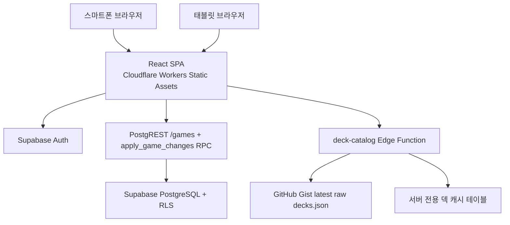

# 3단계 구현 명세 — 로그인 필수 온라인 반응형 웹앱

> 작성일: 2026-08-17
> 상태: **구현 완료** — 3-A·3-B·3-C 완료 (2026-08-18), 3-D·3-E 완료 (2026-08-20), 3-F·3-G·3-H 완료 (2026-08-21)
> 기준 문서: `docs/product-development-roadmap.md` (계획 3 + 25장 P11–P18)
> 이 명세만 읽고 사람 또는 AI 에이전트가 3단계 코드를 작성할 수 있게 한다.
>
> **▶ 3-F 구현 완료 (2026-08-21):** 스마트폰·태블릿 반응형·접근성 보완(§9.1) —
> 하단 내비게이션 전 화면 유지, 48×48 터치 영역, safe-area 반영, 덱 매치업 표 가로
> 스크롤 방지, 토글 스위치·인증 탭 접근성, `theme-color` 동적 갱신, 시스템 테마 전환
> 리스너. 웹은 애니메이션 없음 유지 + `low_spec_mode`/`reduce_motion` 설정 제거,
> 기록 화면 dirty 체크를 baseline 비교로 완전 수정. `npm run build`·`npm run lint`·
> `npm test`(50 tests) 통과.
>
> **▶ 3-G 구현 완료 (2026-08-21):** Cloudflare Static Assets 보안 헤더(CSP·HSTS 등),
> 배포 산출물 server secret 검사, GitHub Actions 웹 CI·수동 배포 workflow, 운영·롤백
> runbook, 인증 서버 장애 재시도 화면, 배포 build ID 표기를 추가했다. `npm run build`·
> `npm run lint`·`npm test`(53 Vitest + 6 Node tests)·secret 검사·Wrangler dry-run 통과.
>
> **▶ 3-H 구현 완료 (2026-08-21):** PWA/TWA를 실제로 구현하지 않는 범위에서 HTTPS·SPA
> routing·정사각형 아이콘 원본·배포 build ID를 준비하고, PWA/TWA 후속 작업을
> `web/PWA_READINESS.md`에 명시했다. 웹 build/lint/test/secret 검사/Wrangler dry-run과
> Python Ruff·format·ty 검사는 통과했다. 전체 Python pytest는 기존 ignored
> `src/mdlogger/remote/_bundled_config.py`가 남아 있어 483 passed/2 failed였으며, 이는
> 사용자 생성 설정을 보존하기 위한 로컬 상태 제약으로 기록한다. 제품 책임자 확인으로
> 3단계 구현 완료로 처리한다.
>
> **▶ 배포 후속 보완 (2026-08-22):** 웹 배포 환경에서 덱 목록 미표시 원인(Edge Function
> CORS/OPTIONS preflight 부재, `invoke` 기본 method POST 차단)을 수정. Edge Functions에
> `corsHeaders` 및 `OPTIONS` preflight 처리를 추가하고, `web`에서 명시적 `GET` 요청 및
> 덱 목록 로드 실패 시 fallback(`["기타"]`) 처리를 적용했다.

이 문서에 나온 모든 결정은 제품 책임자(사용자)와 확정한 값이다. 각 결정의 전후
상태와 이유를 담았으며, 실제 서버 스키마/계약에 근거했다. 알 수 없거나 후속에서
정할 부분은 "확인 필요"로 명시한다.

---

## 1. 확정된 제품 결정 요약 (P11–P18)

| 항목    | 결정                                                                                                                                                                                                         |
| ------- | ------------------------------------------------------------------------------------------------------------------------------------------------------------------------------------------------------------ |
| **P11** | 프런트엔드는 `React + TypeScript + Vite` (SPA).                                                                                                                                                              |
| **P12** | Supabase 공식 브라우저 SDK + PKCE 흐름, **로그인 상태 유지**. 별도 BFF/HttpOnly 쿠키는 두지 않는다.                                                                                                          |
| **P13** | 공식 지원: 최신 Android Chrome 및 최근 주요 버전(스마트폰·태블릿). 데스크톱·노트북 브라우저는 공식 지원 대상이 아니다. Samsung Internet·Firefox·iOS Safari는 "동작 보장 없는 부가 접근". 구버전은 안내 화면. |
| **P14** | 프런트엔드 정적 호스팅: **Cloudflare Workers Static Assets**. 백엔드: **기존 Supabase hosted project 그대로**. 공식 도메인은 **개발 완료 후 확정**.                                                          |
| **P15** | Gist 재검증 TTL **5분**, tab focus 재확인 **O**, 마지막 정상 서버 캐시 허용, Gist에서 삭제된 덱은 다음 성공 갱신부터 새 경기 선택지에서 제거.                                                                |
| **P16** | 데스크톱과 동일 구조: 설정은 **브라우저 `localStorage` 기본 저장** + 사용자가 원할 때만 **수동 업로드/다운로드**(취향 설정만). `DEVICE_KEYS`는 동기화하지 않는다.                                            |
| **P17** | **전체 기능이 MVP**: 기록 생성·수정·삭제, 전체 통계, 계정 데이터 내보내기, 모든 기기 로그아웃, 계정 삭제, 미분류(기존) 기록 수정까지 모두 포함.                                                              |
| **P18** | 브라우저 URL만으로 동작하는 반응형 웹앱. HTTPS·공식 도메인·라우팅·아이콘 원본만 준비. 웹 버전은 배포 build ID/git commit으로 표기(데스크톱 SemVer와 별도). PWA/TWA는 후속 마일스톤.                          |

### 1.1 P16 상세 — 웹 설정 저장·동기화 (데스크톱 P10과 동일 구조)

데스크톱 2단계(§4)와 동일하게, 설정 동기화는 **수동 업로드/다운로드**다(게임
동기화처럼 자동 push/pull이 아니다). 웹은 로컬 DB가 없으므로 저장 위치만 다르다.

| 설정 키                      | 형식  | 기본값      | 저장 위치      | 동기화  |
| ---------------------------- | ----- | ----------- | -------------- | ------- |
| `appearance.theme_mode`      | enum  | `system`    | `localStorage` | ✅ 허용 |
| `appearance.accent_color`    | enum  | `blue`      | `localStorage` | ✅ 허용 |
| `recording.memo_enabled`     | bool  | `true`      | `localStorage` | ✅ 허용 |
| `recording.default_mode`     | enum  | `last_used` | `localStorage` | ✅ 허용 |
| `recording.score_input_mode` | enum  | `delta`     | `localStorage` | ✅ 허용 |
| `appearance.font_scale`      | float | `1.0`       | `localStorage` | 🚫 차단 |

- 동기화 allowlist는 데스크톱과 동일한 `PREFERENCE_KEYS = (theme_mode, accent_color, memo_enabled, default_mode, score_input_mode)`,
  `DEVICE_KEYS = (font_scale)`를 사용한다. 웹은 저사양 모드·애니메이션 감소가 없어
  `low_spec_mode`/`reduce_motion`을 두지 않는다.
- 서버는 기존 `user_settings` 테이블 + `upsert_user_settings` RPC(0025)를 재사용한다.
  데스크톱과 웹이 같은 `PREFERENCE_KEYS`를 수동 동기화하므로 키 충돌이 없다.
- 웹은 `default_mode`를 `localStorage`에 둔다(프로필 DB가 없음). 수동 동기화 대상에는 포함된다.

---

## 2. 아키텍처



- **프런트엔드**: React + TS + Vite SPA. 빌드된 정적 자산을 Cloudflare Workers
  Static Assets로 배포. publishable(anon) key만 포함하고 service-role key는 포함하지 않는다.
- **백엔드**: 기존 Supabase hosted project 그대로. Auth, PostgreSQL+RLS, Edge Functions.
- **덱**: 신규 `deck-catalog` Edge Function이 Gist latest raw를 proxy + 서버 캐시.

### 2.1 프런트엔드 역할

- 로그인·세션 상태 표시, 경기 모드·승패·상세 입력 UI, 서버 요청 전 입력 검증,
  성공 응답 후 저장 완료 표시, 기록 목록·필터, 서버 통계 조회·차트, 설정·계정 작업,
  화면 폭·방향·글자 크기에 따른 레이아웃 변경.

### 2.2 서버 역할

- 인증·세션 검증, 사용자별 경기 소유권 강제(RLS), 경기 생성·수정·삭제 검증,
  점수전·랭크전 규칙 검증, 통계 조회, `deck-catalog` proxy, 계정 내보내기·삭제,
  payload/API 버전 검증. 서버가 데이터의 최종 권위다.

---

## 3. 서버 데이터 계약 (기존 Supabase 재사용)

웹은 데스크톱과 같은 경기 필드·enum 의미를 사용한다(로드맵 17.4). 기존 스키마와
RPC를 재사용하고, 신규는 덱 캐시 테이블과 `deck-catalog` Edge Function뿐이다.

### 3.1 경기 읽기

- PostgREST `GET /rest/v1/games?select=<fields>&order=played_at.desc&limit=&offset=`
  로 RLS가 본인 행만 반환한다. `note` 등 개인 필드는 데스크톱과 동일한 `PRIVATE_GAME_FIELDS`
  목록을 사용한다(로드맵 17.4).
- `deleted_at is null`(tombstone 제외)만 노출한다.

### 3.2 경기 쓰기 (낙관적 동시성)

- 기존 `apply_game_changes` RPC(0023)를 **단일 change**로 호출한다.
    - create: `{op:"create", id:<uuid>, client_version:<build_id>, payload:{...}}`
    - update: `{op:"update", id, expected_change_version:<읽은 값>, client_version, payload}`
    - delete: `{op:"delete", id, expected_change_version:<읽은 값>}`
- `expected_change_version` 불일치 시 RPC가 `conflict`를 반환한다. 웹은 자동 덮어쓰지
  않고 "다른 기기에서 수정됨" 안내 후 최신 내용을 다시 불러온다(로드맵 17.4).
- `client_version`은 웹 배포 build ID/git commit을 전송한다(하드닝 H4/N-1 관례).

### 3.3 `played_at`과 시간대

- `played_at`: 브라우저 로컬 시각의 timezone 없는 ISO 문자열(`YYYY-MM-DDTHH:MM:SS`).
- `timezone_offset_minutes`: 기록 시점의 브라우저 UTC offset.
- 브라우저가 임의 시간대를 추측해 기존 기록을 변환하지 않는다(로드맵 17.5).

### 3.4 설정 동기화

- 기존 `user_settings` + `upsert_user_settings`(0025) 재사용. §1.1의 allowlist 그대로.

### 3.5 계정 운영

- `export_account_data` RPC(0016), `revoke_all_devices`/`revoke_device`(0006/0010),
  계정 삭제는 기존 `account-delete` Edge Function(service_role) 재사용. 웹은
  service-role key를 포함하지 않는다.

### 3.6 덱 제공 (신규 `deck-catalog` Edge Function)

- 브라우저는 Gist를 직접 요청하지 않는다. `deck-catalog`가 proxy한다.
- 서버 전용 캐시 테이블(신규 마이그레이션 `0026_deck_catalog.sql`)에 마지막 정상
  덱 JSON, Gist `ETag`, 마지막 확인/변경 시각, 원본 URL, content hash를 보존한다.
- 캐시 테이블은 RLS로 브라우저 직접 접근을 막고 Edge Function(service_role)만 접근한다.
- 조회 흐름(로드맵 17.6): TTL(5분) 안이면 캐시 반환 → 지났으면 `If-None-Match`로
  재검증 → `304`면 확인 시각 갱신 → 변경 시 배열/크기/문자열 검증 후 원자 교체 →
  Gist 실패 시 마지막 정상 캐시(stale) 반환 → 캐시도 없으면 `503`.
- 공백 제거·중복 제거·`기타` 포함을 보장한다. 웹은 로컬 덱이 없으므로 병합하지 않고
  Edge Function이 반환한 현재 목록을 그대로 사용한다.
- 호출은 로그인 access token을 요구한다(무분별한 proxy 사용 방지).
- 브라우저 Cross-Origin 호출을 위해 `OPTIONS` preflight 및 `corsHeaders`(`Access-Control-Allow-*`)를
  반환하며, `GET`과 `POST` 호출을 모두 수용한다. 클라이언트는 명시적 `GET`으로 호출한다.

---

## 4. 웹 설정 모델

- `WebSettings`(TypeScript): 데스크톱 `AppSettings`와 동일한 키·기본값·검증 규칙을
  `localStorage`에 저장한다(버전 있는 JSON, `schema_version: 1`). 단, 웹은 저사양
  모드·애니메이션 감소가 없어 `low_spec_mode`/`reduce_motion`을 두지 않는다.
- 검증: `font_scale` 0.8~1.5, `accent_color`는 프리셋 id, enum/불리언 손상 시 기본값.
- 수동 동기화: 설정 화면 "계정 및 데이터" 범주에서 업로드/다운로드 버튼.
  `PREFERENCE_KEYS`만 직렬화·전송, `DEVICE_KEYS`는 어떤 경로로도 전송하지 않는다.
- 게스트 없음(로그인 필수)이므로 동기화 버튼은 항상 활성(로그인 상태 전제).

---

## 5. 프런트엔드 구조

### 5.1 프로젝트 기반

- `web/` 디렉터리에 Vite + React + TypeScript 프로젝트.
- `@supabase/supabase-js`(브라우저 SDK), 라우팅 라이브러리(예: React Router),
  차트 라이브러리(경량), 상태 관리(경량, 필요 시).
- 환경 분리: `.env.development`/`.env.preview`/`.env.production`으로 Supabase URL과
  publishable key를 주입. CORS origin은 환경별로 분리.

### 5.2 화면과 내비게이션

핵심 내비게이션은 최대 네 개(로드맵 18.1):

1. **기록** (기본 화면)
2. **통계**
3. **기록 목록**
4. **설정**

- 스마트폰·태블릿: 하단 내비게이션을 일관되게 유지한다. 핵심 항목은 최대 네 개로 제한한다.
- 인증 유효 시 기본 화면은 `기록`. 미로그인 사용자는 경기·통계·설정 URL 접근 시 로그인 화면으로 이동.
- 브라우저 뒤로가기는 웹앱 내부 화면 이력과 일치해야 하며 예기치 않게 로그아웃시키지 않는다.

### 5.3 디자인 토큰

- 데스크톱 `ui/theme.py`의 semantic token(배경/표면/텍스트/accent/성공/위험/경고 등)과
  동일한 의미를 CSS 변수로 재정의한다. 강조색 프리셋(blue/indigo/teal/magenta/amber)과
  라이트/다크 accent hex, `text_on_accent`를 동일하게 사용한다.
- 글자 크기 역할(display/title/section/body/label/caption/numeric)과 배율을 동일하게 적용.

---

## 6. 인증과 계정

- Supabase 브라우저 SDK + PKCE: 이메일/비밀번호 로그인, 회원가입, 이메일 인증,
  비밀번호 재설정, 세션 복구(로그인 유지).
- 로그아웃, 모든 기기 로그아웃(`revoke-sessions` Edge Function), 계정 삭제
  (`account-delete` Edge Function), 계정 데이터 내보내기(`export_account_data`).
- 인증 callback과 잘못된 링크 처리. 세션 만료 시 재인증 안내.

### 6.1 Supabase Auth URL 구성 (배포 전 필수, 코드 외 설정)

이메일 인증·비밀번호 재설정 이메일의 링크는 사용자를 웹앱으로 되돌려보낸다. 이
"되돌아갈 URL"(redirect URL)은 Supabase Auth 서버가 **허용 목록(allowlist)**과
대조해 검증한다. 목록에 없는 URL로는 리다이렉트하지 않는다(오픈 리다이렉트 공격
방지). 따라서 앱 코드가 사용하는 redirect URL을 Supabase 대시보드에 미리 등록해야
이메일 인증·비밀번호 재설정 흐름이 동작한다.

**등록 위치**: Supabase 대시보드 → Authentication → URL Configuration.

| 항목          | 값                                          | 설명                                                     |
| ------------- | ------------------------------------------- | -------------------------------------------------------- |
| Site URL      | 앱 루트 URL (예: `https://app.example.com`) | 기본 리다이렉트 대상. redirectTo를 명시하지 않을 때 사용 |
| Redirect URLs | 아래 경로 포함 (와일드카드 권장)            | 허용된 리다이렉트 대상 목록                              |

앱 코드(`web/src/auth/AuthProvider.tsx`)가 사용하는 redirect URL은
`window.location.origin` 기준으로 동적으로 생성되므로, **배포 도메인에 맞춰** 다음을
등록한다.

- 회원가입 이메일 인증: `<origin>/auth/callback` (예: `https://app.example.com/auth/callback`)
- 비밀번호 재설정: `<origin>/login` (예: `https://app.example.com/login`)

권장 등록 값(와일드카드):

```text
https://app.example.com/**
```

개발 중에는 Vite 개발 서버 origin도 추가한다:

```text
http://localhost:5173/**
```

**등록하지 않으면**: 이메일 인증·비밀번호 재설정 링크를 눌러도 Supabase가
"redirect URL not allowed" 오류를 내고 앱으로 돌아오지 못해, 회원가입 완료와
비밀번호 재설정이 동작하지 않는다.

> 공식 도메인(P14)은 개발 완료 후 확정되므로, 도메인이 정해지면 이 값을 갱신한다.

---

## 7. 핵심 기록 흐름 (데스크톱과 동일 우선순위)

1. 모드 선택 → 승/패 선택 → 상세 입력(덱·선후공·턴·종료·모드별 상태·메모) → 저장.
2. 저장 버튼을 누르면 잠그고 진행 상태 표시 → 서버 검증·저장 → 성공 응답 후 완료 표시.
3. 실패 시 입력값을 화면 메모리에 유지하고 재시도 가능. 새로고침/종료 후까지 보존은 비범위.
4. 저장되지 않은 입력이 있는 상태에서 이탈하면 경고.
5. 마지막 서버 기록 취소/삭제는 `apply_game_changes` delete로 수행.

점수전(경기 전/후 점수), 랭크전(티어/단계 전후), 레이팅(전후) 입력은 데스크톱
`detail_form.py`와 동일한 규칙·프리필(직전 기록)을 따른다.

---

## 8. 기록·통계·설정

### 8.1 기록 목록

- 전체/점수전/랭크전 필터, 페이지네이션 또는 점진적 로딩.
- 넓은 화면은 표, 휴대폰은 카드/상세 화면으로 변환(데스크톱 표를 축소하지 않음).
- 수정·삭제는 낙관적 동시성(`expected_change_version`)으로, 충돌 시 안내.

### 8.2 통계

- 모드별 요약(승/패/승률), 덱 매치업, 점수/랭크/레이팅 시리즈 차트.
- MVP는 서버에서 본인 게임을 조회해 클라이언트 집계(사용자당 수백 건 규모). 대규모
  필요 시 서버 RPC 집계로 확장(후속).

### 8.3 설정

- 데스크톱과 동일 용어: 시스템/밝음/어두움 테마, 강조색 프리셋, 글자 크기,
  메모 사용, 기본 모드, 계정·로그아웃·계정 삭제.
- 변경 즉시 적용(미리보기). 글자 크기 등 재시작/새로고침 필요 항목은 안내.
- "설정 동기화"(수동 업로드/다운로드)와 "설정 초기화"(앱 설정만 기본값, 경기·계정 데이터 불변).

---

## 9. 스마트폰·태블릿 반응형·접근성

- 공식 지원 범위는 스마트폰·태블릿의 최신 Android Chrome과 최근 주요 버전이다.
  데스크톱·노트북 브라우저는 공식 지원·검증 범위에서 제외한다.
- CSS media query(`orientation`, 폭 breakpoint)와 필요 시 container query로 방향·폭 대응.
  기기 모델/user-agent로 방향을 추측하지 않는다(로드맵 18.5).
- 화면 회전/viewport 크기 변경 시 새로고침하지 않고 선택 모드·승패·덱·턴·점수/랭크·메모·스크롤을 유지.
- 터치 영역 최소 48×48 CSS px, 의미 있는 button/input/label/heading, 색상만으로 상태를
  표현하지 않음, 스크린 리더 읽기 순서 일치, 아이콘에 한국어 접근성 이름, 200% 확대/
  큰 글자 대응, 본문 대비 4.5:1 이상, `prefers-reduced-motion` 존중,
  safe-area inset 적용(로드맵 18.7).

### 9.1 3-F에서 반드시 보완·검증할 항목

- 스마트폰·태블릿 모두 하단 내비게이션을 유지한다. 화면 크기·방향에 따라 내비게이션 위치를
  상단 또는 측면으로 바꾸지 않는다.
- 로그인·회원가입·설정·기록 화면의 모든 주요 조작 버튼과 입력 제어는 최소 48×48 CSS px
  터치 영역을 확보한다.
- 고정 하단 내비게이션의 높이와 `safe-area-inset-bottom`을 본문 하단 여백에도 반영한다.
  notch·브라우저 하단 UI·소프트 키보드가 마지막 입력 필드, 목록 항목, 저장 버튼을 가려서는 안 된다.
- 작은/일반 스마트폰과 7~8인치·10인치 이상 태블릿의 세로·가로 viewport에서 가로 스크롤 없이
  핵심 기록 흐름을 완료할 수 있는지 확인한다.
- 키보드 focus 전용 개선과 skip link는 이번 모바일 웹앱의 완료 기준에 포함하지 않는다.

---

## 10. 보안·운영·배포

- HTTPS 강제, CSP·보안 header, XSS·CSRF·open redirect 점검.
- service-role key와 서버 secret을 프런트엔드 번들에 포함하지 않는다(빌드 시 검사).
- RLS 우회 불가 검증, 로그인·저장 rate limit 검토.
- 개인정보 처리방침·계정 삭제 안내, 배포 rollback, 오류 추적 도입 여부(개인정보 검토),
  서버·인증 장애 안내 화면.

---

## 11. 파일 경계

### 신규

| 경로                                               | 내용                                                             |
| -------------------------------------------------- | ---------------------------------------------------------------- |
| `web/`                                             | Vite + React + TS SPA 프로젝트(화면·컴포넌트·설정·동기화·테스트) |
| `supabase/functions/deck-catalog/`                 | Gist proxy + 서버 캐시 Edge Function                             |
| `supabase/migrations/0026_deck_catalog.sql`        | 서버 전용 덱 캐시 테이블 + RLS/권한                              |
| `supabase/tests/database/14_deck_catalog.test.sql` | 덱 캐시 RLS/권한 pgTAP                                           |

### 재사용 (변경 없음)

- `public.games`(0002), `apply_game_changes`(0023), `user_settings`+`upsert_user_settings`(0025),
  `export_account_data`(0016), `revoke_device`/`revoke_all_devices`(0006/0010),
  `account-delete`/`revoke-sessions` Edge Function.

---

## 12. 테스트 계획

- **프런트엔드 단위/컴포넌트**: 설정 모델 검증, 기록 폼 검증, 동시성 충돌 처리, 덱 목록 처리.
- **통합**: Supabase Auth(로그인/세션/재인증), 게임 CRUD(create/update/delete + CAS),
  설정 수동 동기화(allowlist/DEVICE_KEYS 차단), 덱 catalog(TTL/ETag/stale/503).
- **서버(pgTAP)**: 덱 캐시 테이블 RLS 격리, `deck-catalog` 권한.
- **E2E**: 로그인→기록→목록→통계→설정 흐름, 미로그인 접근 차단.
- **스마트폰·태블릿 반응형/접근성**: 테스트 매트릭스(로드맵 20장) — 공식 지원 브라우저·화면 크기·방향·테마·글자·네트워크·계정·동시성·데이터·보안 및 §9.1 보완 항목.
- **회귀**: 데스크톱 push/pull과 웹 직접 수정의 교차 테스트(로드맵 19.4).

---

## 13. 작업 분할 순서 (직렬 단계)

| 단계    | 내용                                                                | 완료 기준                                            | 상태    |
| ------- | ------------------------------------------------------------------- | ---------------------------------------------------- | ------- |
| **3-A** | `web/` 프로젝트 기반(Vite+React+TS, 환경 분리, 라우팅, 디자인 토큰) | 빌드·린트·단위 테스트 통과                           | ✅ 완료 |
| **3-B** | 인증·계정(로그인/인증/재설정/로그아웃/계정 운영)                    | 인증 통합 테스트 통과                                | ✅ 완료 |
| **3-C** | 서버 데이터 계약 + `deck-catalog` + 덱 캐시 마이그레이션            | `supabase test db` 통과                              | ✅ 완료 |
| **3-D** | 핵심 기록 흐름(모드·승패·상세·저장·낙관적 동시성)                   | 기록 CRUD 통합 테스트 통과                           | ✅ 완료 |
| **3-E** | 기록 목록·통계·설정(+수동 동기화)                                   | 기능 테스트 통과                                     | ✅ 완료 |
| **3-F** | 스마트폰·태블릿 반응형·접근성 검증                                  | 매트릭스·§9.1 검증 통과                              | ✅ 완료 |
| **3-G** | 보안·운영·배포(HTTPS/CSP/secret 검사/rollback)                      | 배포 + 보안 점검 통과                                | ✅ 완료 |
| **3-H** | PWA/TWA 후속 준비 확인 + 전체 회귀                                  | 웹 전체 테스트·빌드·배포 검증, 로컬 pytest 제약 기록 | ✅ 완료 |

각 단계는 위 순서(직렬)로 진행한다.

---

## 14. 열린 문제 / 후속 작업

1. **공식 도메인(P14)** — 개발 완료 후 확정. 그 전까지는 Cloudflare Workers Static
   Assets의 기본 서브도메인으로 preview/개발한다.
2. **통계 집계 위치** — MVP는 클라이언트 집계. 사용자 규모가 커지면 서버 RPC 집계로 전환.
3. **오류 추적 도구** — 도입 여부와 개인정보 검토는 배포 단계에서 확정.
4. **`default_mode` 저장 위치** — 웹은 `localStorage`(프로필 DB 없음). 데스크톱과 달리
   기기 간 이동 시 기본 모드가 서버 동기화 전까지 다를 수 있다(수동 동기화로 해소).
5. **PWA/TWA** — 후속 마일스톤. 이번 계획은 HTTPS·도메인·라우팅·아이콘 원본 준비까지만.
