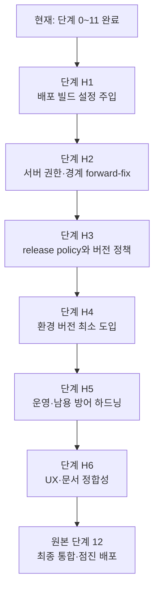

# MDLogger 배포 전 하드닝 로드맵 (단계 12 선행)

- 상태: 단계 H1~H6 **전부 미착수**
- 작성일: 2026-08-09
- 근거: `docs/online-account-and-duel-data-roadmap.md` 단계 0~11 완료 후 수행한 전체 최종 점검
- 대상 프로젝트: MDLogger (`mdlogger`)
- 클라이언트: Python 3.13, PySide6, SQLite
- 기준 백엔드: Supabase Auth + PostgreSQL + Row Level Security
- 선행 문서: `docs/online-account-and-duel-data-roadmap.md` (이하 **원본 로드맵**)
- 후속 문서: 원본 로드맵 `### 단계 12 — 최종 통합·위험 검토·점진 배포`

---

## 1. 문서 목적

원본 로드맵의 단계 0~11은 코드·서버 자산·테스트 수준에서 구현이 끝났고, 프로젝트 필수 품질 게이트(Ruff, format, ty, pytest)도 실제로 통과한다. 그러나 단계 12(최종 통합·점진 배포)에 들어가기 직전에 수행한 전체 교차 점검에서, **단계 12를 수행하는 것 자체를 불가능하게 만드는 구조적 공백**과 **원본 로드맵의 확정 결정을 충족하지 못한 항목**이 발견되었다.

이 문서는 다음을 정의한다.

- 최종 점검에서 발견된 **모든** 문제를 심각도·근거·영향과 함께 기록한다.
- 각 문제에 대해 소유자가 내린 판단(확정 결정)을 기록한다.
- 문제를 해소하기 위한 단계별 작업, 검토 게이트, 완료 조건을 정의한다.
- 이번 릴리스에서 **의도적으로 미루기로 확정한 항목**을 숨기지 않고 명시한다.
- 단계 12 진입 조건을 재정의한다.

이 문서는 원본 로드맵을 대체하지 않는다. 원본 로드맵의 제품 결정, 데이터 계약, 아키텍처 원칙은 계속 유효한 상위 기준이며, 이 문서는 그중 **아직 충족되지 않은 부분**만 다룬다.

### 1.1 AI 에이전트 실행 규칙

이 문서는 전체를 한 번에 구현하라는 단일 작업 지시서가 아니다. AI 에이전트는 다음 규칙을 따라야 한다.

1. 현재 repository와 작업 트리를 먼저 조사하고 사용자 변경을 보존한다.
2. 한 번에 `단계 H1`~`단계 H6` 전체를 구현하지 않는다.
3. 사용자가 명시한 단계 또는 `## 9. 권장 작업 단위`의 한 작업 묶음만 수행한다.
4. 해당 단계의 작업, 검토 게이트, 완료 조건을 모두 작업 범위로 취급한다.
5. 구현 중 새로운 `결정 필요` 항목이 발견되면 임의 기본값으로 처리하지 않고 `## 8. 결정 필요 항목`에 기록해 사용자에게 요청한다.
6. 외부 서비스 자격 증명, Supabase 프로젝트 정보 또는 제품 정책이 없으면 필요한 지점에서 중단하고 사용자에게 요청한다.
7. 스키마나 payload를 변경할 때 migration, rollback/forward-fix, 구버전 호환 테스트를 함께 작성한다.
8. Python 변경 후 `AGENTS.md`의 Ruff, format, ty, 관련 pytest 및 필요한 전체 pytest를 **실제 실행**한다. 실행하지 않은 검사를 통과했다고 보고하지 않는다.
9. 서버 자산(SQL migration, Edge Function)을 변경하면 pgTAP 회귀 테스트를 함께 추가하고, Docker가 없는 환경에서는 실행 불가 사실을 명시해 소유자 환경 검증 대상으로 남긴다.
10. 단계가 끝나면 이 문서에 구현 상태, 실제 파일, 검증 결과, 남은 위험을 갱신한다.
11. 다음 단계로 자동 진행하지 않고 사용자에게 검토 게이트 결과를 보고한다.
12. 이 문서에서 `미루기로 확정`된 항목을 임의로 구현하지 않는다. 필요하다고 판단되면 먼저 사용자에게 재결정을 요청한다.

따라서 새 AI 세션에는 이 문서와 함께 예를 들어 `단계 H2만 구현하고 RH2 결과까지 보고하라`처럼 작업 범위를 지정해야 한다.

### 1.2 원본 로드맵과의 관계

| 구분        | 원본 로드맵                         | 이 문서                              |
| ----------- | ----------------------------------- | ------------------------------------ |
| 역할        | 제품 결정·데이터 계약·아키텍처 기준 | 배포 전 잔여 결함 해소 실행 계획     |
| 단계 번호   | 단계 0~12                           | 단계 H1~H6 (Hardening)               |
| 검토 게이트 | R0~R11, RF                          | RH1~RH6                              |
| 우선순위    | 이 문서와 충돌 시 **원본이 우선**   | 원본의 미충족 항목을 구체화          |
| 진입 조건   | —                                   | 단계 H1~H6 완료 후 원본 단계 12 진입 |

원본 로드맵의 §2(확정된 제품 결정), §6(서버 데이터 경계), §7(데이터 모델), §8(서버 권한과 RLS), §9(동기화 설계), §12(개인정보·품질·남용 방어), §16(의존성 원칙), §17(제품 결정 로그)은 이 문서에서 다시 서술하지 않는다. 필요한 지점에서 조항 번호로 참조한다.

### 1.3 점검 방법과 신뢰 수준

이 문서의 근거는 다음 방식으로 수집했다. 각 문제의 신뢰 수준을 함께 표기한다.

| 방법                                     | 실행 여부               | 신뢰 수준                |
| ---------------------------------------- | ----------------------- | ------------------------ |
| `uv run ruff check .`                    | 실행함                  | 확정                     |
| `uv run ruff format --check .`           | 실행함                  | 확정                     |
| `uv run ty check`                        | 실행함                  | 확정                     |
| `uv run pytest`                          | 실행함                  | 확정                     |
| 클라이언트 소스 정적 분석·심볼 참조 추적 | 실행함                  | 확정                     |
| Supabase SQL/Edge Function 정적 분석     | 실행함                  | 확정(동작 검증은 미실행) |
| `supabase db reset` / `supabase test db` | **미실행**(Docker 없음) | 소유자 환경 검증 필요    |
| Windows PyInstaller 실제 빌드            | **미실행**              | 소유자 환경 검증 필요    |
| hosted Supabase 실제 적용                | **미실행**              | 소유자 환경 검증 필요    |

---

## 2. 점검 시점의 기준선

### 2.1 자동 검증 결과 (실제 실행)

| 명령                           | 결과                                             |
| ------------------------------ | ------------------------------------------------ |
| `uv run ruff check .`          | 통과 — All checks passed                         |
| `uv run ruff format --check .` | 통과 — 75 files already formatted                |
| `uv run ty check`              | 통과 — All checks passed                         |
| `uv run pytest`                | 통과 — **193 passed, 4 skipped** (197 collected) |

skip 4건은 전부 `tests/integration/test_supabase_auth.py`의 환경변수 gate(`MDLOGGER_SUPABASE_URL`/`ANON_KEY`, `MDLOGGER_TEST_EMAIL`/`PASSWORD`)이며 설계된 opt-in 동작이다. collection error 0건.

**따라서 원본 로드맵 §19 완료 정의의 마지막 항목(품질 게이트)은 충족되어 있다.** 이 문서가 다루는 것은 나머지 항목이다.

### 2.2 검증된 강점 (재작업 불필요)

다음은 실제로 견고하며 이 문서의 작업 대상이 아니다. 후속 단계에서 **회귀시키지 않도록** 보존해야 한다.

- **분석 경계**: `analytics.duel_observations`에 note·이메일·표시 이름·직접 auth user ID 컬럼이 구조적으로 존재하지 않는다(`supabase/migrations/0005_analytics_projection.sql:48-92`). 원본 §6.2 금지 항목 0건, §7.4 권장 필드와 32컬럼 일치.
- **`note` 유출 불가**: 등록 projection trigger가 `new.note`를 어디서도 참조하지 않는다(`0005:137-207`). 게스트는 allowlist에서 거부된다(`0008_guest_upsert.sql:86-92`).
- **anon/authenticated → analytics 완전 차단**: schema USAGE 회수(`0005:13-14`), grant 0건, pgTAP 42501 검증(`03_analytics_boundary.test.sql:40-77`).
- **커밋된 시크릿 0건**: working tree와 git history 전체 스캔에서 JWT·service-role key·비밀번호 리터럴 없음. service-role은 전부 `Deno.env.get` 참조.
- **로깅 인프라 부재로 인한 토큰 유출 불가**: `src/mdlogger/`에 `logging`·`warnings`·`traceback` 사용 0건. 모든 예외 메시지가 정적 문자열 또는 HTTP status만 포함.
- **`AuthTokens` repr 제외**: `src/mdlogger/auth/models.py:41-42`의 `field(repr=False)`, 회귀 테스트 존재(`tests/test_account_service.py:79-83`).
- **`games`/`devices` 서버 필드 이중 보호**: BEFORE trigger + 직접 쓰기 권한 회수(`0009:594-595`) + RPC payload allowlist(`0009:104-112, 177-184`).
- **계정 삭제가 분석 관측치 보존**: FK 없음 + `on delete` trigger 없음 → 원본 결정 4·6 충족, pgTAP 검증(`04_guest_ingest.test.sql:174-188`).
- **`prune_guest_ingest_diagnostics`가 `duel_observations` 미접촉**: R11-3 충족(`0010:186-191`).
- **21개 `security definer` 함수 전부 `set search_path = ''`**, 확장 호출 전부 schema-qualified.
- **stdlib `urllib` 기반 HTTP client**: 필수 timeout, TLS 기본 검증, scheme allowlist, 주입 가능 transport — 원본 §16 완전 충족.
- **keyring 실패 경로 전 분기 처리**: 5개 진입점 모두 catch, 로컬 DB 보존, 평문 폴백 거부(`auth/credential_store.py:61-90`).
- **오프라인 저하 동작**: 백엔드 미설정 시 게스트 로컬 기능 전부 정상.
- **pgTAP 7파일 123 assertion**: 각 파일의 `plan(n)`과 실제 assertion 수가 전부 일치.

---

## 3. 발견된 문제 전체 목록

심각도 정의:

| 등급   | 의미                                                                                                             |
| ------ | ---------------------------------------------------------------------------------------------------------------- |
| **P0** | 배포 차단. 이 상태로는 단계 12 작업 항목을 수행하는 것 자체가 불가능하거나, 사용자 데이터·계정 경계에 직접 위험. |
| **P1** | 원본 로드맵의 **확정 결정 또는 완료 조건**을 충족하지 못함. 배포 후 소급 수정이 어렵거나 불가능.                 |
| **P2** | 보안·운영 하드닝. 현재 단일 계층 방어이거나 운영 절차가 불완전.                                                  |
| **P3** | 경미·문서 정합성. 사용자 혼란 또는 유지보수 위험.                                                                |

### 3.1 요약 표

| ID  | 등급   | 문제                                                           | 원본 로드맵 근거             | 해소 단계                   |
| --- | ------ | -------------------------------------------------------------- | ---------------------------- | --------------------------- |
| B1  | **P0** | 패키징 빌드에 백엔드 설정을 주입할 방법이 전무                 | §8.1, §19, 단계 12           | H1                          |
| B2  | **P0** | `next_game_change_version` 권한 회수 불완전 + 소유권 검사 없음 | §8.1, §8.2, §14.6            | H2                          |
| B3  | **P0** | release policy 메커니즘 전면 부재                              | §2.7, §6.1, 결정 14, §17.3.J | H3                          |
| M1  | **P1** | 휴대용 아카이브가 UI에서 도달 불가 (474줄 dead code)           | §2.5, §10.4, R10             | **미루기 확정** → H6 문서화 |
| M2  | **P1** | 플레이 문맥·standing 영구 NULL + 기준정보 테이블 전무          | §2.6, §7.5, §7.6             | H4 (부분)                   |
| M3  | **P1** | 등록 projection이 게스트 철회 마커를 되살림                    | 결정 6, §9.3                 | H2                          |
| H-1 | P2     | RLS 미활성 5개 테이블                                          | §8.1                         | H2                          |
| H-2 | P2     | `public.profiles`가 RPC 경계 미이관, 서버 필드 위조 가능       | §8.2, §7.3                   | H2                          |
| H-3 | P2     | `revoke_all_devices()`가 세션을 폐기하지 않음                  | §5.3, §8.4                   | H5                          |
| H-4 | P2     | 계정 삭제 2단계 비원자성                                       | §12.4, 단계 11               | H5                          |
| H-5 | P2     | guest ingest rate limit·이상 탐지 미구현                       | §12.3, §8.3                  | H5                          |
| H-6 | P2     | Edge Function 계층에 필드 allowlist 없음                       | §8.3                         | H5                          |
| H-7 | P2     | 마이그레이션 재실행 불가·부분 적용 위험                        | §1.1-7, 단계 4 완료 조건     | H5                          |
| H-8 | P2     | `contributor_salt`가 DB별 생성, 백업·rotation 미문서화         | §6.3, 단계 11                | H5                          |
| H-9 | P2     | `account-delete`에 `verify_jwt` 명시 없음                      | §8.4                         | H5                          |
| N-1 | P3     | 버전 드리프트 `0.1.0` vs tag `v0.1.5`, 실제 서버 전송됨        | §2.7, 결정 14                | H3                          |
| N-2 | P3     | `sessions is None`일 때 버튼 3개 무반응                        | §11.3, R6                    | H6                          |
| N-3 | P3     | `supabase/README.md` 마이그레이션 표에 0007~0009 누락          | 단계 4 완료 조건             | H6                          |
| N-4 | P3     | `decks.json` 미번들 → 첫 실행 시 덱 목록 1개 가능              | —                            | H6                          |
| N-5 | P3     | `README.md`가 `.gitignore`된 `.spec` 재사용 안내               | —                            | H6                          |
| N-6 | P3     | 의존성 상한 전무, `pyinstaller` 미고정                         | §16                          | H6                          |
| N-7 | P3     | `score_after` UI 의미 불일치(누적 vs 경기 후)                  | §7.6                         | H6                          |
| N-8 | P3     | §14.4 대량 동기화 매트릭스 미달(205건 < 1,000건)               | §14.4                        | H6                          |
| N-9 | P3     | `open-items.md`·원본 로드맵 상태 표기가 실제보다 낙관적        | §1.1-9                       | H6                          |

---

### 3.2 P0 — 배포 차단

#### B1. 패키징된 빌드에 백엔드 설정을 주입할 방법이 전무

**증상.** `README.md:82`의 PyInstaller 명령으로 만든 `MDLogger.exe`를 사용자가 실행하면 로그인 폼 전체가 비활성화되고 "온라인 계정 설정이 없습니다. 게스트로는 계속 사용할 수 있습니다." 만 표시된다. 로그인·회원가입·게스트 ingest·동기화가 **영구 불가**하다.

**근거.**

- `src/mdlogger/remote/config.py:41-47`이 유일한 설정 진입점이며 환경변수 전용, 기본값 없음:
    ```python
    base_url = os.environ.get(_URL_ENV, "").strip()
    anon_key = os.environ.get(_ANON_KEY_ENV, "").strip()
    if not base_url or not anon_key:
        return None
    ```
- 리포지토리 전체에 다음이 **존재하지 않는다**: `.env` 파일, dotenv 로더, 빌드 타임 상수/생성 모듈, `sys._MEIPASS` 리더(`grep _MEIPASS src/ run.py` → 0 hits), `.spec` 파일(`.gitignore:28`이 `*.spec` 제외), 빌드 스크립트, CI workflow.
- 전파 경로: `config_from_environment()` → `None` → `src/mdlogger/app.py:35-40`에서 `sessions = None` → `src/mdlogger/profile_router.py:126`의 `set_online_available(False)` → `src/mdlogger/ui/account_views.py:264-278`이 email·password·confirm·submit·reset·mode toggle을 전부 `setEnabled(False)`.
- `MDLOGGER_SUPABASE_URL`/`ANON_KEY`는 `README.md`·`AGENTS.md`에 언급이 없고 `docs/operations/runbook.md:17`(소유자용)에만 있다.

**영향.**

- 원본 §19 완료 정의 중 온라인 관련 항목 대부분이 실사용에서 미충족.
- 원본 단계 12의 첫 작업 항목("실제 Windows PyInstaller 빌드에서 인증, secure storage, 네트워크와 worker 종료를 검증한다")을 **수행하는 것 자체가 불가능**.
- `docs/open-items.md` #5는 이를 "검증 미수행"으로 분류했으나, 실제로는 **구현 부재**다. 이 오분류가 문제를 단계 12까지 은폐했다.

**정책 확인.** 원본 §8.1(L572)은 "publishable/anon key는 앱에 포함할 수 있지만 secret/service-role key는 포함하지 않는다"고 명시한다. 따라서 anon key 임베딩은 정책상 **허용**된다. 문제는 정책이 아니라 메커니즘의 부재다.

#### B2. `public.next_game_change_version(uuid)` 권한 회수 불완전 + 소유권 검사 없음

**근거.** `supabase/migrations/0009_stage8_sync.sql:26-49`:

```sql
create or replace function public.next_game_change_version(target_user uuid)
returns bigint language plpgsql security definer set search_path = ''
as $$
begin
    if target_user is null then
        raise exception 'target_user is required' using errcode = '22023';
    end if;
    insert into public.game_change_cursors as cursor_row (user_id, current_version)
    values (target_user, 1)
    on conflict (user_id) do update
    set current_version = cursor_row.current_version + 1
    returning current_version into next_version;
    return next_version;
end;
$$;

revoke all on function public.next_game_change_version(uuid) from public;
```

세 가지가 겹친다.

1. `public` 스키마 + `SECURITY DEFINER` + 스칼라 반환 → PostgREST `POST /rest/v1/rpc/next_game_change_version` 노출 대상.
2. 본문에 **`auth.uid()` 소유권 검사가 전혀 없다.** 가드는 `target_user is not null` 뿐이다.
3. **쓰기 함수**다. 임의 사용자의 cursor를 증가시킨다.

`revoke ... from public`은 암시적 `PUBLIC` 권한만 제거하며, Supabase 부트스트랩의 `ALTER DEFAULT PRIVILEGES IN SCHEMA public GRANT ALL ON FUNCTIONS TO anon, authenticated, service_role`로 부여된 **명시적 role 권한은 제거하지 못한다.**

이 리포지토리는 그 사실을 이미 알고 있다. 9개 객체가 올바른 `from public, anon, authenticated` 형태를 쓴다(`0005:465`, `0006:51`, `0010:65, 96, 129, 153, 209`). 6개만 누락된 **내부 불일치**다.

| 누락 객체                               | 위치                  | RPC 노출               | 위험                              |
| --------------------------------------- | --------------------- | ---------------------- | --------------------------------- |
| `public.next_game_change_version(uuid)` | `0009:49`             | **예**                 | **높음** — 쓰기, 소유권 검사 없음 |
| `public.set_updated_at()`               | `0001:36`             | 아니오(trigger 반환형) | 낮음                              |
| `public.enforce_game_server_fields()`   | `0004:43`, `0009:86`  | 아니오                 | 낮음                              |
| `public.enforce_device_server_fields()` | `0004:75`, `0009:454` | 아니오                 | 낮음                              |

**영향.** 타 사용자의 `current_version`을 임의 증가시켜 pull cursor를 어긋나게 하고, `acknowledge_device_version`(`0009:556-559`)이 해당 장치의 정상 ack를 영구 거부하게 만들 수 있다. 원본 §14.6 "클라이언트가 `change_version`, `created_at`, 소유권 필드를 위조할 수 없음"의 취지 위반이다.

**테스트 공백.** `grep next_game_change_version supabase/tests/` → 0 hits. pgTAP이 이 함수의 접근 불가를 전혀 검증하지 않는다.

**신뢰 수준.** 실제 노출 여부는 인스턴스의 default privileges에 의존하므로 소유자 환경에서 `\df+ public.next_game_change_version` 확인이 필요하다. **다만 확인 결과와 무관하게 revoke 형식은 통일해야 한다.**

#### B3. release policy 메커니즘이 전면 부재

**근거.** `release_polic` / `minimum_supported_version` / `latest_version` / `update_url` / `notice` / `effective_at` / `block_online` / `block_local_writes` / `allow_export` — **리포지토리 전체(원본 로드맵 문서 제외)에서 0 hits.**

그러나 이것은 다음 조항이 요구하는 필수 구성요소다.

- 원본 §6.1(L307): `release_policies`를 예상 서버 테이블로 명시
- 원본 §2.7(L110-118) 전체 — 특히 L114 "최소 지원 버전은 **코드에 고정하지 않고** 서버 release policy에서 변경 가능하게 한다"
- 원본 **확정 결정 14**(L1978)
- 원본 §17.2(L1987-1988) 소유자 운영 값
- 원본 §17.3.J(L2128-2139) 전체
- 원본 **단계 12 작업 항목**: "rollback/forward-fix 기준과 **최소 지원 앱 버전을 확정한다**"

**영향.** 서버는 `sync_schema_version`/`payload_version`을 8곳에서 `1`로 하드핀한다(`0009:128-133, 431-436, 475-480, 536-541`). v2 스키마 전환 시 v1 클라이언트를 우아하게 차단할 수단이 없고, 구버전 사용자는 원인 불명의 오류만 보게 된다. **배포 후 킬 스위치가 없다.**

가장 근접한 기존 자산은 진단용 `client_version` 컬럼(`0002:75`, `0005:82`)뿐이며 아무것도 강제하지 않는다. `register_or_touch_device`가 비어 있지 않은 `client_version`을 요구하지만(`0009:484-486`) 정책과 비교하지 않는다.

---

### 3.3 P1 — 확정 결정 미충족

#### M1. 휴대용 아카이브가 UI에서 완전히 도달 불가

**근거.**

| 심볼                                  | 정의                               | `src/` 내 호출자                          |
| ------------------------------------- | ---------------------------------- | ----------------------------------------- |
| `portable.import_portable_archive`    | `src/mdlogger/portable.py:189`     | **0** (자기 `__all__` 뿐)                 |
| `portable.export_portable_archive`    | `src/mdlogger/portable.py:124`     | `GameService.export_portable_archive` 1건 |
| `GameService.export_portable_archive` | `src/mdlogger/game_service.py:159` | **0** (`find_referencing_symbols` → `{}`) |

`StatsWindow`의 내보내기 행은 CSV/XLSX 두 버튼뿐이다(`src/mdlogger/ui/stats_window.py:132-140`). 앱 전체에 메뉴바·`QAction`·단축키·드래그앤드롭이 존재하지 않으므로 다른 진입 경로도 없다. `portable.py` 474줄 전체가 테스트에서만 실행된다(`tests/test_portable.py` 12 passed).

**영향.**

- 원본 단계 10 검토 게이트 R10 "오프라인 PC → 온라인 PC 흐름이 **실제로 동작하는가**"가 테스트 내부에서만 성립.
- 원본 §2.5, §10.4 미충족.
- `docs/operations/runbook.md:39-40`이 "게스트는 휴대용 아카이브(단계 10)를 사용한다"고 안내하지만 **그 기능에 UI가 없다** → 운영 문서가 수행 불가능한 절차를 기술.
- 원본 §17.3.J의 "이미 존재하는 로컬 DB의 내보내기는 항상 허용해 데이터 탈출 경로를 보장한다"의 완전 왕복 경로가 사용자에게 없다.

**소유자 판단: 이번 릴리스에서 미루기로 확정.** 상세는 §5 참조.

#### M2. 플레이 문맥·standing 필드가 영구 NULL + 기준정보 테이블 전무

원본 로드맵의 핵심 원칙("분석 가능한 정규 데이터")과 직결되는 문제다.

**클라이언트 측 근거.** `src/mdlogger/db.py`의 `_payload`(L62-76), INSERT 컬럼 목록(L116-124), UPDATE set 절(L141-148) 어디에도 문맥 필드가 없다. 입력 폼(`src/mdlogger/ui/detail_form.py:130-151`)이 수집하는 것은 정확히 7개다.

| #   | 키            | 위젯                  | UI 라벨     |
| --- | ------------- | --------------------- | ----------- |
| 1   | `turn_order`  | `SingleSelect`        | 선 / 후공   |
| 2   | `my_deck`     | `SearchableDeckCombo` | 내 덱       |
| 3   | `opp_deck`    | `SearchableDeckCombo` | 상대 덱     |
| 4   | `turns`       | `Stepper`             | 소요 턴     |
| 5   | `end_reason`  | `SingleSelect`        | 종료 방식   |
| 6   | `score_after` | `QLineEdit`           | 점수 (누적) |
| 7   | `note`        | `QLineEdit`           | 메모        |

따라서 `play_context_id`, `standing_kind`, `rank_tier_*`, `rank_division_*`, `rating_*`, `event_points_*` 는 **로컬 컬럼·payload allowlist·sync·guest ingest·portable archive에 전부 배선되어 있으나 값이 절대 채워지지 않는다.** `environment_version_id`/`deck_catalog_version_id`는 클라이언트에 컬럼조차 없다.

**서버 측 근거.** 원본 §7.5(L538-545)의 기준정보 테이블 **6개 전부 부재**다.

| 테이블                  | 존재 |
| ----------------------- | ---- |
| `environment_versions`  | ❌   |
| `play_contexts`         | ❌   |
| `events`                | ❌   |
| `event_stages`          | ❌   |
| `rank_tiers`            | ❌   |
| `deck_catalog_versions` | ❌   |

대신 FK도 CHECK도 없는 자유 `text` 컬럼만 존재하고(`0002:26, 30-31`, `0005:66, 70-71, 78-81`), guest ingest allowlist(`0008:26-27`)가 이들을 통과시켜 `0008:175-178`에서 무검증 insert한다. → **분석 데이터가 미등록 환경 식별자로 오염될 수 있다.**

추가로 **등록 계정 projection은 `event_id`·`event_stage_id`·`environment_version_id`·`deck_catalog_version_id`·`client_version`을 INSERT 컬럼 목록에 아예 넣지 않는다**(`0005:137-159`). 게스트 경로만 채운다(`0008:146-150`). 즉 주 데이터 소스인 등록 계정 관측치는 이 5개 컬럼이 영구 NULL이다.

**영향.** 원본 §2.6("2026년 8월 환경과 2026년 9월 환경의 기록은 집계에서 자동으로 섞이지 않아야 한다")과 §7.6은 현재 코드로 달성 불가능하다. **배포 후 축적되는 데이터는 환경 구분 없이 영구 확정되며, 원본 §7.6의 "기존 기록에 존재하지 않는 환경 정보를 마이그레이션 중 추측하지 않는다" 원칙 때문에 소급 복구도 금지된다.**

**소유자 판단: 최소 구현(환경 버전만) 확정.** 상세는 §4-Q2 참조.

#### M3. 등록 projection이 게스트 철회 마커를 조용히 되살림

**근거.** `supabase/migrations/0005_analytics_projection.sql:187-207`:

```sql
on conflict (source_game_id) do update set
    ...
    payload_version = excluded.payload_version,
    withdrawn_at = null,          -- 가드 없이 무조건 실행
    withdrawal_source = null;
```

게스트 경로는 올바르게 가드한다(`0008:210-211`):

```sql
where analytics.duel_observations.source_kind = 'guest'
  and op = 'upsert'
```

**시나리오.** 게스트가 기록 생성 → ingest → 삭제(withdraw) → 이후 원본 §5.2의 게스트→등록 import 흐름으로 같은 `sync_id`가 등록 계정에 들어옴 → 등록 trigger가 `withdrawn_at`을 NULL로 되돌린다. 또한 `source_kind`/`contributor_key`는 DO UPDATE set에 없어 `'guest'`와 게스트 pseudonym을 유지하므로 **출처 메타데이터가 데이터 내용과 불일치**하게 된다.

`analytics.project_registered_game_timezone()`(`0007:18-20`)도 동일하게 무가드다.

**영향.** 원본 **확정 결정 6**("개인 듀얼 기록 삭제용 private tombstone과 분석 withdrawal marker를 무기한 보존한다") 및 §9.3 위반 소지. 사용자가 명시적으로 철회한 관측치가 분석 dataset에 재진입한다.

---

### 3.4 P2 — 보안·운영 하드닝

| ID      | 문제                                                                                                                                                                               | 근거                                         | 비고                                                                                                                                                                                                                                                                                                                  |
| ------- | ---------------------------------------------------------------------------------------------------------------------------------------------------------------------------------- | -------------------------------------------- | --------------------------------------------------------------------------------------------------------------------------------------------------------------------------------------------------------------------------------------------------------------------------------------------------------------------- |
| **H-1** | RLS 미활성 5개 테이블: `analytics.contributor_salt`, `analytics.duel_observations`, `analytics.ingestion_batches`, `analytics.rejected_observations`, `public.game_change_cursors` | `0005:18, 48, 94, 113`, `0009:11`            | 현재는 grant 회수만으로 방어(단일 계층). `public.game_change_cursors`는 `public` 스키마라 Supabase linter `rls_disabled_in_public` 대상. 향후 실수로 grant 하나만 추가되면 무제한 접근.                                                                                                                               |
| **H-2** | `public.profiles`가 stage-8 RPC 경계로 미이관. `grant select, insert, update`(`0001:21`) 유지 + BEFORE **INSERT** 트리거 없음(`0001:38`은 `before update`)                         | `0009:594-595`가 games/devices만 회수        | 자기 행의 `created_at`/`updated_at` 위조 가능(교차 테넌트 문제는 아님 — `0003_rls.sql:17`의 `with check`가 `id = auth.uid()` 강제). `0009:593` 주석과 `supabase/README.md:29-30`의 주장이 실제와 불일치.                                                                                                              |
| **H-3** | `revoke_all_devices()`가 세션을 폐기하지 않음. `delete from public.devices`만 수행                                                                                                 | `0010:132-151`                               | 원본 §8.4 "모든 세션 폐기" 미충족. 해제된 장치는 JWT 만료까지 계속 동기화하고 이후 자유롭게 재등록(`07_account_operations.test.sql:109-119`가 재등록을 실증). 실제 폐기는 Auth Admin API 필요.                                                                                                                        |
| **H-4** | 계정 삭제 2단계 비원자성                                                                                                                                                           | `functions/account-delete/index.ts:91-119`   | 개인 데이터 삭제 커밋 후 auth 삭제 실패 시 복구 불가(코드가 `:118-119`에서 인지하고 500 반환). 사용자는 데이터가 사라진 빈 계정으로 다시 로그인 가능. 순서를 뒤집으면 FK cascade(`0001:8`, `0002:9, 72`)로 안전해진다. 또한 `delete_account_data`는 `public.game_change_cursors`를 삭제하지 않는다(cascade에만 의존). |
| **H-5** | guest ingest rate limit·이상 탐지 미구현                                                                                                                                           | `functions/guest-ingest/index.ts:45-50`      | `checkAbuseGuards`가 무조건 `{ allowed: true, challengeRequired: false }` 반환. 원본 §12.3 방어 계층 1(IP·installation rate limit)과 4(이상 빈도·불가능 값 탐지)가 부재. **결정 12는 Turnstile만 연기했고 rate limit은 1차 방어로 명시**되어 있다. 구현된 것은 방어 2·3·5·6·7.                                        |
| **H-6** | Edge Function 계층에 필드 allowlist 없음                                                                                                                                           | `functions/guest-ingest/index.ts:52-79, 128` | `validateShape`는 봉투 형식(batch_id UUID, installation_id UUID, payload_version, 배열 크기 1~200)만 검증하고 observations를 그대로 전달. DB 계층만 방어 → 심층 방어 부재. 원본 §8.3은 "payload schema에서 거부"를 요구.                                                                                              |
| **H-7** | 마이그레이션 재실행 불가·부분 적용 위험                                                                                                                                            | 전 마이그레이션                              | `if not exists`가 `0001:5`뿐. `0005:23-24`가 스키마 마이그레이션 안에서 1회성 데이터 insert 수행. `0009:23-24`의 unique index 생성이 실패하면 `game_change_cursors` 생성·seed 이후에 중단되어 부분 적용 상태로 남고, 재시도는 `0009:11`에서 실패. 전체 migration set에 `drop` 문 0건.                                 |
| **H-8** | `contributor_salt`가 DB별 생성                                                                                                                                                     | `0005:23-24`                                 | `db reset`·환경 재구축·다른 프로젝트로 복원 시 salt가 재생성되어 `contributor_key` 비교가 불가능해진다(종단 분석 단절). 이를 탐지할 version marker가 없고, 백업 문서·`export_account_data` 경로에 포함되지 않는다.                                                                                                    |
| **H-9** | `account-delete`에 `verify_jwt` 명시 없음                                                                                                                                          | `supabase/config.toml`                       | `guest-ingest`는 명시(`config.toml:7-10`). `account-delete`는 CLI 기본 `verify_jwt = true`에 암묵 의존한다. 함수 자체는 서명 검증 없이 JWT payload를 base64 디코드하고(`account-delete/index.ts:56-76`) 게이트웨이 검증을 신뢰한다(`:24-25` 주석). **파괴적 엔드포인트**이므로 기본값 의존은 부적절.                  |

### 3.5 P3 — 경미·문서 정합성

| ID      | 문제                                                                                                                                                                                                                                                                                                                               | 근거 |
| ------- | ---------------------------------------------------------------------------------------------------------------------------------------------------------------------------------------------------------------------------------------------------------------------------------------------------------------------------------- | ---- |
| **N-1** | 버전 드리프트: `__version__ = "0.1.0"`(`src/mdlogger/__init__.py:3`, `pyproject.toml:3`) vs git tag `v0.1.5`. 이 값은 **실제로 서버에 전송된다** — guest ingest payload(`remote/guest_ingest.py:142, 168`), 장치 등록(`game_sync/engine.py:208`), 아카이브 manifest(`portable.py:152`). 두 곳에 정적 중복이라 드리프트가 계속 발생 |
| **N-2** | `sessions is None`일 때 무반응 버튼 3개: "장치 관리"(`profile_router.py:687-689`), "모든 기기에서 로그아웃"(`:659-661`), "계정 삭제"(`:714-716`)가 피드백 없이 `return`. **오프라인 복원된 등록 프로필**(`:424-432`)에서 실제 도달 가능. "내 데이터 내보내기"(`:602-606`)만 안내 메시지 표시 → 일관성 결여                         |
| **N-3** | `supabase/README.md:11-20` 마이그레이션 표에 `0007`·`0008`·`0009` 누락. 특히 `0009`(595줄)는 RPC 전용 쓰기 경계 전체를 도입한 가장 보안 중요한 마이그레이션인데 README만 보면 존재를 알 수 없음                                                                                                                                    |
| **N-4** | `decks.json` 미번들: `BASE_DIR / "decks.json"`(`paths.py:88-92`)이 frozen 빌드에서 exe 디렉터리를 가리킴(`paths.py:22-26`) → 첫 실행 시 하드코딩된 Gist(`paths.py:56-59`)에 도달 불가하면 덱 목록이 `["기타"]` 하나뿐                                                                                                              |
| **N-5** | `README.md:88`이 `MDLogger.spec` 재사용을 안내하지만 `.gitignore:28`이 `*.spec` 제외 → 공유 불가능한 recipe                                                                                                                                                                                                                        |
| **N-6** | 의존성 상한 전무(`PySide6>=6.8`, `pyqtgraph>=0.13`, `numpy>=1.26`, `openpyxl>=3.1`, `keyring>=25.0`). `numpy>=1.26`은 NumPy 1→2 ABI 경계를 걸침(lock은 2.4.6). dev의 `pyinstaller>=6.10` 미고정 — keyring 번들링 정확성이 PyInstaller 내장 `hook-keyring.py`에 의존                                                                |
| **N-7** | `score_after` 의미 불일치: 폼·차트는 "점수 (누적)"(`detail_form.py:85`, `stats_window.py:99`), ConflictDialog는 "경기 후 점수"(`account_views.py:508`)                                                                                                                                                                             |
| **N-8** | 원본 §14.4 매트릭스 "오프라인에서 1,000건 생성"에 대해 실제 테스트는 205건(단계 8 기록)                                                                                                                                                                                                                                            |
| **N-9** | `docs/open-items.md`가 8개 항목만 추적하며 B1·B3·M2·H-1~~H-9를 누락. 원본 로드맵 L3 상태 줄("단계 0~~11 구현 완료")이 실제보다 낙관적                                                                                                                                                                                              |

### 3.6 점검 과정에서 정정된 오판

투명성을 위해 기록한다. 보조 조사에서 다음 오류가 있었고 직접 확인해 정정했다.

| 오판                                                   | 실제                                                                                                                                                                          |
| ------------------------------------------------------ | ----------------------------------------------------------------------------------------------------------------------------------------------------------------------------- |
| "`__version__`은 서버로 전송되지 않는다"               | **전송된다.** `remote/guest_ingest.py:142`, `game_sync/engine.py:208`, `portable.py:152`. 따라서 N-1은 단순 표기 문제가 아니라 **잘못된 값이 실제로 서버에 기록되는 문제**다. |
| "keyring이 PyInstaller hidden-import 문제를 일으킬 것" | PyInstaller 6.21.0에 내장 `hook-keyring.py`가 있어 자동 처리된다. 단 `pyinstaller>=6.10` 미고정이므로 N-6으로 남긴다.                                                         |

---

## 4. 확정된 결정

이 절의 결정은 소유자가 최종 점검 결과를 검토한 뒤 확정한 것이다. 원본 §17.1 결정 로그와 동일한 구속력을 가진다.

| 번호    | 결정                                                                                                                                                                                                                                                                                                                         | 대상 문제 |
| ------- | ---------------------------------------------------------------------------------------------------------------------------------------------------------------------------------------------------------------------------------------------------------------------------------------------------------------------------- | --------- |
| **H-1** | 배포 빌드는 **빌드 시 생성되는 모듈을 PyInstaller가 번들**하는 방식으로 Supabase URL과 publishable(anon) key를 포함한다. 원본 §8.1에 따라 anon key 포함은 허용되며, service-role/secret key는 어떤 경로로도 포함하지 않는다.                                                                                                 | B1        |
| **H-2** | 플레이 문맥 체계는 **최소 구현**한다. `environment_version_id`만 서버 기준정보로 관리하고 클라이언트가 신규 기록에 현재 환경 ID를 부여해 **월별 환경 혼합을 방지**한다. `play_contexts`, `events`, `event_stages`, `rank_tiers`, `deck_catalog_versions`와 rank/rating/event_points 입력 UI는 이번 릴리스 범위에서 제외한다. | M2        |
| **H-3** | 휴대용 아카이브 UI 배선은 **이번 릴리스에서 미룬다.** 대신 미배선 사실을 원본 로드맵 단계 10 기록, `docs/open-items.md`, `docs/operations/runbook.md`에 명시하고, runbook의 수행 불가능한 안내 문구를 수정한다.                                                                                                              | M1        |

### 4.1 결정 H-1 배경과 구현 기준

**선택지 비교.**

| 방식                       | 장점                                | 단점                                              | 채택        |
| -------------------------- | ----------------------------------- | ------------------------------------------------- | ----------- |
| (a) 빌드 시 생성 모듈 번들 | 사용자 조작 불필요, exe 하나로 완결 | 키가 exe에 포함(§8.1상 허용), 교체 시 재배포 필요 | **✅ 채택** |
| (b) exe 옆 설정 파일       | 재배포 없이 교체 가능               | 파일 분실·삭제 시 동작 불가, 배포 단순성 상실     | 미채택      |
| (c) 오프라인 전용 출시     | 즉시 출시 가능                      | 단계 4~11 전체가 사용자에게 도달하지 않음         | 미채택      |

**구현 기준.**

- 설정 우선순위: **환경변수 > 번들 빌드 설정 > 없음(오프라인)**. 개발·테스트에서 환경변수로 덮어쓸 수 있어야 한다.
- 생성 모듈은 리포지토리에 **커밋하지 않는다.** `.gitignore`에 추가한다.
- 모듈이 없을 때(개발 환경, 소스 실행)도 import 실패로 앱이 죽지 않아야 한다.
- 생성 모듈에 service-role key·비밀번호·refresh token이 들어가지 못하도록 **자동 검사**를 둔다.
- 빌드 산출물에 대한 시크릿 스캔을 릴리스 절차에 포함한다(기존 `src/mdlogger/checksum.py` 옆에 배치 가능).
- 사용자 문서(`README.md`)에는 환경변수 설정 요구사항을 넣지 않는다. 소유자 빌드 절차만 `docs/operations/runbook.md`에 기록한다.

### 4.2 결정 H-2 배경과 구현 기준

**범위 포함.**

- 서버: `public.environment_versions` 기준정보 테이블(불변 ID, 표시 이름, `effective_from`, `effective_to`). RLS 활성 + 읽기 전용 노출.
- 서버: `public.games`에 `environment_version_id` 추가.
- 서버: 등록 projection INSERT 목록에 `environment_version_id`와 `client_version` 추가(현재 누락, M2 근거 참조).
- 서버: guest ingest가 미등록 `environment_version_id`를 거부하도록 검증 추가.
- 클라이언트: 로컬 schema v5에 `games.environment_version_id` 추가.
- 클라이언트: 현재 환경 ID를 캐시하고 **신규 기록에만** 부여.

**범위 제외(이번 릴리스).**

- `play_contexts`, `events`, `event_stages`, `rank_tiers`, `deck_catalog_versions` 테이블
- rank tier/division, rating, event points 입력 UI와 `standing_kind` 채우기
- `deck_catalog_version_id` 부여

**불변 원칙(원본 §7.6 준수).**

- 기존 기록의 `environment_version_id`를 **추측해서 채우지 않는다.** NULL로 유지한다.
- 오프라인이라 현재 환경 ID를 알 수 없으면 **NULL로 두고 나중에 소급 부여하지 않는다.** 잘못된 환경 부여가 NULL보다 나쁘다.
- 이미 사용된 환경 version의 의미를 나중에 덮어쓰지 않는다.

### 4.3 결정 H-3 배경

`portable.py`의 writer/reader/검증/중복 방지/provenance/outbox 등록은 이미 구현·테스트되어 있고(`tests/test_portable.py` 12 passed), 남은 것은 UI 진입점뿐이다. 이는 배포 차단 사유가 아니며 다음 릴리스에서 저위험으로 추가할 수 있다.

**다만 다음을 반드시 이행한다.**

- 원본 로드맵 단계 10 구현 기록에 "UI 미배선 = 미완료" 를 명시하고 R10의 "오프라인 PC → 온라인 PC 흐름" 검증이 **테스트 범위 한정**임을 기록한다.
- `docs/open-items.md`에 정식 항목으로 유지한다.
- `docs/operations/runbook.md:39-40`의 "게스트는 휴대용 아카이브를 사용한다"를 **현 릴리스에서 사용 불가**로 수정하고 대체 절차(CSV/XLSX 내보내기)를 안내한다.
- 이번 릴리스 사용자에게 데이터 탈출 경로로 CSV/XLSX가 있음을 확인한다(원본 §17.3.J의 `allow_export` 취지).

---

## 5. 비목표와 이번 릴리스 범위 제한

이 문서의 작업에서 다음은 구현하지 않는다. 원본 §3의 비목표에 추가된다.

- 휴대용 아카이브 내보내기·가져오기 UI (결정 H-3)
- `play_contexts`·`events`·`event_stages`·`rank_tiers`·`deck_catalog_versions` 기준정보 테이블 (결정 H-2)
- rank tier/division, rating, event points 입력 UI (결정 H-2)
- `deck_catalog_version_id` 부여 (결정 H-2)
- Turnstile/CAPTCHA 실제 검증 (원본 결정 12 — 남용 관찰 후)
- tombstone 물리 정리와 비활성 장치 제거 (원본 §17.3.C — 데이터 규모 문제 발생 후)
- 도메인 DTO 도입 (`sqlite3.Row` 유지)
- 앱 내부 분석 대시보드
- hosted staging 프로젝트 추가 (원본 결정 11)

이 항목들은 **누락이 아니라 확정된 범위 제한**이다. AI 에이전트는 §1.1-12에 따라 이를 임의로 구현하지 않는다.

---

## 6. 구현 로드맵

각 단계는 구현, 자동 검증, 검토 게이트를 함께 완료해야 다음 단계로 넘어간다.



단계 H1과 H2는 서로 독립적이므로 순서를 바꿔도 된다. H3은 H1(설정 주입)에 의존하고, H4는 H3(정책 전달 경로)에 의존한다.

---

### 단계 H1 — 배포 빌드 설정 주입

해소 대상: **B1**

작업:

- `remote/config.py`의 설정 해석을 **환경변수 > 번들 빌드 설정 > None** 우선순위로 확장한다. 기존 `config_from_environment()`의 동작과 반환 계약(`RemoteConfig | None`)은 보존한다.
- 번들 빌드 설정 모듈을 정의한다. 생성 모듈이 없을 때 `ImportError`를 흡수해 오프라인 동작으로 폴백한다.
- 빌드 시 소유자 값으로 해당 모듈을 생성하는 스크립트를 추가한다. 스크립트는 값이 비어 있으면 실패해야 한다.
- 생성 모듈을 `.gitignore`에 추가하고 커밋되지 않음을 테스트로 강제한다.
- 생성 모듈에 service-role key 패턴·JWT 리터럴·비밀번호 필드가 들어가면 빌드가 실패하도록 검사한다.
- 빌드 산출물 시크릿 스캔 절차를 추가한다.
- `docs/operations/runbook.md`에 소유자 빌드 절차(값 주입 → 빌드 → 스캔 → checksum)를 기록한다.
- `README.md`는 사용자 관점을 유지하고 환경변수 요구사항을 추가하지 않는다.

검토 게이트 RH1:

- 환경변수가 설정된 개발 환경에서 기존 동작이 그대로 유지되는가
- 번들 설정만 있는 경우 로그인·게스트 ingest가 활성화되는가
- 둘 다 없으면 기존과 동일하게 오프라인 게스트 동작으로 폴백하는가
- 환경변수가 번들 설정을 덮어쓰는가
- 생성 모듈이 리포지토리에 커밋될 수 없는가
- 빌드 산출물에 service-role key·JWT·비밀번호가 없는가
- 소스 실행(`uv run mdlogger`)이 생성 모듈 없이 정상 동작하는가

완료 조건:

- 세 가지 설정 상태(환경변수 / 번들 / 없음)에 대한 자동 테스트 통과
- 시크릿 미포함 검사가 자동화됨
- 소유자 빌드 절차가 문서화됨
- Ruff, format, ty, 관련 pytest, 전체 pytest 실제 통과

남은 위험(단계 12로 이월):

- 실제 Windows PyInstaller 빌드에서의 동작 확인은 소유자 환경 필요

---

### 단계 H2 — 서버 권한·경계 forward-fix

해소 대상: **B2, M3, H-1, H-2**

원본 `supabase/README.md`의 forward-fix 정책에 따라 기존 마이그레이션을 수정하지 않고 새 마이그레이션 `0011_*.sql`로 처리한다.

작업:

- **B2**: `public.next_game_change_version(uuid)`의 권한을 `from public, anon, authenticated`로 회수한다. 같은 이유로 `public.set_updated_at()`, `public.enforce_game_server_fields()`, `public.enforce_device_server_fields()`도 형식을 통일한다.
- **B2**: 위 4개 함수가 `anon`·`authenticated`에서 42501로 거부되는지 pgTAP으로 검증한다(현재 테스트 0건).
- **M3**: `analytics.project_registered_game()`과 `analytics.project_registered_game_timezone()`의 `on conflict do update`에 가드를 추가해 **다른 출처의 withdrawal marker를 조용히 지우지 않게** 한다. 구체적 정책은 `## 8. 결정 필요 항목` D-1 확정 후 구현한다.
- **H-1**: `analytics.contributor_salt`, `analytics.duel_observations`, `analytics.ingestion_batches`, `analytics.rejected_observations`, `public.game_change_cursors`에 RLS를 활성화한다. 정책을 만들지 않아 기본 거부 상태로 두고, 테이블 소유자로 실행되는 `security definer` 함수가 계속 동작하는지 확인한다.
- **H-2**: `public.profiles`의 서버 필드를 강제한다. `BEFORE INSERT OR UPDATE` 트리거로 `id = auth.uid()`, `created_at`, `updated_at`을 서버 값으로 고정한다. 구체적 방식은 D-2 확정 후 구현한다.
- `supabase/README.md`의 마이그레이션 표와 보안 모델 설명을 실제와 일치시킨다(N-3과 함께 처리 가능).

검토 게이트 RH2:

- `anon`과 `authenticated`가 `next_game_change_version`을 호출할 수 없는가
- 타 사용자의 `change_version` cursor를 조작할 수 없는가
- 게스트가 철회한 observation이 등록 경로 upsert로 되살아나지 않는가
- 등록 경로가 게스트 관측치를 인수할 때 출처 메타데이터가 일관되는가
- RLS 활성화 후 등록 projection·guest ingest·계정 삭제·진단 정리가 모두 정상 동작하는가
- `profiles`의 `created_at`/`updated_at`을 클라이언트가 위조할 수 없는가
- 기존 단계 4~11의 pgTAP 123 assertion이 전부 유지되는가

완료 조건:

- `supabase db reset`으로 `0001`~`0011` 적용 성공 (**소유자 환경**)
- `supabase test db` 전체 통과, B2·M3·H-1·H-2 각각에 대한 신규 assertion 추가 (**소유자 환경**)
- forward-fix와 rollback 절차가 `supabase/README.md`에 기록됨
- 클라이언트 측 회귀 없음(전체 pytest 통과)

---

### 단계 H3 — release policy와 클라이언트 버전 정책

해소 대상: **B3, N-1**

작업:

- 서버에 `public.release_policies`를 추가한다. 원본 §2.7이 요구하는 필드를 포함한다: 플랫폼, `latest_version`, `minimum_supported_version`, `update_url`, `notice`, `effective_at`, 호환 `payload_version`/`sync_schema_version` 범위, `block_online`·`block_local_writes`·`allow_export` flag.
- RLS를 활성화하고 정책 조회 경로를 정의한다(공개 읽기 또는 RPC — D-3 확정 후).
- 클라이언트에 정책 조회·해석 계층을 추가한다. 온라인 시작 시 조회하고 마지막 정책을 로컬에 캐시한다.
- 원본 §17.3.J의 강제 업데이트 동작을 구현한다:
    - 최소 지원 미만 → 온라인 로그인·업로드·pull 차단 + 업데이트 안내
    - 최소 지원 이상, 최신 미만 → 공지만, 설치는 사용자 선택
    - **내보내기는 항상 허용** (데이터 탈출 경로 보장)
    - 구버전의 pending 기록은 삭제하지 않고 업데이트 후 전송
    - 오프라인에서는 마지막으로 받은 정책만 사용
- **N-1**: 버전 단일 출처화. `pyproject.toml`과 `src/mdlogger/__init__.py`의 중복을 제거하고(hatchling dynamic version 등), 실제 릴리스 태그와 일치시킨다.
- 로컬 개발용 seed 정책 값을 제공하되, production 값은 원본 §17.2에 따라 소유자 운영 값으로 남긴다.

검토 게이트 RH3:

- 최소 지원 미만 클라이언트의 온라인 작업이 차단되는가
- 차단 상태에서도 로컬 기록과 내보내기가 동작하는가
- 오프라인 클라이언트가 마지막 캐시 정책으로 안전하게 동작하는가
- 정책 조회 실패가 앱 시작을 막지 않는가
- 서버로 전송되는 `client_version`이 실제 릴리스 버전과 일치하는가
- 정책 테이블이 RLS로 보호되며 클라이언트가 수정할 수 없는가
- 구버전의 pending 기록이 정책 차단 중에도 보존되는가

완료 조건:

- 정책 미달/일치/최신 세 가지 상태에 대한 자동 테스트 통과
- `supabase test db`에 정책 테이블 권한·위조 방지 assertion 추가 (**소유자 환경**)
- 버전 문자열이 단일 출처에서 유래하고 전송 경로 3곳이 모두 일치
- 소유자가 정책 값을 갱신하는 절차가 `docs/operations/runbook.md`에 기록됨

---

### 단계 H4 — 환경 버전 최소 도입

해소 대상: **M2 (결정 H-2 범위 한정)**

작업:

- 서버에 `public.environment_versions` 기준정보 테이블을 추가한다. 불변 ID, 표시 이름, `effective_from`, `effective_to`를 포함한다. RLS 활성 + 읽기 전용 노출.
- `public.games`에 `environment_version_id`를 추가하고 기준정보를 참조하도록 검증한다.
- **등록 projection의 누락 컬럼을 수정한다.** `0005:137-159`의 INSERT 목록에 `environment_version_id`와 `client_version`을 추가한다.
- guest ingest가 미등록 `environment_version_id`를 거부하도록 검증을 추가한다(현재 무검증 통과).
- 로컬 schema v5에 `games.environment_version_id`를 비파괴 추가한다. 기존 행은 **NULL 유지**.
- 클라이언트가 현재 환경 ID를 조회·캐시하고 **신규 기록에만** 부여한다. 알 수 없으면 NULL.
- `db._payload`·INSERT·UPDATE 경로, payload allowlist(`remote/games.py`, `remote/guest_ingest.py`), `guest_import.py`, `portable.py`에 필드를 일관되게 배선한다.
- 로컬 개발용 seed 환경 값을 제공하되 production 값은 소유자 운영 값으로 남긴다.

검토 게이트 RH4:

- 기존 기록의 `environment_version_id`가 추측 없이 NULL로 유지되는가
- 현재 환경을 알 수 없는 오프라인 신규 기록이 NULL로 저장되고 나중에 소급 부여되지 않는가
- 서로 다른 환경의 기록이 집계에서 자동으로 섞이지 않는 구조인가
- 미등록 환경 ID가 분석 dataset에 들어가지 못하는가
- 등록 계정 관측치에 `environment_version_id`와 `client_version`이 실제로 채워지는가
- 게스트와 등록 두 경로가 같은 의미의 값을 만드는가
- 이미 사용된 환경 version의 의미를 나중에 덮어쓸 수 없는 구조인가
- 로컬 migration v4 → v5가 비파괴이고 재실행 시 idempotent한가

완료 조건:

- 빈 DB, 현재 DB, 구버전 fixture 전부 v5로 상승하고 기존 값 보존
- 신규 기록 stamping과 기존 기록 NULL 유지에 대한 자동 테스트 통과
- `supabase test db`에 기준정보 검증·거부 assertion 추가 (**소유자 환경**)
- 범위 제외 항목(§5)이 문서에 명시된 상태로 유지됨

남은 위험:

- `play_contexts`, `events`, `event_stages`, `rank_tiers`, `deck_catalog_versions`와 standing 입력 UI는 여전히 미구현이다. 이번 릴리스 데이터는 **환경 구분은 되지만 랭크/레이팅/대회 문맥은 없다.** 이 사실을 원본 로드맵 §7.5 기준으로 명시해야 한다.

---

### 단계 H5 — 운영·남용 방어 하드닝

해소 대상: **H-3, H-4, H-5, H-6, H-7, H-8, H-9**

작업:

- **H-3**: 모든 장치 로그아웃이 실제 세션을 폐기하도록 한다. Auth Admin API 경로가 필요하므로 `account-delete`와 동일한 Edge Function 패턴을 사용한다. 구현이 어려우면 현재 동작(장치 행 삭제만)의 한계를 UI 문구와 runbook에 명시한다.
- **H-4**: 계정 삭제를 auth 사용자 삭제 우선 순서로 재구성해 FK cascade가 개인 데이터를 정리하게 한다. 부분 실패 시 복구 가능 상태를 보장한다. `delete_account_data`가 `game_change_cursors`도 처리하도록 한다.
- **H-5**: guest ingest에 installation pseudonym·IP 단기 rate limit과 기본 이상 탐지를 구현한다. 원본 §12.3 방어 1·4. 임계값은 D-4 확정 후 적용한다. Turnstile은 여전히 범위 제외.
- **H-6**: Edge Function 계층에도 observation 필드 allowlist를 적용해 심층 방어를 만든다. DB 계층 검증은 유지한다.
- **H-7**: 마이그레이션 재실행·부분 적용 안전성을 개선한다. `contributor_salt` 같은 1회성 데이터 부작용을 idempotent하게 만들고, 중단 지점에서 재개 가능한 절차를 `supabase/README.md`에 기록한다.
- **H-8**: `contributor_salt`의 백업·복원·rotation 절차를 문서화하고, 재생성 시 종단 분석이 단절됨을 명시한다. 필요 시 salt version marker 도입을 검토한다.
- **H-9**: `supabase/config.toml`에 `account-delete`의 `verify_jwt`를 명시한다.

검토 게이트 RH5:

- 모든 장치 로그아웃 후 기존 세션으로 동기화가 불가능한가 (또는 한계가 명시되었는가)
- 계정 삭제가 중간 실패해도 복구 가능한 상태로 남는가
- 계정 삭제 후 분석 observation이 계속 보존되는가 (원본 결정 4·6 회귀 없음)
- 비정상적으로 많은 guest ingest 요청이 차단되는가
- 정상 사용자가 rate limit이나 CAPTCHA를 만나지 않는가 (원본 결정 12)
- Edge Function이 허용되지 않은 필드를 DB에 도달하기 전에 거부하는가
- 마이그레이션 중단 후 안전하게 재개할 수 있는가
- `contributor_salt` 재생성 영향이 문서화되었는가

완료 조건:

- `supabase test db` 전체 통과 및 신규 assertion 추가 (**소유자 환경**)
- Edge Function 로컬 검증 통과 (**소유자 환경**, `supabase/README.md`의 SELinux 절차 준수)
- 백업·복구 rehearsal 수행 (**소유자 환경**)
- 운영 runbook이 실제 구현과 일치

---

### 단계 H6 — UX·문서 정합성과 잔여 항목

해소 대상: **N-2 ~ N-9, M1 문서화(결정 H-3)**

작업:

- **N-2**: `sessions is None`일 때 "장치 관리"·"모든 기기에서 로그아웃"·"계정 삭제"가 무반응하지 않도록 안내 메시지를 표시한다. "내 데이터 내보내기"(`profile_router.py:602-606`)와 동일한 패턴을 적용한다.
- **N-3**: `supabase/README.md`의 마이그레이션 표에 `0007`·`0008`·`0009`·`0011`을 추가하고 보안 모델 설명을 실제와 일치시킨다.
- **N-4**: `decks.json` 번들 여부를 결정하고(D-5) 첫 실행 시 덱 목록이 1개로 남지 않게 한다.
- **N-5**: `README.md:88`의 `.spec` 재사용 안내를 정리한다. 포터블한 spec을 커밋하거나 해당 문장을 제거한다.
- **N-6**: 의존성에 상한을 두고 `pyinstaller`를 고정한다. keyring 번들링이 PyInstaller 내장 hook에 의존한다는 사실을 문서화한다.
- **N-7**: `score_after`의 UI 라벨 의미를 통일한다(`detail_form.py:85`, `stats_window.py:99, 163`, `account_views.py:508`, `main_window.py:117`).
- **N-8**: 원본 §14.4의 1,000건 대량 동기화 시나리오 테스트를 추가한다.
- **N-9 / M1**: 문서 상태를 실제와 일치시킨다.
    - 원본 로드맵 L3 상태 줄 갱신, 단계 10 기록에 "UI 미배선" 명시, 단계 12 진입 조건을 이 문서 참조로 변경
    - `docs/open-items.md`를 이 문서의 문제 목록과 동기화(해소된 항목 제거, 누락 항목 추가, 미루기 확정 항목 표기)
    - `docs/operations/runbook.md:39-40`의 휴대용 아카이브 안내를 현 릴리스에서 사용 불가로 수정하고 CSV/XLSX 대체 절차 안내
- Serena 메모리(`core`, `conventions`, `suggested_commands`, `task_completion`)를 변경 사항에 맞게 갱신한다.

검토 게이트 RH6:

- 사용자가 클릭했을 때 아무 반응 없는 UI 요소가 남아 있지 않은가
- 운영 문서가 실제로 수행 가능한 절차만 기술하는가
- 미루기로 확정한 항목이 문서에 숨겨지지 않고 명시되었는가
- 첫 실행 사용자가 정상적인 덱 목록을 얻는가
- 의존성 고정으로 빌드가 재현 가능한가
- UI 문구가 데이터 의미와 일치하는가
- `docs/open-items.md`와 원본 로드맵 상태 표기가 실제 구현과 일치하는가

완료 조건:

- Ruff, format, ty, 관련 pytest, 전체 pytest 실제 통과
- 1,000건 동기화 테스트 통과
- 세 문서(원본 로드맵, `open-items.md`, `runbook.md`)와 이 문서가 상호 모순 없음
- Serena 메모리 갱신 완료

---

## 7. 필수 검증 매트릭스 (추가분)

원본 §14의 매트릭스는 계속 유효하다. 이 문서의 작업으로 다음이 추가된다.

### 7.1 배포 빌드 설정

| 시나리오                       | 기대 결과                          |
| ------------------------------ | ---------------------------------- |
| 환경변수 + 번들 설정 모두 존재 | 환경변수가 우선 적용               |
| 번들 설정만 존재               | 로그인·게스트 ingest 정상 활성화   |
| 둘 다 없음                     | 오프라인 게스트 동작, 앱 정상 실행 |
| 생성 모듈 없이 소스 실행       | `ImportError` 흡수, 정상 실행      |
| 빌드 산출물 시크릿 스캔        | service-role key·JWT·비밀번호 0건  |
| 생성 모듈 커밋 시도            | `.gitignore`로 차단, 테스트로 검증 |

### 7.2 서버 권한 경계 (추가)

| 시나리오                                                         | 기대 결과           |
| ---------------------------------------------------------------- | ------------------- |
| `anon`이 `next_game_change_version` 호출                         | 42501 거부          |
| `authenticated`가 타 사용자 대상 `next_game_change_version` 호출 | 42501 거부          |
| 게스트 withdraw 후 등록 경로 upsert                              | `withdrawn_at` 유지 |
| RLS 활성화 후 등록 projection 실행                               | 정상 동작           |
| RLS 활성화 후 guest ingest 실행                                  | 정상 동작           |
| 클라이언트가 `profiles.created_at` 위조 시도                     | 서버 값으로 강제    |

### 7.3 release policy

| 시나리오                              | 기대 결과                                                |
| ------------------------------------- | -------------------------------------------------------- |
| 최소 지원 미만 클라이언트 온라인 시작 | 온라인 작업 차단, 업데이트 안내, 로컬 기록·내보내기 허용 |
| 최소 지원 이상 최신 미만              | 공지만, 동작 계속                                        |
| 정책 조회 실패                        | 마지막 캐시 정책 사용, 앱 시작 성공                      |
| 오프라인 시작                         | 캐시 정책 사용, 로컬 기록 정상                           |
| 차단 중 pending 기록                  | 삭제되지 않고 보존                                       |
| 클라이언트가 정책 수정 시도           | 거부                                                     |

### 7.4 환경 버전

| 시나리오                      | 기대 결과                                        |
| ----------------------------- | ------------------------------------------------ |
| 기존 기록 migration           | `environment_version_id` NULL 유지, 추측 없음    |
| 온라인 신규 기록              | 현재 환경 ID 부여                                |
| 오프라인 신규 기록(환경 미상) | NULL 저장, 소급 부여 없음                        |
| 미등록 환경 ID로 guest ingest | 거부 및 사유 기록                                |
| 등록 계정 관측치              | `environment_version_id`·`client_version` 채워짐 |
| 서로 다른 환경 기록           | 집계에서 자동으로 섞이지 않음                    |

### 7.5 남용 방어 (추가)

| 시나리오                        | 기대 결과                       |
| ------------------------------- | ------------------------------- |
| 짧은 시간에 과도한 guest ingest | rate limit 적용, 로컬 기록 유지 |
| 정상 사용 빈도                  | 제한 없음, CAPTCHA 없음         |
| 허용되지 않은 필드 포함 payload | Edge Function 계층에서 거부     |
| 계정 삭제 중간 실패             | 복구 가능 상태 유지             |

---

## 8. 결정 필요 항목

원본 §1.1-5와 이 문서 §1.1-5에 따라, 구현 중 임의 기본값으로 처리하지 않고 소유자 결정을 받아야 하는 항목이다.

| ID      | 대상 | 질문                                                                                                                                                                                                                        | 관련 단계 |
| ------- | ---- | --------------------------------------------------------------------------------------------------------------------------------------------------------------------------------------------------------------------------- | --------- |
| **D-1** | M3   | 등록 경로가 게스트 관측치를 인수할 때: (a) `withdrawn_at`을 절대 지우지 않고 `source_kind`도 `'guest'` 유지 (b) 등록 경로가 인수하면 `source_kind`·`contributor_key`를 등록 값으로 갱신하되 `withdrawn_at`은 보존 (c) 그 외 | H2        |
| **D-2** | H-2  | `public.profiles` 서버 필드 강제 방식: (a) `grant`를 유지하고 `BEFORE INSERT OR UPDATE` 트리거 추가(클라이언트 계약 변경 없음) (b) `games`·`devices`처럼 직접 쓰기를 회수하고 RPC로 이관(클라이언트 변경 필요)              | H2        |
| **D-3** | B3   | release policy 조회 경로: (a) RLS 읽기 전용 공개 테이블 (b) `get_release_policy(platform)` RPC. 또한 미인증(anon) 상태에서도 조회 가능해야 하는지                                                                           | H3        |
| **D-4** | H-5  | guest ingest rate limit 임계값: installation당·IP당 허용 요청 수와 시간 창, 초과 시 응답(429 + `retry_after` 값)                                                                                                            | H5        |
| **D-5** | N-4  | `decks.json` 처리: (a) PyInstaller `--add-data`로 번들 (b) 패키지 리소스로 포함해 `importlib.resources`로 읽기 (c) 현행 유지하고 Gist 의존 명시                                                                             | H6        |
| **D-6** | H-3  | 모든 장치 로그아웃의 실제 세션 폐기를 이번 릴리스에 구현할지, 아니면 현재 한계를 명시하고 다음 릴리스로 미룰지                                                                                                              | H5        |
| **D-7** | B3   | 초기 `latest_version`·`minimum_supported_version` 값과 `update_url`. 원본 §17.2의 소유자 운영 값                                                                                                                            | H3        |
| **D-8** | H-2  | 환경 버전 식별자 명명 규칙(예: `md-2026-08`). 이후 변경 불가하므로 사전 확정 필요                                                                                                                                           | H4        |

---

## 9. 권장 작업 단위

대규모 일괄 변경 대신 다음 순서의 독립적인 작업 묶음으로 진행한다. 각 묶음은 자체 테스트와 rollback 가능한 범위를 가져야 한다.

1. 빌드 설정 주입 계층과 시크릿 미포함 검사 (단계 H1)
2. 서버 함수 권한 회수 통일과 pgTAP 회귀 (단계 H2 / B2)
3. projection withdrawal 가드와 RLS 활성화 (단계 H2 / M3, H-1)
4. `profiles` 서버 필드 강제 (단계 H2 / H-2)
5. release policy 서버 스키마와 조회 경로 (단계 H3)
6. 클라이언트 정책 해석·강제 업데이트 흐름과 버전 단일 출처화 (단계 H3)
7. 환경 버전 기준정보와 서버 projection 보정 (단계 H4)
8. 로컬 schema v5와 클라이언트 stamping (단계 H4)
9. guest ingest rate limit과 Edge Function allowlist (단계 H5 / H-5, H-6)
10. 계정 삭제 원자성과 세션 폐기 (단계 H5 / H-3, H-4)
11. 마이그레이션 재실행 안전성과 salt 운영 문서 (단계 H5 / H-7, H-8, H-9)
12. UI 무반응 경로 해소와 문구 통일 (단계 H6 / N-2, N-7)
13. 문서 정합화와 메모리 갱신 (단계 H6 / N-3, N-5, N-9, M1)
14. 의존성 고정·번들 리소스·대량 동기화 테스트 (단계 H6 / N-4, N-6, N-8)

서버 스키마, 인증 계층, 정책 강제, UI 변경을 하나의 변경으로 합치지 않는다.

---

## 10. 단계 12 진입 조건 (재정의)

원본 단계 12는 다음이 **모두** 충족된 뒤에 시작한다.

- [ ] 단계 H1~~H6의 검토 게이트 RH1~~RH6이 전부 통과했다.
- [x] `## 8. 결정 필요 항목`의 D-1~D-8이 전부 확정되었다. (2026-08-09: D-1 게스트 유지, D-4 1분/10회, D-7 최소=최신=0.1.5, 나머지 기본값 채택)
- [x] 소유자 환경에서 `supabase db reset` + `supabase test db`가 전체 통과했다. (2026-08-10: migration 0001~0016, pgTAP 173 tests 전체 통과. 최초 실기동에서 드러난 5개 원인은 `docs/final_bugs.md` §6에 해소 기록)
- [x] 소유자 환경에서 Edge Function(`guest-ingest`, `account-delete`)이 검증되었다. (2026-08-10: `guest-ingest` 정상 200 / disallowed 422 / rate-limit 429, `account-delete` 200 · auth 종속 게임 삭제 · 분석 observation 보존)
- [ ] 패키징된 Windows 빌드에서 로그인·게스트 ingest가 실제로 동작한다.
- [ ] 빌드 산출물 시크릿 스캔이 통과했다.
- [x] `uv run ruff check .`, `uv run ruff format --check .`, `uv run ty check`, `uv run pytest`가 전부 실제 통과했다. (2026-08-10: ruff/format/ty 통과, pytest 252 passed, 4 skipped)
- [x] 원본 로드맵, `docs/open-items.md`, `docs/operations/runbook.md`, 이 문서가 상호 모순 없이 실제 구현 상태를 기술한다. (2026-08-10: `final_bugs`·`open-items`·`hardening` 간 pytest 수치 252·Qt UI 클릭 테스트 추가 반영 등 정합 갱신. 로드맵 단계별 수치는 해당 단계 시점의 스냅샷으로 유지)
- [x] 이번 릴리스에서 미루기로 확정한 항목(§5)이 문서에 명시되어 있고, 사용자에게 미치는 영향이 파악되었다. (2026-08-10: §5 비목표·`open-items` #2·4·7·8·9·runbook §3.1에 휴대용 아카이브 미배선·세션 폐기 지연·Turnstile/tombstone·DTO 범위 제외와 CSV/XLSX 대체 경로 명시)

---

## 11. 완료 정의

이 문서의 작업은 다음이 모두 충족되어야 완료로 본다. 원본 §19의 완료 정의에 추가된다.

- 배포된 빌드에서 등록 계정 로그인과 게스트 자동 업로드가 **실제로 동작한다.**
- 서버 함수와 테이블의 권한 경계가 명시적으로 회수되고 pgTAP으로 검증된다.
- 사용자가 철회한 분석 관측치가 어떤 경로로도 조용히 되살아나지 않는다.
- 서버가 최소 지원 클라이언트 버전을 강제할 수 있고, 차단 상태에서도 로컬 기록과 내보내기가 보장된다.
- 클라이언트가 서버에 보고하는 버전이 실제 릴리스 버전과 일치한다.
- 신규 기록이 월별 환경 버전을 보존하며, 서로 다른 환경의 기록이 자동으로 섞이지 않는다.
- 알 수 없는 환경 정보를 추측해서 채우지 않는다.
- guest ingest가 rate limit과 payload 검증으로 남용을 제어하되 정상 사용자를 방해하지 않는다.
- 계정 삭제·세션 폐기·백업 복구 절차가 실제 구현과 일치한다.
- 사용자가 클릭했을 때 아무 반응 없는 UI 요소가 없다.
- 미루기로 확정한 기능이 문서에서 은폐되지 않고, 그 영향과 대체 경로가 명시된다.
- 프로젝트 필수 Ruff, format, ty, 관련 테스트와 전체 테스트가 실제로 통과한다.

---

## 12. 구현 상태 (2026-08-09) 및 채택한 기본값

§1.1-10에 따라 H1~H6의 구현 상태와 소유자 확정이 필요한 기본값을 기록한다.

### H1~H6 구현 상태

| 단계 | 해소된 문제        | 실 구현(파일)                                                                                                                                    | 자동 검증                                                          | 남은 위험(소유자 환경)                                      |
| ---- | ------------------ | ------------------------------------------------------------------------------------------------------------------------------------------------ | ------------------------------------------------------------------ | ----------------------------------------------------------- |
| H1   | B1                 | `remote/config.py`(환경 > 번들 > None), `scripts/generate_build_config.py`, `secret_scan.py`, `.gitignore`, runbook §1.1                         | `tests/test_build_config.py` 17개 통과, 시크릿 검사 자동화         | 실제 Windows PyInstaller 빌드·시크릿 스캔                   |
| H2   | B2, M3, H-1, H-2   | `0011_permission_forward_fix.sql`, `08_hardening.test.sql`, supabase README                                                                      | pgTAP 08(24 assertion) 작성; 클라이언트 회귀 없음(전체 pytest)     | `supabase db reset`/`supabase test db`(Docker)              |
| H3   | B3, N-1            | `0012_release_policy.sql`, `release_policy.py`, `_version.py`(단일 출처 0.1.5), `app.py` 정책 차단, runbook §1.2                                 | `tests/test_release_policy.py` 20개 통과                           | D-7 확정(최소=최신=0.1.5)                                   |
| H4   | M2(환경)           | `0013_environment_version.sql`, `environment.py`, 로컬 schema v5, `db.py` stamping, allowlist 배선                                               | `tests/test_environment.py`·`test_migrations.py` 통과, 전체 pytest | `supabase db reset`/`test db`(Docker)                       |
| H5   | H-3~H-9            | `0014_guest_abuse.sql`, guest-ingest Edge(rate limit+allowlist), account-delete 재구성, `config.toml`, runbook                                   | pgTAP 09/10/11 작성; 클라이언트 회귀 없음                          | Edge Function 로컬 검증, salt 백업 rehearsal                |
| H6   | N-2~N-9, M1 문서화 | `profile_router.py` 안내, decks 번들(`data/decks.json`), `pyproject` 상한·pyinstaller 고정, 라벨 통일, `test_sync_engine` 1,000건, 문서 3종 정합 | `uv run ruff/format/ty/pytest` 전부 통과(252 passed, 4 skipped)    | 통계 창·편집 흐름 등 UI 클릭 테스트는 단계 12에서 보강 예정 |

### §8 결정 필요 항목 — 소유자 확정 (2026-08-09)

| ID  | 구현 시 채택한 기본값                                                                                                                          | 비고                              |
| --- | ---------------------------------------------------------------------------------------------------------------------------------------------- | --------------------------------- |
| D-1 | (a) **확정**: 철회 마커(`withdrawn_at`/`withdrawal_source`)는 어떤 upsert로도 지우지 않고, 게스트 출처(`source_kind`/`contributor_key`)도 유지 | M3 보수적 가드                    |
| D-2 | (a): grant 유지 + BEFORE INSERT OR UPDATE 트리거(클라이언트 계약 불변)                                                                         |                                   |
| D-3 | (a): 읽기 전용 공개 테이블(anon/authenticated SELECT RLS). 미인증에서도 정책 조회 가능                                                         |                                   |
| D-4 | **확정**: installation·IP 각각 1분 창 최대 10회. 초과 시 429 + retry_after                                                                     | 운영 값 조정 가능(Edge/0014 상수) |
| D-5 | (b): 패키지 리소스(`mdlogger/data/decks.json`)를 `importlib.resources`로 읽어 첫 실행 시드                                                     |                                   |
| D-6 | 현재 릴리스는 세션 실폐기 미구현, 한계를 UI·runbook에 명시. 실제 Auth Admin 폐기는 다음 릴리스                                                 |                                   |
| D-7 | **확정**: 최소 = 최신 = `0.1.5`(유일 버전), update_url 비움(당장 업데이트 없음). 업데이트 발생 시 재결정                                       |                                   |
| D-8 | `md-YYYY-MM`(시드: `md-2026-08`)                                                                                                               | 이후 불변                         |

## 13. 참고자료

- 원본 로드맵: `docs/online-account-and-duel-data-roadmap.md`
- 미결 항목: `docs/open-items.md`
- 운영 runbook: `docs/operations/runbook.md`
- 서버 자산과 rollback 절차: `supabase/README.md`
- 프로젝트 규칙과 필수 검증: `AGENTS.md`
- Supabase Row Level Security: <https://supabase.com/docs/guides/database/postgres/row-level-security>
- Supabase Edge Functions: <https://supabase.com/docs/guides/functions>
- Supabase Auth: <https://supabase.com/docs/guides/auth>
- PyInstaller Runtime Information: <https://pyinstaller.org/en/stable/runtime-information.html>

이 문서의 모든 작업은 원본 로드맵의 제품 결정을 바꾸지 않는다. 미충족 상태를 충족 상태로 만드는 것이 목적이며, 원본과 충돌하는 구현이 필요하다고 판단되면 임의로 진행하지 않고 §8에 기록해 소유자 결정을 받는다.
