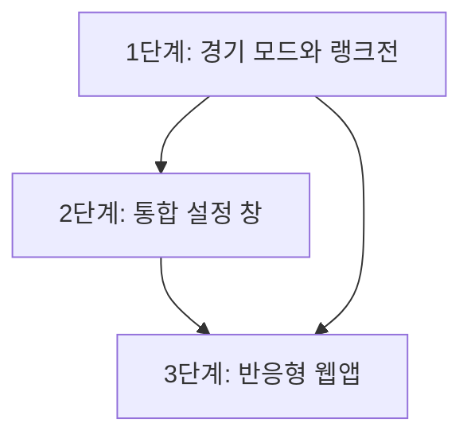
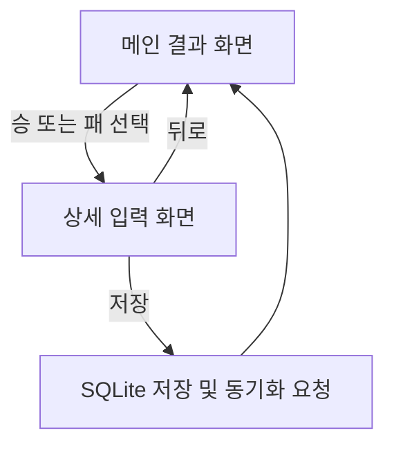
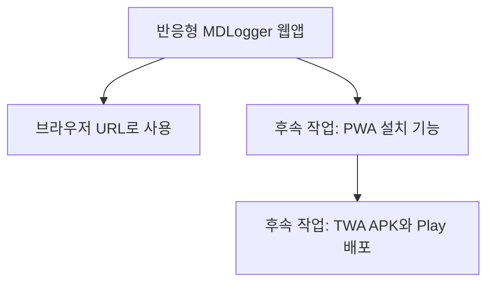
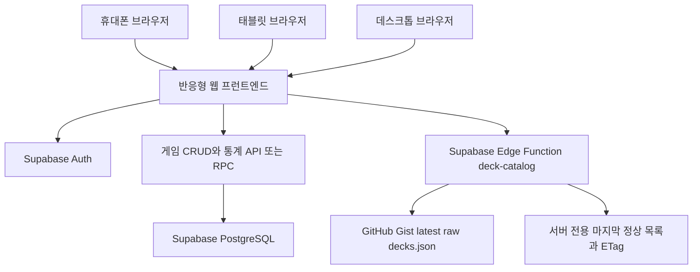
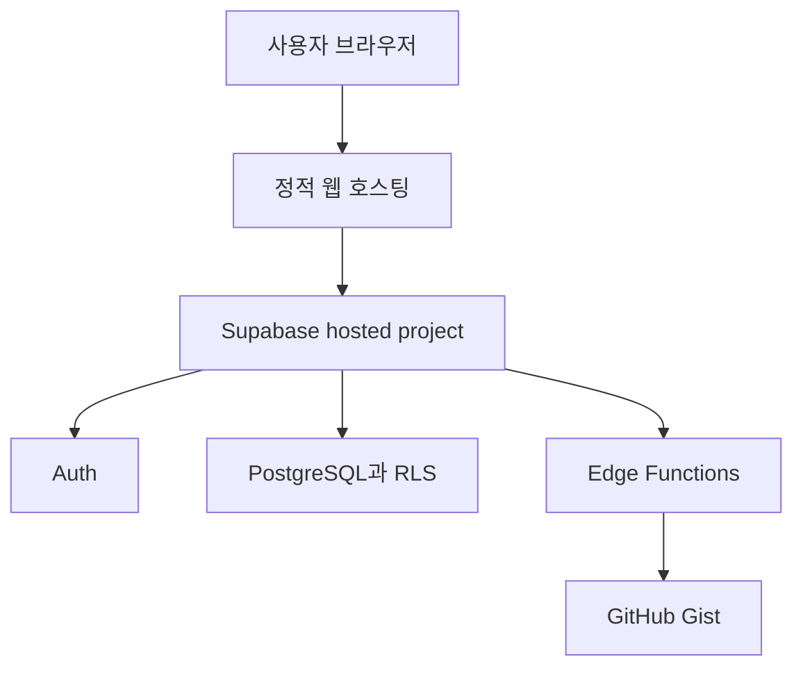

# MDLogger 중장기 제품 개발 계획서

> 문서 상태: 초안 — 제품 책임자 결정 대기 항목 포함
>
> 작성 기준일: 2026-08-16
>
> 대상 독자: 제품 책임자, 개발자, 디자이너, 테스트 담당자, AI 코딩 에이전트

---

## 0. 문서 목적

이 문서는 다음 세 가지 제품 계획을 실제 개발 작업으로 옮길 수 있도록 구체화한다.

1. 기존 점수 기록과 랭크전을 함께 지원하는 **경기 모드 확장**
2. 성능·테마·글자·메모·계정을 한곳에서 관리하는 **설정 창**
3. 휴대폰과 태블릿을 지원하는 **로그인 필수 온라인 반응형 웹앱**

단순한 아이디어 목록이 아니라 다음 내용을 명시하는 것이 목적이다.

- 사용자가 경험할 최종 동작
- 현재 코드와 데이터에 미치는 영향
- 권장 구현 단계와 단계별 산출물
- 호환성, 동기화, 접근성, 성능 요구사항
- 테스트와 완료 기준
- 제품 책임자가 구현 전에 결정해야 하는 사항
- 세 계획 사이의 선행 관계와 권장 개발 순서

이 문서에서 **권장**은 개발상 안전하고 유지보수하기 쉬운 기본 제안이며, 최종 제품 정책은 제품 책임자가 결정한다.

---

## 1. 한눈에 보는 결론

### 1.1 권장 개발 순서



권장 순서는 **1 → 2 → 3**이다.

| 순서 | 계획               | 먼저 해야 하는 이유                                                                                                                                                  |
| ---- | ------------------ | -------------------------------------------------------------------------------------------------------------------------------------------------------------------- |
| 1    | 경기 모드와 랭크전 | 경기 데이터 계약은 데스크톱과 웹앱이 반드시 공유해야 한다. 웹 개발 뒤에 스키마를 바꾸면 두 클라이언트와 서버 계약을 동시에 다시 수정해야 한다.                       |
| 2    | 통합 설정 창       | 테마, 글자 크기, 저사양 모드, 메모 표시 정책의 의미를 먼저 확정하면 웹에서도 같은 설정 개념과 사용자 용어를 사용할 수 있다.                                          |
| 3    | 반응형 웹앱        | 로그인·서버 저장 전용으로 범위를 줄이더라도 새 프런트엔드와 웹 API가 필요하다. 데이터와 설정 정책이 안정된 뒤 시작해야 재작업과 교차 클라이언트 충돌을 줄일 수 있다. |

### 1.2 핵심 권장안

- 메인 화면에는 승/패 버튼과 별도로 **`점수전` / `랭크전` 모드 선택기**를 둔다.
- 경기에는 단순한 화면 상태가 아니라 **모드와 경기 문맥을 데이터로 저장**한다.
- 랭크 기록은 결과만 보고 앱이 임의 계산하지 않고, 최소한 **경기 전 랭크와 경기 후 랭크의 스냅샷**을 저장한다.
- 기존 DB와 서버에 이미 준비된 랭크 관련 컬럼을 우선 활용한다.
- 설정은 화면별 임시 값이 아니라 타입과 기본값이 정해진 **버전 있는 설정 모델**로 관리한다.
- 저사양 모드는 여러 옵션을 삭제하는 기능이 아니라, 애니메이션·시각 효과·그래프 품질을 한 번에 낮추는 **상위 프리셋**으로 만든다.
- 메모 비활성화는 기존 메모를 삭제하지 않고 입력과 표시만 숨긴다.
- 휴대폰과 태블릿에는 APK 대신 **로그인 필수 온라인 반응형 웹앱**을 제공한다.
- 웹앱은 경기 로컬 DB, 게스트, 오프라인 저장과 데이터 이동 기능을 제공하지 않고 서버를 단일 데이터 원본으로 사용한다.
- PWA와 TWA는 자동으로 완성되는 기능이 아니지만, 같은 반응형 웹앱을 기반으로 나중에 별도 작업으로 추가할 수 있다.

---

## 2. 현재 구조와 이미 갖춰진 기반

계획 수립 시점의 코드베이스에는 다음 기반이 있다.

### 2.1 현재 사용자 흐름

현재 메인 흐름은 다음과 같다.



- `src/mdlogger/ui/result_view.py`: 승/패 선택, 오늘 전적, 되돌리기, 통계 진입
- `src/mdlogger/ui/detail_form.py`: 선후공, 덱, 턴, 종료 방식, 점수, 메모 입력
- `src/mdlogger/ui/main_window.py`: 결과 선택 → 상세 입력 → 저장 흐름 조정
- `src/mdlogger/game_service.py`: UI와 SQLite 구현 사이의 서비스 경계
- `src/mdlogger/db.py`: SQLite CRUD와 통계 쿼리

이 빠른 입력 흐름은 제품의 핵심이므로 유지한다. 모드 선택 때문에 매 경기마다 불필요한 화면을 하나 더 거치게 해서는 안 된다.

### 2.2 현재 데이터 구조에서 중요한 사실

로컬 SQLite 스키마 버전은 현재 `5`이다. 초기 UI가 사용하는 공용 컬럼에는 `score_after`와 `note`가 있지만, 로컬 스키마와 Supabase에는 미래 확장을 위해 다음 컬럼이 이미 준비되어 있다.

- `play_context_id`
- `standing_kind`
- `rank_tier_before`, `rank_tier_after`
- `rank_division_before`, `rank_division_after`
- `rating_before`, `rating_after`
- `event_points_before`, `event_points_after`

서버의 `standing_kind`는 이미 다음 값을 허용한다.

- `rank`
- `rating`
- `event_points`

그러나 현재 `src/mdlogger/db.py`의 입력 정규화, INSERT/UPDATE, 통계, 내보내기와 현재 UI는 이 필드들을 완전히 연결하지 않는다. 즉, **스키마 기반은 있으나 제품 기능은 아직 완성되지 않은 상태**다.

이 사실 때문에 1번 계획의 핵심은 컬럼을 다시 만드는 것이 아니라 다음과 같다.

1. 준비된 필드의 제품 의미를 확정한다.
2. 입력·수정·동기화·충돌 해결·통계·내보내기 전체에 연결한다.
3. 기존 `score_after` 기록의 호환 정책을 정한다.

### 2.3 현재 테마와 계정 구조

- `src/mdlogger/ui/theme.py`에는 시스템·밝은·어두운 테마를 적용할 수 있는 `ThemeController` 기반이 있다.
- 현재 선택한 테마를 영구 저장하는 통합 설정 저장소는 없다.
- 계정, 로그아웃, 모든 기기 로그아웃, 계정 삭제는 `AccountDialog`와 `ProfileRouter`에 연결되어 있다.
- 계정 삭제와 로그아웃은 이미 세션·프로필 수명 주기와 연결되어 있으므로, 설정 창으로 옮길 때 기능을 다시 구현하기보다 기존 동작을 호출해야 한다.

### 2.4 웹앱 계획에 영향을 주는 현재 제약

- 현재 앱은 Python 3.13, PySide6 Qt Widgets, SQLite, pyqtgraph, openpyxl을 사용하는 데스크톱 앱이다.
- 서버에는 Supabase Auth, RLS, 경기 테이블, 동기화 RPC와 계정 작업이 이미 준비되어 있다.
- 데스크톱은 로컬 우선 저장과 outbox/pull을 사용하지만 웹앱은 온라인 서버를 직접 읽고 쓴다.
- PySide6 UI와 SQLite 저장 코드는 브라우저에서 재사용할 수 없으므로 별도 웹 프런트엔드가 필요하다.
- 웹에서 수정한 데이터가 데스크톱의 change-version pull과 충돌 처리에 안전하게 연결되어야 한다.
- 브라우저에는 service-role key를 넣을 수 없으며 publishable key와 RLS만 사용해야 한다.

---

# 계획 1. 점수전과 랭크전을 함께 지원하는 경기 모드 확장

## 3. 목표

한 앱 안에서 점수전과 랭크전을 모두 기록하고, 저장된 경기의 모드를 명확히 구분하며, 통계와 기록 목록에서도 모드별로 조회할 수 있게 한다.

### 3.1 사용자 관점의 목표 상태

1. 사용자는 메인 결과 화면에서 현재 기록할 모드를 `점수전` 또는 `랭크전`으로 선택한다.
2. 선택한 모드는 승/패를 누른 뒤에도 유지된다.
3. 점수전 상세 화면에는 기존 점수 입력이 표시된다.
4. 랭크전 상세 화면에는 티어와 단계 입력이 표시된다.
5. 저장된 경기에는 결과와 함께 모드 및 해당 모드의 상태 변화가 저장된다.
6. 기록 목록과 통계에서 `전체`, `점수전`, `랭크전`을 필터링할 수 있다.
7. 기존 기록은 사라지거나 잘못된 랭크 기록으로 바뀌지 않는다.
8. 데스크톱과 향후 웹앱에서 같은 계정 데이터를 사용해도 의미가 유지된다.

## 4. 용어와 데이터 의미

### 4.1 권장 용어

| 사용자 표시 | 내부 의미                                              | 권장 저장 값                     |
| ----------- | ------------------------------------------------------ | -------------------------------- |
| 점수전      | 누적 이벤트 점수를 기록하는 경기                       | `standing_kind = "event_points"` |
| 랭크전      | 티어와 단계가 변하는 경기                              | `standing_kind = "rank"`         |
| 경기 문맥   | 시즌, 이벤트, 대회 단계처럼 기록을 묶는 기준           | `play_context_id`                |
| 티어        | 루키, 브론즈, 실버, 골드, 플래티넘, 다이아몬드, 마스터 | `rank_tier_*`                    |
| 단계        | 각 티어의 5부터 1까지의 단계                           | `rank_division_*`                |

`play_context_id`는 화면 표시 문자열 자체가 아니라 안정적인 식별자로 사용한다. 예시는 다음과 같다.

- `ranked_2026_08`
- `wcq_2026_stage_2`
- `legacy_score`

단, 실제 ID 생성 규칙과 시즌 관리 여부는 제품 책임자 결정이 필요하다.

### 4.2 경기 상태는 전후 스냅샷으로 저장한다

랭크전은 다음 값을 한 경기 레코드에 함께 저장하는 방식을 권장한다.

- `rank_tier_before`: 경기 전 티어
- `rank_division_before`: 경기 전 단계
- `rank_tier_after`: 경기 후 티어
- `rank_division_after`: 경기 후 단계

점수전도 장기적으로 다음 형태를 권장한다.

- `event_points_before`: 경기 전 점수
- `event_points_after`: 경기 후 점수

현재 `score_after`는 기존 기록 호환을 위해 당분간 유지한다. 새 점수전 기록은 과도기 동안 `event_points_after`와 `score_after`를 함께 기록할 수 있다. 모든 지원 버전이 새 필드를 이해하게 된 뒤 `score_after`를 읽기 전용 레거시 필드로 전환한다.

### 4.3 앱이 랭크를 자동 계산할지에 대한 원칙

현재 설명만으로는 다음 규칙이 확정되지 않았다.

- 각 단계에서 승급에 필요한 정확한 승수
- 패배 시 진척 감소 여부
- 강등 가능 여부와 강등 보호
- 루키 또는 마스터의 예외 규칙
- 시즌 초기화와 시즌별 규칙 변경

따라서 첫 버전에서 결과만 보고 랭크를 완전히 자동 계산하면 잘못된 기록을 만들 위험이 있다.

**권장 MVP:**

- 직전 랭크전의 `after`를 다음 경기의 `before`로 자동 채운다.
- 경기 후 값은 사용자가 `변동 없음`, `승급`, `강등`, `직접 선택` 중 빠르게 정한다.
- 정확한 승급 진척도는 규칙이 확정되기 전까지 자동 예측하지 않는다.

정확한 승급까지 추적하려면 다음 필드 또는 별도 진행 모델이 추가로 필요하다.

- `rank_progress_before`
- `rank_progress_after`
- 또는 시즌별 랭크 규칙 테이블

이 값의 단위는 `연승 수`, `승급까지 남은 승수`, `승급 포인트` 중 하나로 제품 책임자가 결정해야 한다.

## 5. UX 설계

### 5.1 메인 결과 화면

승/패 버튼 위에 2분할 선택기를 둔다.

```text
┌─────────────────────────────┐
│ 오늘 전적  3승 2패          │
│                             │
│   [ 점수전 ] [ 랭크전 ]     │
│                             │
│ 이번 듀얼의 결과를 기록하세요 │
│ ┌──────────┐ ┌──────────┐   │
│ │    승    │ │    패    │   │
│ └──────────┘ └──────────┘   │
└─────────────────────────────┘
```

요구사항:

- 모드 선택기는 승/패보다 시각적 우선순위가 낮아야 한다.
- 현재 모드는 색상뿐 아니라 텍스트, 선택 표시, 접근성 상태로 구분한다.
- 앱 시작 시 마지막 사용 모드를 복원하는 방식을 권장한다.
- 사용자가 모드를 바꾸기 전까지 다음 경기에도 유지한다.
- 키보드와 스크린 리더로도 현재 선택 상태를 확인할 수 있어야 한다.
- 모드 변경은 즉시 반영하되, 경기 상세 입력 중에는 확인 없이 다른 모드로 바뀌지 않게 한다.

### 5.2 상세 입력 화면

공통 입력은 유지한다.

- 선공/후공
- 내 덱/상대 덱
- 소요 턴
- 종료 방식
- 메모가 활성화된 경우 메모

모드별 입력만 교체한다.

| 모드   | 표시할 상태 입력                                         |
| ------ | -------------------------------------------------------- |
| 점수전 | 경기 전 점수, 경기 후 점수, 변화량                       |
| 랭크전 | 경기 전 티어·단계, 경기 후 티어·단계 또는 빠른 변동 선택 |

랭크 입력은 드롭다운 두 개를 나열하기보다 다음과 같은 빠른 조작을 권장한다.

- 현재 상태: `골드 3`
- 빠른 선택: `변동 없음`, `한 단계 승급`, `한 단계 강등`
- 예외 처리: `직접 선택`

티어 순서는 코드 한곳에서 정의한다.

```text
루키 → 브론즈 → 실버 → 골드 → 플래티넘 → 다이아몬드 → 마스터
```

단계 순서는 `5 → 4 → 3 → 2 → 1`이다. 티어 1에서 상위 티어 5로 이동하는 동작은 제품 정책에 따라 자동 또는 직접 선택으로 처리한다.

### 5.3 기록과 통계 화면

상단에 공통 필터를 둔다.

- 전체
- 점수전
- 랭크전

권장 표시:

- 기록 목록에 `점수전` 또는 `랭크전` 배지를 표시한다.
- 점수전 행은 점수와 변화량을 표시한다.
- 랭크전 행은 `골드 3 → 골드 2`처럼 표시한다.
- 랭크 변화가 없으면 `골드 3 유지`처럼 표시한다.
- 랭크전 통계에는 현재 랭크, 최고 도달 랭크, 승률, 선후공 승률, 덱별 승률을 제공한다.
- 점수 그래프와 랭크 그래프는 같은 Y축에 섞지 않는다.
- 랭크 그래프는 티어·단계를 정렬 가능한 내부 수치로 변환해 그리되, 축 라벨은 사람이 읽는 랭크로 표시한다.
- 색상만으로 승패나 승급·강등을 구분하지 않고 아이콘, 선 모양, 텍스트를 함께 사용한다.

### 5.4 기록 수정과 마지막 기록 취소

- 기록 수정 창에서도 저장된 모드를 확인하고 수정할 수 있어야 한다.
- 모드를 바꾸면 이전 모드 전용 값은 자동 삭제하기 전에 확인한다.
- `마지막 기록 취소`는 모드와 무관하게 가장 최근 경기를 대상으로 한다.
- 취소 후 헤더의 현재 점수 또는 현재 랭크를 다시 계산해 표시한다.

## 6. 구현 단계

### 6.1 1-A. 제품 규칙 확정

구현 전에 아래 14장의 P1 결정을 완료한다.

산출물:

- 모드 이름과 내부 값
- 티어·단계 규칙
- 기존 기록 분류 정책
- 시즌/경기 문맥 정책
- 랭크 자동 계산 범위

> ✅ **1단계 결정 확정(2026-08-16):** P1–P7 및 스냅샷/`score_after` 정책 확정 완료.
> 상세 확정값은 `docs/phase1-ranked-implementation-spec.md` 참조.
> ✅ **구현 완료(2026-08-17):** 계획 1(1-A~1-I) 구현·배포 완료. 상세는 `docs/phase1-ranked-implementation-spec.md`의 구현 완료 기록 참조.

### 6.2 1-B. 도메인 모델 정리

문자열과 임의 `dict` 사용을 줄이고 다음 개념을 명시적인 모델 또는 enum으로 만든다.

- `GameMode` 또는 `StandingKind`
- `RankTier`
- `RankStanding`
- `GameStandingSnapshot`
- `PlayContext`

검증 규칙:

- 점수전은 점수 필드를 사용하고 랭크 필드를 사용하지 않는다.
- 랭크전은 티어·단계 필드를 사용하고 이벤트 점수 필드를 사용하지 않는다.
- 단계는 허용된 티어에서만 유효하며 범위는 기본적으로 1~5다.
- 경기 전후 상태 중 필수 값이 누락되면 저장 전에 사용자에게 알린다.
- 알 수 없는 미래 티어 값은 동기화 데이터를 파괴하지 않도록 보존 전략을 둔다.

### 6.3 1-C. 로컬 저장과 마이그레이션

기존 컬럼을 실제 CRUD 경로에 연결한다.

수정 대상 범위:

- `src/mdlogger/db.py`의 입력 정규화
- INSERT/UPDATE 쿼리
- outbox payload
- 레코드 조회와 현재 상태 조회
- 요약·시계열·덱 상대 통계의 모드 필터
- 로컬 마이그레이션 및 백업 검증

중요 원칙:

- 기존 레코드를 삭제하거나 랭크로 오인하지 않는다.
- `played_at`의 로컬 naive ISO 형식은 바꾸지 않는다.
- 새 모드 필드는 동기화 outbox에 포함한다.
- 사용자 DB 마이그레이션 전 백업 정책을 유지한다.
- `MDLOGGER_DATA_DIR`와 프로필별 DB 소유권을 유지한다.

### 6.4 1-D. 서버와 동기화 계약

서버 컬럼과 allowlist는 상당 부분 준비되어 있으나 다음을 검증해야 한다.

- 등록 계정 push/pull에서 모든 모드 필드 왕복
- 게스트 ingest 허용 필드
- 3-way merge 충돌에서 모드와 전후 상태 보존
- portable archive와 게스트 가져오기
- 구버전 클라이언트가 신필드를 모른 채 수정했을 때 값이 사라지지 않는지
- payload version 또는 최소 지원 버전 변경 필요 여부
- 분석 projection에서 개인 메모 제외 정책 유지

서버 배포는 다음 순서를 권장한다.

1. 서버가 새 클라이언트와 구버전 클라이언트를 모두 받아들이도록 먼저 배포
2. 데스크톱 새 버전 배포
3. 충분한 전환 기간 후 오래된 쓰기 클라이언트 제한 검토
4. 웹앱은 안정된 계약과 서버 API를 사용

### 6.5 1-E. UI 연결

- `ResultView`에 모드 선택기 추가
- `MainWindow`가 선택한 모드를 상세 화면과 저장 레코드에 전달
- `DetailForm`을 공통 입력과 모드별 상태 입력으로 분리
- 마지막 점수와 마지막 랭크를 각각 조회해 기본값 설정
- 모드별 검증 오류에 초점 이동
- 기록 수정 창의 조건부 필드

### 6.6 1-F. 통계와 내보내기

- 전체/모드별 필터를 서비스 쿼리까지 전달
- CSV/XLSX에 모드와 랭크 전후 컬럼 추가
- 헤더 순서와 레거시 소비자 호환 정책 확정
- portable archive manifest 또는 payload version 검토
- 점수 그래프와 랭크 진행 그래프 분리
- 기록 목록의 모드 배지와 상태 변화 표시

## 7. 테스트 계획

### 7.1 단위 테스트

- 모든 티어와 1~5 단계 검증
- 티어 1 → 상위 티어 5 전환
- 최고 티어와 최저 티어 경계
- 점수전 레코드에 랭크 값이 섞이지 않음
- 랭크전 레코드에 점수 값이 섞이지 않음
- 직전 모드별 상태 조회
- 기존 `score_after` 레코드 읽기

### 7.2 DB·동기화 테스트

- 기존 스키마에서 최신 스키마로 마이그레이션
- 모드 필드 INSERT/UPDATE/DELETE/restore
- outbox payload 왕복
- 서버 push/pull 왕복
- 서로 다른 기기에서 같은 랭크 기록 수정 시 충돌
- portable export/import 이후 값 동일
- 구버전 필드가 포함된 레코드를 새 버전이 손실 없이 처리

### 7.3 UI 테스트

- 모드 선택 → 승/패 → 상세 → 저장
- 모드별 필드 전환과 Tab 순서
- 마지막 모드 복원
- 글자 확대 시 티어 이름이 잘리지 않음
- 380px 데스크톱 최소 폭에서 가로 넘침 없음
- 승패와 승급/강등이 색상 없이도 식별됨

## 8. 계획 1 완료 기준

- [x] 점수전과 랭크전을 메인 화면에서 선택할 수 있다.
- [x] 선택한 모드가 모든 저장·수정·삭제·동기화 경로에서 보존된다.
- [x] 랭크 전후 상태가 기록된다.
- [x] 기록과 통계를 모드별로 필터링할 수 있다.
- [x] 점수전과 랭크전 그래프가 의미에 맞게 분리된다.
- [x] 기존 기록과 내보내기 데이터가 손실되지 않는다.
- [x] 데스크톱 구버전과의 동기화 호환 정책이 검증되었다.
- [x] 관련 단위·통합·UI 테스트가 통과한다.

### 8.1 `v0.2.0` 출시와 최소 지원 버전 전략

현재 완성 버전은 `v0.1.6`이며, 다음 기능 릴리스는 `v0.2.0`으로 시작한다. `v0.2.1`은 `v0.2.0` 공개 후 호환 가능한 버그를 수정할 때 사용한다.

`latest_version`과 `minimum_supported_version`은 독립적으로 운영한다.

| 상황                           | 최신 버전    | 최소 지원 버전    |
| ------------------------------ | ------------ | ----------------- |
| 랭크전 활성화 직후             | `0.2.0`      | `0.2.0`           |
| 호환 가능한 버그 수정          | `0.2.1`      | `0.2.0`           |
| 추가 호환 수정                 | `0.2.2`      | `0.2.0`           |
| 설정 창 추가, 데이터 계약 동일 | `0.3.0` 가능 | `0.2.0` 유지 가능 |

랭크전 활성화 시 `v0.1.6`의 온라인 사용을 계속 허용하는 것은 권장하지 않는다. 구버전은 모드별 조회를 모르기 때문에 랭크 경기의 `score_after = NULL`을 현재 점수 0으로 해석하거나, 점수 그래프와 전체 통계에 랭크 경기를 잘못 섞고, 랭크 레코드 수정 시 레거시 점수를 함께 저장할 수 있다.

호환 방향은 다음처럼 정의한다.

- `v0.2.0`은 `v0.1.6`이 만든 `standing_kind = NULL` 레코드를 `기존 기록` 또는 `알 수 없음`으로 안전하게 읽는다.
- `알 수 없음`은 화면용 상태이며 서버의 `standing_kind` 새 값으로 저장하지 않는다.
- 이미 배포된 `v0.1.6`이 `v0.2.0` 랭크 레코드를 안전하게 이해하도록 나중에 바꿀 수는 없다.
- 따라서 랭크 쓰기 기능을 활성화하는 시점에 온라인 최소 지원 버전을 `0.2.0`으로 올린다.
- 최소 지원 미만 버전도 현재 정책대로 로컬 기록과 내보내기는 허용하되 로그인·push·pull은 차단한다.

권장 배포 순서:

1. 서버가 기존 payload와 신규 payload를 모두 안전하게 검증하도록 먼저 배포한다.
2. `v0.2.0` 설치 파일과 업데이트 URL을 준비한다.
3. 필요하면 랭크 기능을 원격 플래그로 비활성 상태에서 배포한다.
4. `minimum_supported_version = 0.2.0` 전환과 랭크 쓰기 활성화를 동시에 수행한다.
5. 이후 `v0.2.x`가 같은 데이터 계약을 사용하면 최소 버전은 `0.2.0`으로 유지한다.

추가 안전장치로 로컬 schema version을 `6`으로 올려 `v0.2.0` DB를 `v0.1.6`이 다시 열어 수정하지 못하게 하는 방안을 권장한다. 새 컬럼이 이미 존재하더라도 schema 6은 “모드 의미가 활성화된 데이터”라는 호환성 경계가 된다.

payload envelope가 동일하고 경기 필드 의미만 바뀐다면 `payload_version`을 `2`로 올리고 `sync_schema_version`은 유지할 수 있다. 최종 값은 서버 RPC 검증 방식과 함께 확정한다.

---

# 계획 2. 통합 설정 창

## 9. 목표

성능, 화면, 입력 기능, 계정 관리를 한곳에 모으고, 변경 사항이 재시작 후에도 예측 가능하게 유지되도록 한다.

## 10. 정보 구조

설정 창은 다음 네 영역을 권장한다.

1. **화면 및 접근성**
    - 테마
    - 글자 크기
    - 애니메이션 감소
2. **성능**
    - 저사양 모드
    - 그래프 품질 또는 효과 옵션
3. **기록**
    - 메모 기능 사용
    - 마지막 경기 모드 기억
    - 향후 기본 모드
4. **계정 및 데이터**
    - 현재 프로필 상태
    - 로그인 또는 계정 관리
    - 동기화
    - 로그아웃
    - 모든 기기에서 로그아웃
    - 데이터 내보내기
    - 계정 삭제

설정 버튼은 메인 화면의 현재 `계정` 버튼을 대체하는 톱니바퀴 아이콘과 `설정` 접근성 이름으로 제공할 수 있다. 아이콘만 보이더라도 tooltip과 accessible name이 필요하다.

### 10.1 권장 화면 형태

- 데스크톱: 모달 다이얼로그 또는 독립 설정 창
- 왼쪽: 범주 목록
- 오른쪽: 선택한 범주의 옵션
- 폭이 좁으면 범주 목록 → 상세 페이지의 단일 열 탐색
- 파괴적 계정 동작은 일반 설정과 시각적으로 분리한 `위험 구역`에 배치

설정은 너무 많은 옵션을 한 화면에 펼치지 않고 범주별로 나눈다. 각 옵션에는 이름만 아니라 실제 영향이 드러나는 짧은 설명을 붙인다.

## 11. 설정 데이터 모델

### 11.1 권장 설정 목록

| 키 예시                        | 형식  | 권장 기본값      | 범위 또는 값              |
| ------------------------------ | ----- | ---------------- | ------------------------- |
| `performance.low_spec_mode`    | bool  | `false`          | 켜기/끄기                 |
| `accessibility.reduce_motion`  | bool  | 시스템 설정 따름 | 켜기/끄기/시스템          |
| `appearance.theme_mode`        | enum  | `system`         | `system`, `light`, `dark` |
| `appearance.font_scale`        | float | `1.0`            | 권장 0.8~1.5              |
| `recording.memo_enabled`       | bool  | `true`           | 켜기/끄기                 |
| `recording.remember_last_mode` | bool  | `true`           | 켜기/끄기                 |
| `recording.default_mode`       | enum  | `event_points`   | 점수전/랭크전             |

### 11.2 저장 위치와 수명

**권장:** 데스크톱에는 버전이 있는 `AppSettings` 모델과 전용 저장소를 만들고, OS 표준 데이터 디렉터리 아래에 원자적으로 저장한다.

이유:

- `MDLOGGER_DATA_DIR` 지원과 함께 테스트하기 쉽다.
- Windows 레지스트리에만 묶이지 않는다.
- 백업·복원과 portable 동작을 명시적으로 설계할 수 있다.
- UI가 파일 형식을 직접 알지 않아도 된다.

설정은 기본적으로 **기기 로컬**로 둔다. 데스크톱과 휴대폰은 화면 크기와 성능이 다르므로 글자 크기, 저사양 모드, 방향을 계정 동기화하면 오히려 불편하다.

계정 동기화가 필요한 제품 설정이 나중에 생기면 `device settings`와 `account preferences`를 별도 모델로 분리한다.

### 11.3 설정 적용 우선순위

권장 우선순위는 다음과 같다.

1. OS 접근성 및 플랫폼 제한
2. 저사양 모드의 강제 제한
3. 사용자가 선택한 개별 설정
4. 앱 기본값

예를 들어 사용자가 애니메이션을 켰더라도 저사양 모드가 켜져 있으면 실제 애니메이션은 비활성화한다. 단, 사용자의 원래 선택값은 보존해 저사양 모드를 끄면 복원한다.

## 12. 기능별 세부 설계

### 12.1 저사양 모드

저사양 모드는 다음 항목을 한 번에 조정하는 프리셋으로 정의한다.

- 승/패 버튼 hover 확대와 전환 애니메이션 비활성화
- 장식용 그림자와 비용이 큰 효과 최소화
- 그래프 antialiasing, 애니메이션, 불필요한 실시간 갱신 감소
- 통계 창의 무거운 계산을 창이 열릴 때만 수행
- 백그라운드 동기화 자체는 끄지 않되 연속 재시도와 UI 갱신 빈도 제한

기록 저장, 데이터 무결성, 인증 보안, 동기화 정확도를 낮춰서는 안 된다. 저사양 모드는 **시각 품질과 갱신 비용**만 줄인다.

UI 설명 예시:

> 애니메이션과 일부 시각 효과를 줄여 CPU·GPU 사용량을 낮춥니다. 기록과 동기화 기능은 그대로 유지됩니다.

### 12.2 테마

1차 범위는 다음 세 가지 프리셋을 권장한다.

- 시스템 설정 사용
- 밝은 테마
- 어두운 테마

현재 `ThemeController`가 이 범위의 기반을 이미 제공하므로 영구 설정과 설정 UI를 연결하면 된다.

사용자가 말한 “테마를 직접 설정”이 색상까지 직접 고르는 의미라면 2차 범위로 분리하는 것을 권장한다.

- 안전한 강조색 프리셋 제공
- 사용자 지정 강조색 선택 시 대비 자동 검증
- 배경·텍스트색의 완전 자유 입력은 접근성과 상태 색상 붕괴 위험 때문에 초기 버전에서 제외

모든 색상은 semantic token을 통해 적용하고 화면별 하드코딩 색상을 만들지 않는다.

### 12.3 글자 크기

- 권장 범위: 80%~150%
- 권장 단계: 80, 90, 100, 110, 125, 150%
- 본문, 제목, 버튼, 표에 역할별 배율을 적용한다.
- 아이콘과 터치/클릭 영역은 글자와 함께 필요한 만큼 확장한다.
- 최소 창 크기에서도 잘리지 않도록 레이아웃을 재배치하거나 스크롤을 허용한다.
- 미리보기 문구를 설정 화면에 제공한다.
- 100%, 125%, 150% Windows DPI와 앱 글자 배율의 조합을 테스트한다.

폰트 파일을 새로 내려받는 기능은 초기 범위에서 제외한다. OS 글꼴과 현재 폰트 역할 체계를 유지하는 편이 시작 속도와 배포 크기에 유리하다.

### 12.4 메모 기능 비활성화

권장 동작:

- 새 경기 상세 화면에서 메모 입력 영역을 숨긴다.
- 기록 표의 메모 열을 숨긴다.
- 새 기록은 빈 메모로 저장한다.
- 기존 메모는 DB와 서버에서 삭제하지 않는다.
- 설정을 다시 켜면 기존 메모가 다시 보인다.
- 계정 데이터 내보내기에는 기존 메모를 계속 포함한다.

메모 비활성화는 개인정보 삭제 기능이 아니다. 메모 일괄 삭제가 필요하면 별도의 파괴적 기능과 확인 절차로 설계한다.

### 12.5 계정과 데이터 작업 이동

설정 창은 기존 계정 기능의 새로운 진입점이 된다.

이동 대상:

- 로그인 상태 표시
- 동기화 상태 및 수동 동기화
- 데이터 내보내기
- 로그아웃
- 모든 기기에서 로그아웃
- 계정 삭제

구현 원칙:

- 기존 `SessionManager`, `ProfileRouter`, 계정 서비스 동작을 재사용한다.
- 설정 창이 인증 토큰이나 raw DB connection을 직접 소유하지 않는다.
- 로그아웃과 계정 삭제 완료 시 설정 창과 현재 프로필 창을 안전한 순서로 닫는다.
- 계정 삭제는 설정 저장값 삭제와 구분한다.
- 계정 삭제 확인문에는 서버 개인 기록과 메모 삭제, 로컬 기록 처리 정책을 명확히 표시한다.

### 12.6 설정 초기화

`설정 초기화`를 제공하는 것을 권장한다.

- 앱 설정만 기본값으로 되돌린다.
- 경기 기록, 계정, 인증 정보는 건드리지 않는다.
- 적용 전 확인하고, 재시작이 필요한 항목이 있다면 표시한다.

## 13. 구현 단계

### 13.1 2-A. 설정 정책 확정

- 설정 범위와 기본값
- 기기 로컬/계정 동기화 구분
- 테마 사용자 지정 범위
- 메모 비활성화 세부 동작
- 저사양 모드가 덮어쓸 항목

### 13.2 2-B. 설정 코어

- 타입 있는 설정 모델
- 설정 스키마 버전
- 기본값과 범위 검증
- 손상된 설정 파일의 안전한 복구
- 원자적 저장
- 변경 알림
- 테스트용 메모리 저장소

UI는 저장 파일을 직접 읽지 않고 설정 서비스만 사용한다.

### 13.3 2-C. 전역 적용

- 앱 시작 전에 테마와 글자 배율 적용
- `ThemeController`와 영구 설정 연결
- 애니메이션 구성 요소가 reduce-motion/저사양 모드를 구독
- 통계 그래프가 성능 설정을 구독
- 메모 입력·표시가 메모 설정을 구독

가능하면 설정 변경을 즉시 미리보기하고 적용한다. 재시작이 꼭 필요한 경우에만 명확히 알린다.

### 13.4 2-D. 설정 UI와 계정 연결

- 범주형 설정 창
- 현재 값, 설명, 기본값 복원
- 계정 상태별 다른 작업 표시
- 파괴적 작업 분리
- 좁은 폭과 글자 확대 대응
- 키보드 탐색과 접근성 이름

### 13.5 2-E. 회귀 테스트

- 설정 없음 → 기본값 생성
- 이전 설정 버전 → 신규 버전 마이그레이션
- 손상된 파일 → 안전한 기본값과 사용자 안내
- 테마 즉시 적용과 재시작 후 복원
- 글자 확대 시 화면 깨짐 없음
- 저사양 모드 on/off 시 사용자 개별값 보존
- 메모 off/on 시 기존 메모 보존
- 로그아웃·계정 삭제 후 창 수명 주기

## 14. 계획 2 완료 기준

- [ ] 모든 설정이 한 창에서 범주별로 관리된다.
- [ ] 설정이 재시작 후 복원된다.
- [ ] 저사양 모드가 애니메이션과 고비용 효과를 실제로 줄인다.
- [ ] 시스템/밝은/어두운 테마를 선택할 수 있다.
- [ ] 글자 크기를 조절해도 주요 화면이 잘리지 않는다.
- [ ] 메모를 꺼도 기존 데이터가 삭제되지 않는다.
- [ ] 계정 작업이 기존 인증·프로필 경계를 깨지 않고 설정 창에서 수행된다.
- [ ] 설정 초기화가 경기와 계정 데이터를 건드리지 않는다.
- [ ] 접근성, 테마, DPI, 성능 관련 테스트가 통과한다.

---

# 계획 3. 로그인 필수 온라인 반응형 웹앱

## 15. 목표와 범위

휴대폰과 태블릿의 웹브라우저에서 MDLogger에 접속해 로그인한 뒤 경기 기록, 기록 목록, 통계, 설정과 계정 기능을 사용할 수 있는 **온라인 전용 반응형 웹앱**을 만든다.

이 계획의 최종 산출물은 APK가 아니라 HTTPS URL로 배포되는 웹앱이다. Android 사용자가 주요 대상이지만, 표준 웹 기술을 사용하므로 지원 브라우저 조건을 만족하는 데스크톱과 다른 모바일 운영체제에서도 접속할 수 있다.

### 15.1 확정된 제품 정책

- 모든 사용자는 로그인해야 한다.
- 게스트 모드는 제공하지 않는다.
- 인터넷 연결이 있어야 기록을 조회하거나 저장할 수 있다.
- 경기 기록의 로컬 DB나 오프라인 사본을 만들지 않는다.
- outbox, 오프라인 동기화, 로컬 충돌 해결 엔진을 웹에 구현하지 않는다.
- 로컬 데이터 가져오기·내보내기·portable archive 기능을 웹에 구현하지 않는다.
- 덱 목록은 클라이언트 번들에 고정하지 않고 웹 서버 또는 공개 읽기 API에서 제공한다.
- 경기 데이터는 Supabase의 사용자별 서버 데이터와 직접 연결한다.
- Android의 화면 회전을 브라우저가 반영하면 현재 viewport에 맞춰 세로·가로 레이아웃을 자동 전환한다.
- 기기 모델·종류를 감지해 앱이 적합한 방향을 임의로 선택하거나 화면 방향을 강제로 잠그지 않는다.
- Capacitor, Kotlin 네이티브 앱, Flutter 앱은 현재 계획 범위에서 제외한다.

### 15.2 로그인 세션에 대한 예외

“로컬 데이터를 저장하지 않는다”는 정책은 **경기 기록과 사용자 데이터의 로컬 사본을 만들지 않는다**는 뜻이다. 로그인 상태를 유지하려면 브라우저에는 세션 쿠키 또는 refresh token과 같은 최소 인증 정보가 필요하다.

선택지는 다음과 같다.

- 브라우저를 닫아도 로그인 유지: 안전한 세션 정보만 브라우저에 보존
- 브라우저를 닫으면 로그아웃: 세션 수명은 짧지만 매번 다시 로그인해야 함

세션 보존 방식과 기간은 25장의 P12에서 제품 책임자가 결정한다.

### 15.3 초기 비범위

- 오프라인 경기 작성과 나중에 전송
- 게스트 계정과 게스트 기록 가져오기
- 브라우저 IndexedDB에 경기 전체 복제
- 데스크톱 SQLite DB와 브라우저 사이의 직접 파일 이동
- CSV/XLSX/portable archive의 브라우저 로컬 가져오기
- 강제 세로·가로 방향 잠금
- Google Play 배포
- PWA 설치 기능
- TWA APK
- 푸시 알림과 Android 전용 API

계정 데이터 내보내기가 법적·운영상 필요하다면 기존 서버 내보내기 기능으로 제공할 수 있다. 이는 로컬 DB 이동 기능과 별개의 계정 운영 기능이다.

## 16. 웹앱, PWA, TWA의 관계

### 16.1 이번 계획에서 만드는 것

이번 계획은 다음 형태의 반응형 웹앱을 만든다.

```text
https://app.<서비스 도메인>
```

사용자는 Chrome 같은 브라우저에서 링크를 열어 사용한다. 로그인과 데이터 조작이 중심이므로 단순 정보 사이트가 아니라 웹 애플리케이션이다.

### 16.2 반응형 웹앱을 만들면 PWA와 TWA가 자동으로 완성되는가?

아니다. 다만 **반응형 웹앱이 PWA와 TWA의 공통 기반**이 된다.



- 반응형 웹앱: 화면 크기에 맞춰 동작하는 실제 서비스 본체
- PWA: 같은 웹앱에 manifest, 아이콘, 설치 동작과 필요한 브라우저 설정을 추가한 형태
- TWA: 품질 기준을 충족한 PWA를 검증된 도메인과 연결해 Android APK에서 전체 화면으로 여는 배포 방식

따라서 웹앱을 올바르게 설계하면 기능과 화면을 다시 만들지 않고 PWA/TWA로 확장할 수 있다. 그러나 PWA 설치 가능성 검증, TWA 도메인 소유권 연결, APK 서명과 Play 정책 검증은 각각 별도 작업이다.

### 16.3 후속 확장을 막지 않는 준비

현재는 PWA/TWA를 구현하지 않지만 다음 원칙은 처음부터 지킨다.

- HTTPS 배포
- 안정적인 단일 서비스 도메인
- 새로고침해도 주요 URL이 동작하는 라우팅
- 앱 이름과 정사각형 아이콘 원본 준비
- 모바일 전체 폭과 safe area 대응
- 브라우저 뒤로가기의 예측 가능한 동작
- 외부 브라우저에서도 로그인 callback이 정상 동작하는 URL 설계
- service worker가 없어도 모든 핵심 기능이 정상 동작

이 준비는 미래 확장 비용을 줄이지만 PWA/TWA를 현재 완료 기준에 포함하지는 않는다.

## 17. 권장 웹 아키텍처



### 17.1 프런트엔드 역할

- 로그인과 세션 상태 표시
- 경기 모드·승패·상세 입력 UI
- 서버 요청 전 입력 검증
- 성공 응답을 받은 뒤 저장 완료 표시
- 기록 목록과 필터
- 서버 통계 조회와 차트 표시
- 설정 및 계정 작업
- 화면 폭, 방향, 글자 크기에 따른 레이아웃 변경

프런트엔드는 service-role key를 포함하지 않는다. 브라우저에 공개되어도 되는 publishable key만 사용하며 실제 데이터 권한은 Supabase Auth와 RLS가 강제한다.

### 17.2 서버 역할

- 사용자 인증과 세션 검증
- 사용자별 경기 소유권 강제
- 경기 생성·수정·삭제 검증
- 점수전·랭크전 데이터 규칙 검증
- 현재 상태와 통계 조회
- Supabase Edge Function으로 Gist 덱 목록을 검증·중계
- 계정 데이터 내보내기와 계정 삭제
- 지원 payload/API 버전 검증

서버가 데이터의 최종 권위다. 웹 UI 검증만 믿지 않고 서버에서 동일한 제약을 다시 확인한다.

### 17.3 경기 저장 방식

웹앱은 로컬 우선 저장을 사용하지 않는다.

1. 사용자가 저장을 누른다.
2. 화면은 저장 버튼을 잠그고 진행 상태를 표시한다.
3. 서버가 검증하고 저장한다.
4. 성공 응답 후에만 완료로 표시하고 결과 화면으로 돌아간다.
5. 실패하면 입력값을 현재 화면 메모리에 유지하고 재시도할 수 있게 한다.

페이지 새로고침이나 브라우저 종료 뒤까지 미완료 입력을 보존하는 것은 초기 범위가 아니다. 저장되지 않은 입력이 있는 상태에서 이탈하려 하면 경고할 수 있다.

### 17.4 데스크톱 앱과의 데이터 관계

웹앱은 별도 로컬 동기화 클라이언트가 아니라 서버 데이터를 직접 읽고 쓴다.

- 데스크톱 앱: SQLite에 기록한 뒤 outbox/pull로 서버와 동기화
- 웹앱: 로그인 상태에서 서버 레코드를 직접 조회·수정

두 클라이언트는 같은 경기 필드와 enum 의미를 사용해야 한다. 웹에서 수정한 레코드는 `change_version`을 증가시켜 데스크톱 pull에 전달한다. 데스크톱의 미동기화 변경과 웹 수정이 겹치면 현재 CAS·3-way merge 정책에 따라 데스크톱에서 충돌을 감지할 수 있어야 한다.

웹에는 로컬 base가 없으므로 수정 화면을 열 때 읽은 `change_version`을 저장 요청에 보내는 낙관적 동시성 제어를 권장한다. 다른 클라이언트가 먼저 수정했다면 자동 덮어쓰지 않고 최신 내용을 다시 불러오도록 안내한다.

### 17.5 `played_at`과 시간대

현재 계약을 유지한다.

- `played_at`: 사용자의 브라우저 로컬 시각을 timezone 없는 ISO 문자열로 전송
- `timezone_offset_minutes`: 기록 시점의 브라우저 UTC offset 전송
- 서버 생성 시각: 서버 관리 필드로 별도 유지

브라우저가 임의의 시간대를 추측해 기존 기록을 변환해서는 안 된다.

### 17.6 GitHub Gist 덱 목록과 Supabase proxy

웹앱도 데스크톱과 같은 GitHub Gist의 SHA 없는 `latest raw` URL을 덱 목록의 권위 있는 원본으로 사용한다. 커밋 SHA가 포함된 raw URL은 특정 리비전에 고정되므로 사용하지 않는다.

브라우저가 Gist를 직접 요청하지 않고, 기존 Supabase hosted project에 `deck-catalog` Edge Function을 추가해 처음부터 proxy로 사용한다.

```text
웹앱 → Supabase Edge Function deck-catalog → GitHub Gist latest raw URL
```

집이나 별도 VPS에서 24시간 실행되는 서버를 운영하지 않는다. Edge Function은 요청이 있을 때 Supabase가 실행하는 관리형 serverless 함수이며, 현재 프로젝트의 `guest-ingest`, `account-delete`, `revoke-sessions`와 같은 배포·운영 방식을 따른다.

Edge Function은 실행 인스턴스의 메모리를 영구 캐시로 믿지 않는다. Supabase PostgreSQL의 서버 전용 단일 행 캐시 테이블에 다음 값을 보존한다.

- 마지막 정상 덱 JSON
- Gist `ETag`
- 마지막 확인 시각
- 마지막 변경 시각
- 원본 URL과 선택적 content hash

캐시 테이블은 브라우저가 직접 읽거나 수정하지 못하게 RLS와 권한을 설정하고 Edge Function만 서버 권한으로 접근한다. service-role key는 Supabase 함수 환경에만 두며 프런트엔드에 포함하지 않는다.

권장 조회 흐름:

1. 로그인 완료 후 기록 화면이 `deck-catalog`를 호출한다.
2. 캐시의 마지막 확인 시각이 TTL 안이면 Gist를 다시 호출하지 않고 캐시를 반환한다.
3. TTL이 지났으면 저장된 `ETag`를 `If-None-Match`로 보내 Gist를 재검증한다.
4. `304 Not Modified`이면 확인 시각만 갱신하고 기존 목록을 반환한다.
5. 변경된 JSON을 받으면 배열 형식, 최대 크기, 문자열 길이를 검증한다.
6. 공백 제거·중복 제거·`기타` 포함을 보장한 뒤 캐시를 원자적으로 교체한다.
7. Gist 요청이 실패했지만 정상 캐시가 있으면 stale 상태와 함께 마지막 정상 목록을 반환한다.
8. 정상 캐시도 없으면 명확한 `503` 오류와 재시도 방법을 반환한다.

데스크톱은 사용자가 로컬에 추가한 덱을 보존하기 위해 원격 목록과 로컬 목록을 합집합 병합한다. 웹앱에는 로컬 사용자 덱이 없으므로 병합하지 않고 **Edge Function이 반환한 현재 Gist 목록을 사용**한다. Gist에서 삭제된 덱은 다음 성공적인 갱신부터 새 경기 선택지에서 사라지며, 과거 경기의 덱 문자열은 그대로 보존한다.

여기서 “실시간”은 Gist 변경을 서버가 push하는 방식이 아니라 TTL이 지난 첫 요청에서 최신 원본을 pull하는 방식이다. 사용자가 탭으로 돌아왔을 때 일정 시간이 지났다면 다시 `deck-catalog`를 호출할 수 있다. 매 화면 render마다 호출해서는 안 된다.

함수 호출은 로그인한 사용자의 access token을 요구하도록 구성하는 것을 권장한다. 덱 목록 자체는 공개 Gist지만, 로그인 필수 웹앱의 요청 경로를 일관되게 하고 무분별한 proxy 사용을 줄일 수 있다.

### 17.7 서버와 프런트엔드 호스팅

집이나 개인 컴퓨터를 서버로 사용하지 않는다. 관리형 클라우드를 다음처럼 나눈다.



- 정적 웹 호스팅: 빌드된 HTML, CSS, JavaScript와 아이콘 제공
- Supabase hosted project: 로그인, PostgreSQL, RLS, 경기 API/RPC, `deck-catalog` Edge Function 제공
- GitHub Gist: 덱 목록의 권위 있는 원본

현재 프로젝트가 이미 Supabase hosted 환경과 Edge Function을 사용하므로 별도의 VPS, 홈 서버, Docker 상시 실행 PC를 추가하지 않는다.

프런트엔드 호스팅 후보:

| 후보             | 적합성 | 비고                                                                                    |
| ---------------- | ------ | --------------------------------------------------------------------------------------- |
| Cloudflare Pages | 높음   | Vite 정적 빌드, custom domain, preview 배포에 적합                                      |
| Vercel           | 높음   | 정적 SPA와 preview 배포에 적합                                                          |
| Netlify          | 높음   | 정적 SPA와 redirect 설정에 적합                                                         |
| GitHub Pages     | 제한적 | 단순 정적 배포는 가능하지만 SPA fallback, 보안 header, 환경 분리 운영이 상대적으로 불편 |

**권장 시작 구성:** React + TypeScript + Vite를 선택한다면 Cloudflare Pages 또는 Vercel에 프런트엔드를 배포하고, 백엔드는 기존 Supabase를 그대로 사용한다. 최종 제공자의 무료 요금제, 트래픽·빌드·Edge Function 호출 한도와 가격은 실제 선택 시점에 다시 확인한다.

개발 환경에서는 로컬 Vite 개발 서버가 hosted 또는 local Supabase 개발 환경을 호출한다. 운영 환경에서는 공식 HTTPS 도메인의 정적 웹앱이 hosted Supabase만 호출한다. 개발·preview·운영의 URL과 허용 CORS origin을 분리한다.

## 18. 반응형 웹 UX 설계

### 18.1 내비게이션

휴대폰에서는 하단 내비게이션, 넓은 태블릿과 데스크톱에서는 측면 또는 상단 내비게이션을 권장한다.

핵심 항목은 최대 네 개로 유지한다.

1. 기록
2. 통계
3. 기록 목록
4. 설정

앱 시작 후 인증이 유효하면 기본 화면은 `기록`이다. 브라우저 뒤로가기는 웹앱 내부 화면 이력과 일치해야 하며 사용자를 예기치 않게 로그아웃시키면 안 된다.

### 18.2 휴대폰 세로 화면

- 단일 열
- 모드 선택 → 승/패 → 상세 입력의 우선순위
- 승/패 버튼은 엄지로 누르기 쉬운 큰 영역
- 상세 입력은 섹션별 세로 스크롤
- 저장 버튼이 브라우저 UI와 소프트 키보드에 가리지 않게 배치
- 덱 검색 결과는 전체 폭 목록 또는 하단 sheet 형태

### 18.3 휴대폰 가로 화면

- 짧은 세로 높이를 고려해 장식과 빈 공간 축소
- 승/패 버튼 좌우 배치
- 상세 입력은 두 열 또는 입력·요약 분할
- 화면 키보드가 열린 상태에서 핵심 필드와 저장 버튼 접근 가능
- 가로 스크롤 없이 사용 가능

### 18.4 태블릿과 넓은 화면

- 휴대폰 화면을 단순 확대하지 않는다.
- 기록 목록과 상세를 동시에 보는 master-detail 구조 검토
- 콘텐츠 최대 폭을 두어 입력 요소가 지나치게 벌어지지 않게 함
- 긴 문장의 읽기 폭 제한
- 통계 카드와 차트는 사용 가능한 폭에 따라 열 수를 조정
- 데스크톱 브라우저에서도 과도한 빈 공간이 생기지 않게 중앙 정렬

### 18.5 화면 방향

초기 웹앱은 방향을 강제로 잠그지 않는다. 사용자가 Android 자동 회전을 켜고 기기를 돌리면 운영체제와 브라우저가 viewport의 폭·높이를 갱신하고, 웹앱은 그 변화에 맞춰 즉시 레이아웃을 재배치한다.

구현은 기기 모델이나 user-agent를 보고 방향을 추측하는 방식이 아니다. CSS media query의 `orientation: portrait`·`orientation: landscape`, 폭 기준 breakpoint와 필요할 때의 container query를 사용한다. JavaScript의 `matchMedia`는 차트 배치처럼 CSS만으로 해결하기 어려운 동작에만 제한적으로 사용한다.

실제 기준은 물리적인 기기 종류가 아니라 **현재 웹앱에 주어진 viewport**다. 따라서 가로로 든 태블릿이라도 분할 화면 때문에 웹앱 영역이 좁으면 세로형 단일 열 레이아웃을 사용할 수 있다. 이는 기기 정보를 바탕으로 방향을 선택하는 것이 아니라 현재 사용 가능한 공간에 안전하게 대응하는 동작이다.

화면 회전이나 창 크기 변경 시 페이지를 새로고침하거나 입력 화면을 다시 만들지 않는다. 현재 페이지가 유지되는 동안 다음 상태를 잃지 않아야 한다.

- 선택한 경기 모드
- 승/패 선택
- 덱과 턴 수
- 점수 또는 랭크 입력
- 작성 중인 메모
- 중요한 스크롤 위치

### 18.6 설정

웹 설정은 데스크톱과 같은 용어를 사용한다.

- 시스템/밝은/어두운 테마
- 글자 크기
- motion 감소 또는 저사양 모드
- 메모 기능
- 기본 경기 모드
- 계정·로그아웃·계정 삭제

설정을 계정 서버에 저장할지 브라우저별로 저장할지는 P16 결정이 필요하다. 브라우저 저장을 선택해도 경기 기록은 저장하지 않는다.

### 18.7 접근성 요구사항

- 모든 터치 영역은 최소 48×48 CSS px를 목표로 함
- 의미 있는 HTML button, input, label, heading 사용
- 승패, 선택, 승급·강등을 색상만으로 표현하지 않음
- TalkBack과 브라우저 스크린 리더의 읽기 순서가 시각 순서와 일치
- 아이콘에 한국어 접근성 이름 제공
- 브라우저 200% 확대와 큰 시스템 글자에서도 기능 사용 가능
- 밝고 어두운 테마 모두 본문 대비 4.5:1 이상 목표
- 키보드 focus 표시를 제거하지 않음
- `prefers-reduced-motion`을 존중
- notch와 브라우저 하단 UI를 고려한 safe-area inset 적용

## 19. 웹앱 구현 단계

### 19.1 3-A. 제품·기술 결정

구현 전에 P11~P18을 확정한다.

산출물:

- 프런트엔드 기술 스택
- 로그인 세션 방식과 수명
- 공식 지원 브라우저
- 호스팅과 도메인
- 덱 목록 제공 방식
- 초기 기능 범위
- 설정 저장 위치
- PWA/TWA 준비 수준과 웹 버전 표기

### 19.2 3-B. 웹 프로젝트 기반

- TypeScript 기반 웹 프로젝트 생성
- 개발·테스트·운영 환경 분리
- 환경 변수와 publishable key 주입
- 라우팅과 인증 보호 화면
- 공통 디자인 토큰
- API 오류 모델
- 반응형 layout shell
- 자동 테스트와 배포 파이프라인

### 19.3 3-C. 인증과 계정

- 로그인
- 이메일 인증 상태 처리
- 비밀번호 재설정
- 세션 만료와 재인증
- 로그아웃
- 모든 기기 로그아웃
- 계정 데이터 내보내기
- 계정 삭제
- 인증 callback과 잘못된 링크 처리

로그인하지 않은 사용자는 경기·통계 URL에 접근할 수 없고 로그인 화면으로 이동한다.

### 19.4 3-D. 서버 데이터 계약과 덱 제공

- 점수전·랭크전 공통 payload 확정
- 웹용 create/update/delete API 또는 RPC
- RLS와 서버 validation 검증
- `change_version` 기반 동시 수정 방지
- 웹 `client_version` 또는 build ID 기록
- Supabase `deck-catalog` Edge Function 구현
- 서버 전용 덱 캐시 테이블과 RLS·권한 구현
- Gist `ETag` 재검증과 TTL 정책
- JSON 크기·형식 검증, 중복 제거, `기타` 보장
- Gist 장애 시 마지막 정상 서버 캐시 또는 `503` 정책
- 데스크톱 push/pull과 웹 직접 수정의 교차 테스트

### 19.5 3-E. 핵심 기록 흐름

- 모드 선택
- 승/패 선택
- 공통 상세 입력
- 점수전 상태 입력
- 랭크전 상태 입력
- 서버 저장 진행·성공·실패 상태
- 저장되지 않은 입력 이탈 경고
- 마지막 서버 기록 취소 또는 삭제

데스크톱의 빠른 결과 선택 → 상세 입력 → 저장 흐름을 웹에서도 유지한다.

### 19.6 3-F. 기록·통계·설정

- 전체/점수전/랭크전 기록 필터
- 페이지네이션 또는 점진적 목록 로딩
- 모드별 요약 통계
- 작은 화면용 차트와 카드
- 기록 수정·삭제와 동시성 충돌 안내
- 테마·글자·메모·성능 설정
- 계정 작업 통합

넓은 데스크톱 표를 휴대폰에 그대로 축소하지 않고 카드 또는 상세 화면으로 변환한다.

### 19.7 3-G. 반응형·접근성 검증

- 작은 휴대폰 세로·가로
- 일반 휴대폰 세로·가로
- 7~8인치 태블릿
- 10인치 이상 태블릿
- 데스크톱 브라우저
- 화면 확대와 큰 글자
- TalkBack과 키보드 탐색
- 밝은·어두운 테마
- 느린 네트워크와 요청 실패

### 19.8 3-H. 보안·운영·배포

- HTTPS 강제
- CSP와 보안 header
- XSS·CSRF·open redirect 점검
- service-role key와 서버 secret의 프런트엔드 번들 포함 방지
- RLS 우회 불가 검증
- 로그인·저장 요청 rate limit 검토
- 개인정보 처리방침과 계정 삭제 안내
- 배포 rollback 방법
- 오류 추적 도입 여부와 개인정보 검토
- 서버 장애 및 인증 장애 안내 화면

### 19.9 3-I. PWA/TWA 후속 준비 확인

웹앱 완성 후 별도 마일스톤으로 다음을 검토할 수 있다.

PWA 추가 작업:

- web app manifest
- 설치 아이콘과 splash 자산
- standalone 표시 모드
- 설치 동작 검증
- 온라인 전용 안내 또는 최소 offline fallback 화면
- service worker 캐시 정책

TWA 추가 작업:

- 안정된 PWA와 HTTPS 도메인
- 앱과 웹 도메인 소유권 연결
- Android package와 release signing
- Play Store 정책·품질 검증
- 브라우저 미지원 또는 인증 callback 예외 처리

현재 반응형 웹앱 완료 여부는 PWA/TWA 구현에 의존하지 않는다.

## 20. 웹앱 테스트 매트릭스

| 영역      | 최소 검증 조합                                                                     |
| --------- | ---------------------------------------------------------------------------------- |
| 브라우저  | 공식 지원 Android Chrome, Samsung Internet 여부, 데스크톱 Chrome/Edge/Firefox 범위 |
| 화면 크기 | 작은 휴대폰, 일반 휴대폰, 7~8인치 태블릿, 10인치 이상 태블릿, 데스크톱             |
| 방향      | 휴대폰·태블릿 세로/가로, 데스크톱 창 크기 변경                                     |
| 테마      | 밝음, 어두움, 시스템 전환                                                          |
| 글자      | 기본, 200% 브라우저 확대, 큰 시스템 글자                                           |
| 네트워크  | 정상, 느림, 저장 중 끊김, 서버 오류, 인증 만료                                     |
| 계정      | 미로그인 접근, 로그인, 재인증, 로그아웃, 계정 삭제                                 |
| 동시성    | 웹 두 탭 수정, 웹과 데스크톱 동시 수정, 삭제 충돌                                  |
| 데이터    | 점수전, 랭크전, 기존 미분류 기록, 메모 있음/없음                                   |
| 보안      | 다른 사용자 데이터 접근 거부, RLS, XSS/CSRF, secret 미포함                         |

## 21. 계획 3 완료 기준

- [ ] HTTPS URL에서 로그인 필수 웹앱에 접근할 수 있다.
- [ ] 미로그인 사용자는 경기·통계·설정 데이터에 접근할 수 없다.
- [ ] 휴대폰과 태블릿의 세로·가로 화면에서 점수전·랭크전을 기록할 수 있다.
- [ ] 저장 성공 응답 전에는 기록 완료로 표시하지 않는다.
- [ ] 네트워크 실패 시 입력을 현재 화면에 유지하고 명확한 재시도 방법을 제공한다.
- [ ] 경기 기록은 브라우저 로컬 DB가 아니라 서버에 저장된다.
- [ ] 덱 목록을 GitHub Gist latest raw 원본에서 불러오고 변경 시 새 목록을 반영한다.
- [ ] 웹과 데스크톱이 같은 경기 계약을 사용한다.
- [ ] 동시 수정이 조용히 덮어써지지 않는다.
- [ ] 기록·통계·설정·계정 기능이 반응형으로 동작한다.
- [ ] TalkBack, 키보드, 큰 글자, 대비, 터치 영역 검증을 통과한다.
- [ ] 프런트엔드 번들에 서버 secret이 포함되지 않는다.
- [ ] PWA/TWA 없이 브라우저 URL만으로 완전한 핵심 기능을 사용할 수 있다.

---

# 공통 로드맵과 의존성

## 22. 권장 마일스톤

| 마일스톤                      | 주요 결과                                | 선행 조건          |
| ----------------------------- | ---------------------------------------- | ------------------ |
| M0. 제품 결정                 | 모드·랭크·설정·웹앱 범위 확정            | 없음               |
| M1. 경기 데이터 계약          | 도메인 모델, 레거시 정책, 서버 호환 계약 | M0                 |
| M2. 데스크톱 모드 MVP         | 점수전/랭크전 입력과 저장                | M1                 |
| M3. 모드 통계·내보내기·동기화 | 필터, 차트, export, 교차 클라이언트 검증 | M2                 |
| M4. 설정 코어                 | 설정 모델, 저장소, 테마·성능 적용        | M0, M2 권장        |
| M5. 통합 설정 UI              | 메모·계정·초기화 포함                    | M4                 |
| M6. 웹 vertical slice         | 로그인, 서버 덱 조회, 경기 한 건 저장    | M1, 서버 개발 환경 |
| M7. 반응형 웹앱 기능 완성     | 기록, 통계, 설정, 계정, 접근성           | M3, M5, M6         |
| M8. 웹 운영 배포              | HTTPS, 도메인, 보안, 실제 기기 검증      | M7                 |
| M9. 선택적 PWA/TWA            | 설치 기능 또는 Play 배포                 | M8, 별도 제품 결정 |

## 23. 병렬 개발 가능 범위

경기 데이터 계약이 확정된 후에는 다음 일부 작업을 병렬화할 수 있다.

- 데스크톱 설정 코어와 웹 layout shell·인증 화면
- 데스크톱 통계 필터와 웹 반응형 기록 UI
- 서버 계약 테스트와 웹 API client 계약 테스트

반면 다음 작업은 병렬화하지 않는 편이 안전하다.

- 모드 필드 의미를 확정하기 전의 웹 경기 쓰기 API 구현
- 레거시 점수 정책 확정 전의 일괄 데이터 마이그레이션
- 설정 우선순위 확정 전의 플랫폼별 저사양 모드 구현

## 24. 공통 품질 원칙

### 24.1 데이터

- 데스크톱은 로컬 저장이 네트워크보다 우선하고, 웹앱은 서버 성공 응답을 받은 뒤에만 저장 완료로 처리한다.
- 기존 데이터를 추측으로 변경하지 않는다.
- 스키마 변경은 백업과 하위 호환 계획을 포함한다.
- 개인 메모는 분석 데이터에서 제외하는 현재 정책을 유지한다.
- `played_at`의 로컬 naive ISO 형식을 유지한다.

### 24.2 UX

- 게임 직후 빠른 기록을 최우선으로 한다.
- 모드 선택 때문에 추가 확인 화면을 강제하지 않는다.
- 승/패와 주요 버튼은 큰 클릭·터치 영역을 유지한다.
- 색상만으로 상태를 전달하지 않는다.
- 애니메이션은 의미가 있을 때만 사용하며 저사양·motion 감소 설정을 존중한다.

### 24.3 플랫폼

- 플랫폼별 UI 구현은 달라도 데이터 의미와 사용자 용어는 같아야 한다.
- 데스크톱의 최소 폭과 Windows DPI, 웹의 viewport·브라우저 확대·safe area를 각각 검증한다.
- 플랫폼에 맞는 세션 저장 방식을 사용하고 secret을 코드나 프런트엔드 번들에 넣지 않는다.

---

# 제품 책임자 결정 필요 사항

## 25. 우선 결정해야 하는 항목

아래 항목은 구현자가 임의로 정하면 향후 데이터 호환에 영향을 줄 수 있다.

### P1. 점수전의 공식 표시 이름

선택 예시:

- `점수전`
- `이벤트전`
- `WCQ 점수전`
- 이벤트 이름을 문맥별로 표시

**권장:** 상위 모드는 `점수전`, 세부 경기 문맥에서 `WCQ 2026 2nd STAGE`처럼 표시한다.

**▶ 확정(1단계):** 모드는 이벤트 이름 그대로 표시. 현재 4개 = `랭크`, `YY.MM DC컵`, `YYYY WCQ`, `레이팅`. 내부 `standing_kind`: rank / event_points / rating. → `docs/phase1-ranked-implementation-spec.md` §1, §2.1

### P2. 모드 선택의 기본값

선택지:

- 항상 점수전
- 마지막 사용 모드
- 사용자가 설정에서 고른 기본 모드

**권장:** `마지막 사용 모드`를 기본으로 하되 설정에서 고정 기본값을 선택할 수 있게 한다.

**▶ 확정(1단계):** 설정창 "기본 모드" = {랭크, DC컵, WCQ, 레이팅, 이전 모드 기억}. `database_metadata.default_mode`/`last_used_mode`에 저장. → spec §1, §3.1, §6.4

### P3. 기존 기록의 모드 분류

선택지:

1. 모든 기존 기록을 점수전으로 분류
2. 기존 기록은 `레거시/미분류`로 유지
3. 사용자에게 한 번 분류를 요청

**권장:** 기존 `score_after` 기록은 점수전으로 볼 근거가 강하지만 시즌은 알 수 없다. `standing_kind = event_points`, `play_context_id = null`로 두거나 화면에서 `기존 점수 기록`으로 표시하는 보수적 마이그레이션이 안전하다.

**▶ 확정(1단계):** 레거시 없음 — `score_after` 컬럼을 v6에서 완전 삭제, 미분류 개념 제거. 기존 테스트 데이터는 **개발 후 폐기**(이관 안 함). → spec §1, §2.1, §3.3

### P4. 시즌과 경기 문맥을 관리할지

결정할 내용:

- 랭크 시즌을 월별로 나눌지
- 점수 이벤트 이름을 저장할지
- 사용자가 직접 문맥을 만들 수 있는지
- 종료된 시즌을 선택할 수 있는지

**권장:** MVP에는 기본 문맥 한 개를 제공하고, 서버가 관리하는 문맥 목록은 후속 단계로 둔다. 단, `play_context_id`는 처음부터 저장한다.

**▶ 확정(1단계):** 모드/시즌 관리를 이번에 전부 구현. 관리자(개발자)만 추가·수정, 사용자는 선택만. **점수·랭크·레이팅 모두 시즌별(A2)**로 분기(단일 지속 모드 아님). `26.08 DC컵`과 `27.08 DC컵`은 서로 다른 모드. 모드 활성/비활성은 관리자가 수동 관리(A3). 모드 기준정보는 **서버 `game_modes`가 원본**(B2). → spec §1, §2.3, §4.8, §6.7

### P5. 랭크 승급 자동 계산 범위

선택지:

1. 사용자가 경기 후 랭크를 직접 선택
2. 한 단계 승급/강등만 빠르게 선택
3. 시즌별 승급 규칙을 앱이 완전 계산

**권장:** MVP는 1과 2를 조합한다. 규칙이 확실하고 변경 이력을 관리할 수 있을 때만 3으로 확장한다.

**▶ 확정(1단계):** 전 상태는 직전 랭크전 after 자동 프리필, 후 상태는 빠른 버튼(변동 없음/한 단계 승급/한 단계 강등) + 직접 선택. 자동 계산 안 함. → spec §1, §2.4, §6.2

### P6. 정확한 랭크 진행 규칙

반드시 확정할 내용:

- 각 티어·단계의 승급 필요 승수
- 패배 시 진행 감소
- 강등과 강등 보호
- 루키 예외
- 마스터 예외
- 시즌 리셋

이 결정 없이는 “몇 판 더 이기면 승급” 표시를 정확하게 구현할 수 없다.

**▶ 확정(1단계):** MVP 자동 계산 안 함 → 정확한 승급·강등 규칙은 후속으로 미룸. `rank_progress_*`/시즌 규칙 테이블 추가 안 함. → spec §1(정책 A), §10-1

### P7. 티어와 단계의 예외

확인할 내용:

- 모든 티어가 정말 5~1을 갖는지
- 루키와 마스터도 동일한지
- 최고 랭크 이후 별도 rating이 있는지

서버는 `rating_*` 필드도 이미 준비되어 있으므로 최고 랭크 이후 rating 기능이 필요하면 별도 모드가 아니라 랭크전의 후속 상태로 연결할 수 있다.

**▶ 확정(1단계):** 모든 티어가 동일하게 5→1. 마스터 1이 최고. 앱은 티어 무관하게 레이팅 모드 선택 허용(MD 규칙과 달리). → spec §1, §2.2

### P8. 메모 비활성화 시 기존 메모 노출

선택지:

- 모든 화면에서 숨김
- 입력만 숨기고 기록에서는 표시
- 기록별 `메모 보기`로만 표시

**권장:** 입력과 기록 열을 모두 숨기되 데이터와 내보내기는 보존한다.

### P9. “직접 설정하는 테마”의 범위

선택지:

1. 시스템/밝음/어두움만 선택
2. 검증된 강조색 프리셋 추가
3. 사용자가 모든 색을 자유 지정

**권장:** 1을 먼저 완성하고 2를 추가한다. 3은 대비와 상태 색상 검증 도구가 준비된 뒤 검토한다.

### P10. 설정의 계정 동기화 여부

선택지:

- 모든 설정을 기기 로컬로 유지
- 일부 설정만 계정 동기화
- 모두 동기화

**권장:** 초기에는 모두 기기 로컬. 화면 크기와 성능이 플랫폼마다 다르기 때문이다.

### P11. 웹 프런트엔드 기술 스택

선택 예시:

- React + TypeScript + Vite
- Vue + TypeScript + Vite
- SvelteKit
- Next.js

**권장:** 초기 MDLogger는 검색 노출이나 서버 렌더링보다 로그인 후 상호작용이 중심이므로 `React + TypeScript + Vite` 같은 단순한 SPA 구성이 구현과 정적 배포에 유리하다. 다만 팀이 가장 잘 유지보수할 수 있는 기술을 우선한다.

### P12. 로그인 세션 유지 방식

선택지:

1. 브라우저를 닫아도 로그인 유지
2. 브라우저 세션 동안만 유지
3. 사용자가 `로그인 상태 유지`를 선택

추가 기술 결정:

- Supabase 브라우저 SDK와 PKCE를 직접 사용
- 별도 BFF가 HttpOnly 세션 쿠키 관리

**권장:** 첫 버전은 Supabase 공식 브라우저 인증 흐름을 사용하고 로그인 상태를 유지한다. 경기 데이터는 로컬에 저장하지 않되 인증 정보만 최소한으로 보존한다. BFF는 보안 요구나 서버 중개 필요성이 확인될 때 검토한다.

### P13. 공식 지원 브라우저

결정할 내용:

- Android Chrome 최소 지원 범위
- Samsung Internet 공식 지원 여부
- 데스크톱 Chrome·Edge·Firefox 지원 여부
- iOS Safari를 공식 지원할지, 동작 보장 없는 부가 접근으로 둘지
- 브라우저가 너무 오래된 경우 표시할 안내

**권장:** 첫 공식 범위는 최신 Android Chrome과 최근 주요 버전, 데스크톱 Chrome·Edge로 제한한다. Samsung Internet과 Firefox는 자동 테스트 비용을 검토해 추가한다.

### P14. 호스팅과 공식 도메인

결정할 내용:

- 공식 URL과 소유 도메인
- 정적 프런트엔드 호스팅 서비스
- 개발·테스트·운영 환경별 서브도메인
- 배포 rollback과 preview 환경
- 장애·오류 추적 서비스

**권장 URL 예시:** `https://app.<소유 도메인>`

백엔드 서버는 기존 Supabase hosted project로 확정하고, 프런트엔드 정적 호스팅만 선택한다. React + TypeScript + Vite 기준으로 Cloudflare Pages 또는 Vercel을 우선 검토한다.

PWA/TWA를 나중에 고려한다면 임시 무료 도메인보다 장기간 소유할 공식 도메인을 초기부터 사용하는 편이 좋다. 다만 초기 개발·preview 단계는 호스팅 제공자의 기본 서브도메인으로 시작할 수 있다.

### P15. Gist proxy 운영 정책

다음 사항은 확정한다.

- 덱 목록의 권위 있는 원본은 현재 데스크톱과 같은 GitHub Gist의 SHA 없는 latest raw `decks.json`이다.
- 브라우저는 Gist를 직접 요청하지 않는다.
- 기존 Supabase hosted project의 `deck-catalog` Edge Function이 proxy를 담당한다.
- 마지막 정상 목록과 `ETag`는 Supabase의 서버 전용 캐시 테이블에 저장한다.

추가로 결정할 내용:

- Gist 재검증 TTL을 몇 분으로 둘지
- tab focus 때 TTL이 지났으면 즉시 재확인할지
- stale 서버 캐시를 허용할 최대 기간
- Gist에서 덱이 삭제됐을 때 즉시 새 경기 선택지에서 제거할지

**권장:** 첫 운영값은 짧은 분 단위 TTL, tab focus 재확인, 마지막 정상 서버 캐시 허용으로 시작한다. 정확한 숫자는 예상 사용자 수와 Gist 갱신 빈도를 보고 확정한다.

### P16. 웹 설정 저장 위치

선택지:

1. 모든 설정을 계정 서버에 저장
2. 모든 설정을 브라우저별로 저장
3. 제품 설정은 서버, 화면 설정은 브라우저에 분리

**권장:** 메모 사용과 기본 경기 모드는 계정 서버에 저장하고, 테마·글자 크기·저사양 모드는 기기 특성이 다르므로 브라우저별로 저장한다. 단순성을 더 중요하게 본다면 첫 버전에서 모든 설정을 계정 서버에 저장하는 것도 가능하다.

브라우저별 설정 저장은 경기 기록의 로컬 DB를 만든다는 의미가 아니다.

### P17. 웹 첫 출시 기능 범위

결정할 내용:

- 기록 생성만 제공할지, 수정·삭제까지 포함할지
- 통계 전체를 제공할지 핵심 요약만 제공할지
- 계정 데이터 내보내기를 포함할지
- 모든 기기 로그아웃과 계정 삭제를 포함할지
- 웹에서 기존 미분류 기록을 수정할 수 있게 할지

**권장 MVP:** 로그인, 덱 조회, 점수전·랭크전 기록 생성, 최근 기록 목록, 핵심 통계, 로그아웃을 포함한다. 수정·삭제, 전체 통계, 계정 운영은 다음 마일스톤으로 나눌 수 있다.

### P18. PWA/TWA 준비와 웹 버전 표기

결정할 내용:

- 첫 웹 배포부터 manifest와 아이콘 원본만 준비할지
- PWA 설치 기능을 별도 릴리스로 계획할지
- TWA와 Play Store 배포를 장기 목표로 유지할지
- 웹 화면에 사용자용 버전을 표시할지 build ID만 사용할지

**권장:** 첫 목표는 브라우저 URL에서 완전하게 동작하는 반응형 웹앱으로 제한한다. 다만 HTTPS, 공식 도메인, 라우팅, 아이콘 원본은 PWA/TWA 확장을 막지 않게 준비한다. 웹은 서버 배포로 자동 갱신되므로 데스크톱 SemVer와 별도로 배포 build ID 또는 git commit을 기록하고, 공유 API/payload 버전은 명시적으로 관리한다.

---

# 구현 작업을 시작할 때의 체크리스트

## 26. 사람 또는 AI 개발자용 시작 조건

각 마일스톤을 시작하기 전에 다음을 확인한다.

- [ ] 관련 P 결정이 문서에 기록되어 있다.
- [ ] 변경할 데이터 필드와 null 정책이 확정되었다.
- [ ] 기존 기록의 변환 또는 비변환 정책이 있다.
- [ ] 서버를 먼저 배포해야 하는지 확인했다.
- [ ] 구버전 클라이언트와의 동기화 동작을 정의했다.
- [ ] UI 상태와 저장 데이터 상태를 구분했다.
- [ ] 접근성 및 저사양 동작을 acceptance criteria에 포함했다.
- [ ] 실패 시 롤백 또는 복구 방법이 있다.
- [ ] 관련 단위·통합·UI 테스트 대상을 지정했다.

## 27. 변경 단위 원칙

한 번의 구현 작업에서 다음을 모두 섞지 않는 것을 권장한다.

- 데이터 마이그레이션과 대규모 UI 재설계
- 인증 구조 변경과 설정 창 이동
- 웹 vertical slice와 운영 서버 계약 변경

권장 분할 예시:

1. 도메인 enum과 검증
2. SQLite CRUD 연결
3. 서버 왕복과 계약 테스트
4. 데스크톱 모드 선택 UI
5. 모드별 상세 입력
6. 통계와 내보내기
7. 설정 저장소
8. 설정 UI
9. 웹 로그인·경기 저장 vertical slice

작은 변경 단위는 회귀 원인을 찾기 쉽고, AI 에이전트가 작업 범위를 정확히 이해하는 데도 유리하다.

---

## 28. 최종 권고

가장 먼저 해야 할 일은 웹 프로젝트 생성이 아니라 **랭크 규칙과 경기 데이터 의미를 확정하는 것**이다. 현재 저장소에는 랭크·rating·이벤트 점수를 담을 필드가 이미 상당 부분 준비되어 있으므로, 이 기반을 일관되게 연결하면 불필요한 스키마 재설계를 줄일 수 있다.

그다음 설정 모델을 데스크톱에서 안정화하면 저사양 모드, 테마, 글자 크기, 메모 정책을 웹에서도 같은 용어로 구현할 수 있다. 마지막으로 로그인 필수 온라인 웹앱을 만들고 서버 계약과 fixture를 공유하면 데스크톱과 웹의 데이터 의미가 갈라지는 것을 방지할 수 있다.

따라서 실행 순서는 다음과 같이 확정하는 것을 권장한다.

1. **제품 결정 P1~P7 확정**
2. **점수전·랭크전 데이터 계약과 데스크톱 기능 완성**
3. **제품 결정 P8~P10 확정 후 통합 설정 완성**
4. **제품 결정 P11~P18 확정 후 웹 로그인·경기 저장 vertical slice**
5. **교차 클라이언트 검증 후 반응형 웹앱 전체 기능과 HTTPS 운영 배포**
6. **필요할 때만 PWA 또는 TWA를 별도 후속 계획으로 결정**
